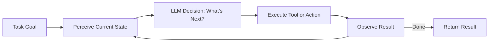

"AI Agent" has become a fixture at every tech conference in 2026. But when people discuss agents, they often miss a more fundamental question: why do some agents look impressive in demos but fail constantly in production?

The answer is usually not the model. It's the **harness**.

## TL;DR

- **AI Agent** = model + tools + perception loop, enabling an LLM to keep taking actions until a task is complete
- **Harness Engineering** = the discipline of designing environments that make agents stable, reliable, and safe
- The model is the brain; the harness is the nervous system plus the safety mechanisms. A brilliant brain with no nervous system can't do anything.

## What is an AI Agent?

At its core: an AI Agent is an AI system that can complete tasks autonomously — not just answer a question.

Traditional LLM interaction is linear: input → output. Agent interaction is a loop:

This loop enables agents to:
- Search for data, summarize it, then decide what to search for next
- Write code, run it, read the output, fix bugs, run again
- Browse pages, fill forms, make decisions, continue to the next step

Each iteration updates the agent's understanding of the world state, then drives the next decision.

## What is Harness Engineering?

A capable model isn't enough. The problem: LLMs perform well in sandboxed environments, but real environments are full of uncertainty.

Harness Engineering is the discipline focused on **everything outside the model**:

**1. Tool definitions and permission boundaries**

Which tools can an agent use? What resources can it access? An agent without explicit permission boundaries is a security risk. The harness defines tool interfaces and constrains what the agent can do.

**2. Context management**

LLMs have context window limits. A long-running agent will gradually "forget" early task context. The harness decides: what information stays in context? What gets compressed? What gets discarded?

**3. Observation and error handling**

What happens when a tool call fails? What if the agent enters an infinite loop? The harness monitors every step, designing retry logic, timeout mechanisms, and fallback strategies.

**4. Output parsing**

LLM output is natural language, but software systems need structured data. The harness parses model output into executable actions and handles parsing failures gracefully.

**5. State persistence**

Agent tasks may span multiple sessions. The harness manages task state serialization and recovery.

## Harness Engineering vs. Traditional AI Engineering

| | Traditional AI Engineering | Harness Engineering |
|---|---|---|
| Core goal | Make models smarter | Make smart models reliably usable |
| Focus | Training data quality | Environment constraint design |
| Metric | Model accuracy | Agent task completion rate |
| Runtime | Batch inference | Long-running autonomous operation |

Traditional AI engineering makes models better. Harness Engineering makes models usable in the real world.

## Why Did Everyone Start Caring About This in 2026?

Model capabilities made a leap in 2025–2026, but agent reliability didn't keep pace. Engineers found that writing a demo with the latest model was easy, but running 1,000 tasks reliably in production often yielded only 60–70% success rates.

That missing 30–40% isn't the model being insufficiently smart. It's the harness being underdone:
- Context fills up, and the model starts hallucinating
- Tool calls return unexpected formats, and the agent doesn't know how to continue
- Task goals are too vague, and the agent drifts off course
- No checkpoints mean a mid-task failure requires starting over

Harness Engineering emerged as the engineering response to this problem.

## Summary

The model is intelligence; the harness is reliability infrastructure. If you're building AI Agents, time spent on harness design typically returns more value than time spent upgrading to a better model.

## References

- [How AI Agents Work and What is Harness?](https://www.youtube.com/watch?v=B91bZL8wcAI)
- [Harness Engineering Complete Analysis](https://hackmd.io/@BASHCAT/SkQEW0F2bg)
- [Agent Harness: What Actually Determines Whether AI Delivers or Disappoints](https://yu-wenhao.com/en/blog/ai-harness/)
