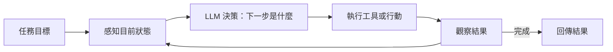

2026 年，「AI Agent」幾乎成了每個技術會議的關鍵詞。但很多人在討論 Agent 的時候，忽略了一個更根本的問題：為什麼有些 Agent 在演示時很驚艷，部署到生產環境就頻繁翻車？

答案通常不在模型，而在 **Harness**。

## TL;DR

- **AI Agent** = 模型 + 工具 + 感知迴圈，讓 LLM 能持續採取行動直到完成任務
- **Harness Engineering** = 設計讓 Agent 穩定、可靠、安全運作的環境工程
- 模型是大腦，Harness 是神經系統加防護機制——你可以有很聰明的大腦，但沒有好的神經系統，它什麼事都做不了

## 什麼是 AI Agent？

最基本的定義：AI Agent 是一個能自主完成任務的 AI 系統，而不只是回答一個問題。

傳統 LLM 的互動是線性的：輸入 → 輸出。Agent 的互動是迴圈的：

這個迴圈讓 Agent 能做到：
- 搜尋資料、整理、再根據結果決定要進一步搜什麼
- 寫程式碼、執行、看輸出、修 bug、再執行
- 瀏覽網頁、填表單、做決策、繼續下一步

每次迴圈，Agent 都在更新它對「世界狀態」的理解，然後再做下一個決定。

## 什麼是 Harness Engineering？

光有會思考的模型還不夠。問題在於：LLM 在沙盒（sandbox）裡表現很好，但真實環境充滿不確定性。

Harness Engineering 是一門工程學科，專注在**模型之外的那些東西**：

**1. 工具定義與權限邊界**

Agent 能用哪些工具？能存取哪些資源？一個沒有明確權限邊界的 Agent 在真實環境裡是安全隱患。Harness 定義工具的呼叫介面，限制它能做什麼。

**2. Context 管理**

LLM 有 context window 限制。一個長時間運作的 Agent 會逐漸「忘記」早期的任務脈絡。Harness 要解決：什麼資訊要留在 context 裡？什麼該壓縮？什麼該捨棄？

**3. 觀察與錯誤處理**

工具呼叫失敗了怎麼辦？Agent 進入無限迴圈怎麼辦？Harness 需要監控 Agent 的每一步，設計重試邏輯、逾時機制和 fallback 策略。

**4. 輸出解析**

LLM 的輸出是自然語言，但程式系統需要結構化資料。Harness 負責把模型輸出解析成可執行的行動，並在解析失敗時能優雅地處理。

**5. 狀態持久化**

Agent 任務可能跨越多個 session。Harness 要管理任務狀態的序列化和恢復。

## Harness Engineering 跟傳統 AI 工程的差別

以前做 AI 工程，重點在模型選擇、資料品質、訓練流程。Harness Engineering 的重點不同：

| | 傳統 AI 工程 | Harness Engineering |
|---|---|---|
| 核心目標 | 讓模型更聰明 | 讓聰明的模型能被可靠使用 |
| 關注點 | 訓練資料品質 | 環境限制的設計 |
| 評估指標 | 模型準確率 | Agent 任務完成率 |
| 運行模式 | 批次推論 | 長時間自主運作 |

傳統 AI 工程是讓模型更好，Harness Engineering 是讓模型能在真實世界裡用。

## 為什麼 2026 年大家突然開始重視 Harness？

因為模型的能力在 2025–2026 年出現了跨越式的進步，但 Agent 的可靠性卻沒有跟上。大量工程師發現：用最新的模型寫個 demo 很容易，但要讓它在生產環境穩定跑 1000 個任務，成功率往往只有 60–70%。

剩下那 30–40% 不是模型不夠聰明，而是 harness 沒做好：
- Context 被填滿，模型開始出現幻覺（hallucination）
- 工具呼叫回傳意外格式，Agent 不知道怎麼繼續
- 任務目標太模糊，Agent 走偏了
- 沒有適當的 checkpoint，中途失敗就全部重來

Harness Engineering 的興起，是對這個問題的工程回應。

## 小結

模型是智能，Harness 是可靠性的基礎設施。如果你在建構 AI Agent，花在 harness 設計上的時間，通常比換更強的模型更值得。

## 參考資料

- [AI Agent 工作原理是什麼，Harness 又是什麼？](https://www.youtube.com/watch?v=B91bZL8wcAI)
- [Harness Engineering 完全解析：當 AI Agent 的護城河不再是模型，而是環境](https://hackmd.io/@BASHCAT/SkQEW0F2bg)
- [Agent Harness: What Actually Determines Whether AI Delivers or Disappoints](https://yu-wenhao.com/en/blog/ai-harness/)
