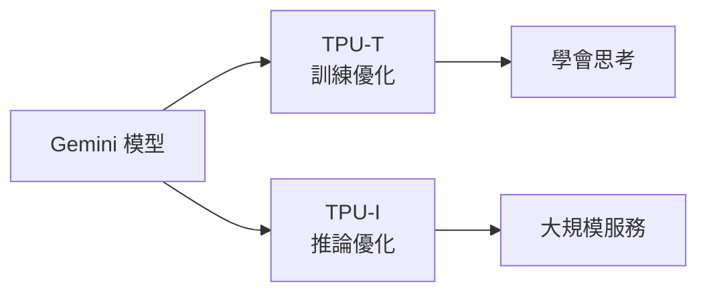

2026 年 5 月 22 日，Google I/O 落幕。Sundar 與 Demis 在台上描繪了一個野心十足的軟體未來——而那個未來，簡單講就是「Gemini 藏在每一個產品裡」。

這次的產品路線圖幾乎可以用一句話總結：**拿 Gemini，後面接一個名詞，然後出貨**。Gemini Spark、Gemini Omni、Gemini Flow⋯⋯清單一路往下。Google 自己給這個階段取的名字是 **agentic Gemini era（代理人化的 Gemini 時代）**：搜尋是 AI agent、Gmail 是 AI agent、Android 是 AI agent，連你的眼鏡都是 AI agent。

坐在現場看完 keynote，會意識到一件事：Google 已經不再想用「藍色超連結」來組織全世界的資訊了。在它的敘事裡，傳統搜尋引擎正在變成一種過時的技術；Google 想做的，是趕在 Anthropic 和 OpenAI 之前，成為「通往現實本身的介面」。

## Google 真正的護城河：規模

無論你喜不喜歡 Google，它最讓人印象深刻的能力始終是**規模化**。它不只把核心產品服務給數十億日活用戶，過去兩年的推論量更是誇張地成長——

- 兩年前：每月約 **9.7 兆（trillion）tokens**
- 現在：每月約 **3.2 千兆（quadrillion）tokens**

而且這個數字還會繼續加速。與此同時，Alphabet 的資本支出（capex）也跟著爆炸性成長，蓋新的基礎設施來撐起這一切（包括你們用 nano banana 生的一堆 AI 圖）。

## TPU 拆成兩顆：TPU-T 與 TPU-I

支撐這種規模的關鍵之一，是 Google 自家的 **TPU（Tensor Processing Unit）**。今年 I/O 的一個底層變化是：Google 把 TPU 拆成兩種各司其職的晶片——

- **TPU-T**：專門優化 **training（訓練）**
- **TPU-I**：專門優化 **inference（推論）**

換句話說，一顆晶片負責「教模型怎麼思考」，另一顆負責「把結果大規模地跑出來」。這種訓練/推論分家的做法，反映的是當推論量衝到千兆 token 等級後，把硬體針對兩種截然不同的工作負載分別優化，比一顆通用晶片全包更划算。

## Gemini Omni 與 Neural Expressive

I/O 2026 的頭條發表是 **Gemini Omni**：一個能吃下任何輸入（文字、影片、聲音）、產出任何輸出的模型。

Demis Hassabis 看起來是徹底的「world model 信徒」。這類模型不再只是生成像素而已，而是理解語言、物理、運動，以及你世界裡的其他一切——理解到足以「按需模擬現實」的程度。

伴隨 Omni 一起來的，是 Gemini app 全新的設計系統 **Neural Expressive**。乍看之下它只是換了新 icon、漸層更好看的介面改版；但真正特別的地方在於，它是為了**按需生成 UI 元素**而優化的——像是圖表（diagrams）、時間軸（timelines），甚至是在你下 prompt 之前根本不存在的迷你 app。

## Gemini Flash 3.5：主打速度，不是最強腦

在核心 LLM 這條線上，Google 發表了 **Gemini Flash 3.5**。要先講清楚：這**不是**那顆最強的大腦，而是那顆**快**的模型。

根據 Google 自家（就是那種「trust me bro」）的 benchmark，Flash 3.5 的表現逼近 **Opus 4.7** 和 **GPT-5.5**，但跑起來快得多。在它秀出的速度/智慧象限圖裡，Flash 自己獨佔了一個象限。

不過要提醒的是：這**不是** Google 的頂規模型。真正的旗艦 **Gemini 3.5 Pro** 目前還沒揭曉，預計要**今年夏末**才會發表——這一點讓不少網路上的人相當失望。

## Antigravity IDE 與那場 Doom demo

不是每個人都對 Google 的 **Antigravity** IDE 新方向買單。Antigravity 的前身是 **Windsurf**，跟 Cursor 一樣是主打 AI coding 的工具。而它最新版本——再一次跟著 Cursor 的腳步——看起來更像是 **OpenAI Codex 的複製品**：重心從「寫程式」偏向「管理一群 agent」。

老派工程師大概不會太開心這個轉向，但現場 demo 確實有點狠：他們用這個工具**從零打造了一個完整的作業系統**，過程花了大約 **12 小時**、燒掉數十億 tokens。接著他們想在上面跑 **Doom**，結果因為缺 driver 而失敗；於是他們當場讓 Gemini 把缺的 driver 寫出來，幾秒後——Doom 就跑起來了。

## 一句話總結這場 I/O

如果要抓出這次 I/O 背後的策略主軸，其實不複雜：**Google 想把 Gemini 變成所有產品的底層，讓 agent 直接替使用者行動**，而不只是提供一個可以呼叫的 app 或 API。

搜尋、Gmail、Android、眼鏡——這些原本的入口，全被重新包裝成「代理人」。至於這套「代理人化」到底能不能兌現行銷上的承諾，還是只是把 Gemini 這個名詞接到更多產品後面出貨，就得等這些功能真正落地後，用實際體驗來檢驗了。

## 參考資料

- [The Code Report — Google I/O 2026（YouTube）](https://www.youtube.com/watch?v=9OQ5vaYbGV0)
- [Google I/O 2026 官方公告整理 - Google Blog](https://blog.google/innovation-and-ai/technology/ai/google-io-2026-all-our-announcements/)
