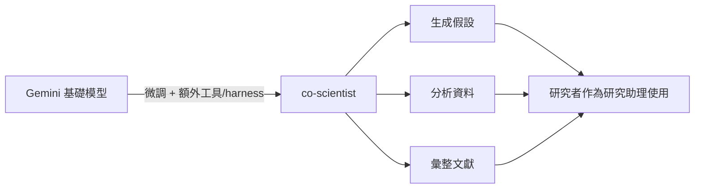

多數關於 DeepMind 的討論都聚焦在 AlphaFold 得諾貝爾獎這種里程碑。但在這場與 Demis Hassabis 的輕鬆對談裡，更有意思的其實是另一個層次的問題：這些模型**在日常裡到底怎麼被用**——包括一般人、也包括 Demis 自己。

以下把對談內容整理成幾個重點。

## 長脈絡模型在醫療影像上的真實案例

對談中一位提問者分享了自己的經歷：母親做完健康掃描後，拿到的是一個很大的影像檔案，而正式評估報告要等好幾週，家人在等待期間非常焦慮。他後來想到 Gemini 的 long context 能力，就把掃描檔丟給它分析，Gemini 判斷「不用擔心，沒問題」，而**後來醫師的判讀也證實了這個結果**。

Demis 回應說，這類軼事他們聽過很多——人們把 Gemini 用在健康相關的問題上，**在某些情況下甚至能救命**，他認為這是個很了不起的使用情境。

同一段對談也提到，DeepMind 釋出的 **Gemma 4** 是免費的本地模型，理論上也能做到類似的事，被形容為「給一般人的禮物」。

> 需要提醒的是：這是對談中分享的個人經驗，不是醫療建議。模型的判讀不能取代專業醫師的正式評估。

## Demis 自己怎麼用 Gemini

提問者引用 Nvidia 的 Jensen Huang——他說自己把 LLM 當成做決策時的 confidant（知己／參謀）——並問 Demis 會不會也這樣用。

Demis 的回答很具體：

- **他目前還沒把它當成 confidant**，但主要拿來做**腦力激盪**：想專案點子、想專案名字、發想各種創意。他很喜歡把它當成這件事的 **sparring partner（對練夥伴）**。
- 另一個主要用途是**快速掌握陌生領域**：當他想了解一個自己不那麼熟的新研究方向時，用它來彙整、摘要那個領域，快速抓到主要的 key points。

至於「請它批評自己的想法」這件事，Demis 說他確實會用 **Deep Think**（對談中與數學奧林匹亞等級的推理連在一起提到）來**幫他把已經在想的一些步驟從頭想過一遍**。不過他傾向用**比較協作的框架**，而不是叫它「更嚴厲一點、把這個想法的缺陷全找出來」——他自己也承認，或許可以試著讓它更狠一點。但整體來說，他把它當成一種 sparring partner。

這裡有個對工程師實用的觀察：同一個模型，用「協作對練」還是「找碴挑錯」的框架去 prompt，得到的產出會很不一樣。

## 從諾貝爾獎到「二階諾貝爾」

對談中也聊到 Demis 因 AlphaFold 拿到諾貝爾獎（提問者開玩笑說，這是「主題樂園 AI」終於得到應有的肯定——呼應 Demis 早年做遊戲的背景）。

真正有意思的是 John Jumper 的一句話：他期待有一天，有人**用你的 alpha 技術去發明出某個東西，然後那個東西再去拿諾貝爾獎**。提問者把這個概念命名為「**second order Nobel（二階諾貝爾）**」。

Demis 認為這是有可能發生的——他提到目前**已經有超過 300 萬名研究者在使用 AlphaFold**，這些人都在做非常重要、非常有影響力的工作。以這個規模來看，Jumper 說的那一天總會到來，而那會是很了不起的時刻。

## co-scientist：把 Gemini 變成研究助理

對談重點之一是 DeepMind 的 **co-scientist** 系統。Demis 的說明很清楚：

> 你可以把 co-scientist 想成是 Gemini 的一個**微調版本**，在上面**加掛了額外的工具與 harness**，專門用來協助研究工作。

它的定位是一個**很好的研究助理**，主要幫忙三件事：

- **生成假設（hypothesis generation）**
- **分析資料**
- **彙整文獻**

換句話說，它不是要取代研究者，而是接手研究流程裡那些耗時、可被輔助的環節。

## 假設生成器的實測體感

對談中有人實際用了 co-scientist 的**假設生成器**，分享了幾個很具體的使用體感：

- **它會要你把想法收窄**：你只是丟出一個籠統的說法，系統會反過來引導你把 idea 講得更明確。
- **它會花時間跑**：這位使用者提到**等了大約八小時**才拿到結果。
- **它在冷門領域也管用**：他把它用在自己的老本行——**ray tracing 的 global illumination**，這是一個**訓練資料很少、做的人也很少**的方向。即便如此，系統跑出來的結果讓他覺得「這太驚人了」，回饋了一些**有道理、有幫助的想法**，而不只是在熱門主題上表現好。

這一點對評估這類研究型 AI 很關鍵：真正的價值不在於它能在資料充足的熱門題目上答得漂亮，而在於它能不能在**資料稀薄、少人涉足**的角落給出 sensible 的方向。

## 小結

把這場對談拆開來看，會發現 DeepMind 的產品其實橫跨了兩端：

- 一端是**給大眾的通用能力**——Gemini 的 long context、免費的本地模型 Gemma 4，讓一般人也能在健康這類高焦慮情境裡得到即時協助。
- 另一端是**給研究者的專用工具**——co-scientist 把 Gemini 微調並加掛工具，變成能生成假設、跑八小時、還能在冷門領域給出方向的研究助理。

而 Demis 自己的用法，恰好示範了一種務實的中間態：不神化、也不當知己，就是把模型當成一個隨叫隨到的**腦力激盪與對練夥伴**，用它快速補齊自己不熟的領域。

## 參考資料

- [DeepMind's Insane AI Breakthroughs With CEO Demis Hassabis（原始對談）](https://www.youtube.com/watch?v=huAwz_BR8WM)
- [AlphaFold - DeepMind](https://www.deepmind.com/research/highlighted-research/alphafold)
- [AI co-scientist - Google Research](https://research.google/blog/accelerating-scientific-breakthroughs-with-an-ai-co-scientist/)
