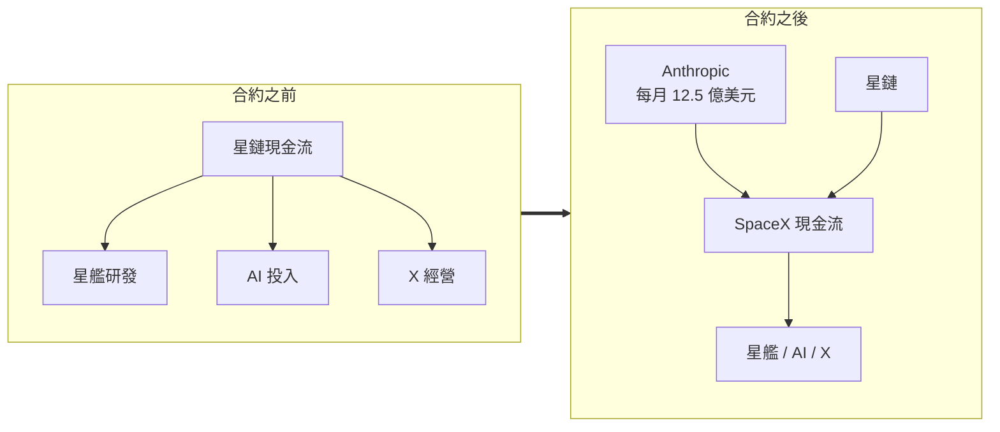

5 月 21 日，SpaceX 向 SEC 提交了招股書（S-1）。這次 IPO 預計募資 750 億美元，上市當天市值有望超過 2 兆美元——一次前無古人、後也很難有來者的人類史上最大 IPO。

主流媒體大多聚焦在星鏈與火箭發射本身，但真正值得細看的，是招股書裡那些「主流解讀之外」的亮點：一份把 SpaceX 收入結構整個掀翻的算力合約、一筆全世界排名前十的比特幣持倉、一份清一色由馬斯克盟友組成的董事會名單，以及一套幾乎堵死所有股東反抗空間的治理條款。

## 最重磅：Anthropic 每月 12.5 億美元的算力合約

招股書裡最意外、也最重磅的消息，是 SpaceX 與 Anthropic 簽了一份大合同：**Anthropic 每月向 SpaceX 支付 12.5 億美元購買算力**，範圍涵蓋 Colossus 1 與 Colossus 2 兩個資料中心集群，合約執行到 2029 年 5 月。

簡單算一下，這會為 SpaceX 帶來每年約 150 億美元的收入、三年總價值 450 億美元。對照財報揭露的數字，SpaceX 2025 年營收是 187 億美元——這一份合約，等於把年營收一口氣拉高超過 80%，規模甚至超過星鏈，成為 SpaceX 的最大單一收入來源。

這件事的意義要放進 SpaceX 的現金流結構才看得懂。在這筆合約之前，SpaceX 是一家「由星鏈養著其他業務」的公司：星艦研發、AI 投入、X 的經營，都在吞噬現金流。有了這份三年 450 億美元的合約，星鏈也可以稍微鬆一口氣。

對 Anthropic 來說，算力短缺是每一個 Claude Code 使用者都感同身受的痛。價格雖然「小貴」，但提前鎖定未來三年的大額算力，依舊划算。

合約中還藏了一個讓人興奮的條款：Anthropic 表示有興趣與 SpaceX 合作，開發「吉瓦級」的太空 AI 算力——也就是馬斯克對資本市場講的那個故事：**太空資料中心**。

提交招股書隔天，馬斯克發推說，還有「多家」公司正在洽談算力合約——注意是多家、而不是一家。本身就受限於算力不足、又是 SpaceX 大股東的 Google，大概率會是下一個大客戶。換句話說，SpaceX 未來很可能貼上一個新標籤：一家超大號的 Neo Cloud。

## 非幣圈最大的比特幣持倉

招股書還揭露，SpaceX 目前持有 **18712 枚比特幣**，平均成本約 3.5 萬美元，按提交當時的市值計算約 14.5 億美元。

這個持幣量超過了特斯拉的 11509 枚，也超過 Coinbase 的 9267 枚。在全世界能統計到的所有公司中排第 11、在上市公司中排第 5。排在 SpaceX 之前的，不是 MicroStrategy、Marathon Digital 這類囤幣公司，就是 Tether、Block.one 這類幣圈公司——換句話說，SpaceX 是目前已知**非幣圈公司裡持有最多比特幣的公司**。

## 董事會：馬斯克與他的長期盟友

招股書揭露的董事會有 8 人，SpaceX 的早期投資者幾乎悉數在列。其中 Gwynne Shotwell 是公司總裁，Donald Harrison 代表 Google。其餘幾個名字，個個都和馬斯克有一段舊事：

- **Ira Ehrenpreis**（DBL Partners 創辦人）：矽谷知名投資人、「影響力投資」最早的倡導者之一，是馬斯克長達 20 年的盟友。早在 2006 年就投資特斯拉，2007 年加入特斯拉董事會；今年 2 月加入 SpaceX 董事會擔任獨立董事。他的基金也投了 Boring Company 與 Neuralink。
- **Antonio Gracias**（Valor Equity Partners）：在 SpaceX 瀕臨倒閉的極早期就出手支持，只比 Founders Fund 稍晚。他 2000 年就投了剛完成合併的 PayPal、2005 年投特斯拉、2006 年進特斯拉董事會、2008 年在絕境中投了 SpaceX。他投資的馬斯克系公司還包括 SolarCity、Neuralink 與合併前的 xAI。招股書顯示 Valor 及其關聯實體持股約 7.3%、超過 5 億股——按上市當天 1.75 兆的市值，這些股份價值將超過 1000 億美元。
- **Luke Nosek**（Founders Fund 共同創辦人）：Confinity 共同創辦人、PayPal 早期高管，後來與 Peter Thiel 一起成立 Founders Fund。在第三次發射失敗後的 2008 年 8 月，他與 Thiel 共同主導了 SpaceX B 輪 2000 萬美元融資，當時 Founders Fund 是唯一的外部機構投資者。2017 年他離開 Founders Fund，成立專門投 SpaceX 的專項基金 Gigafund，對外的說法是「這不是財務投資，而是使命投資」。
- **Steve Jurvetson 與 Randy Glein**（代表 DFJ）：Steve 是全世界第一輛量產版 Model S（車架號 0001）的車主，也是最後一輛 Model S 的車主。他與馬斯克相識於 1996 年，當年馬斯克找他投資第一家公司 Zip2 卻被拒絕——這被 Steve 稱為投資生涯最後悔的決定，於是他之後投了馬斯克的每一家公司。2009 年 DFJ 領投了 SpaceX 約 6000 萬美元融資，2010 年再加碼。他也是 Boring Company 與 Neuralink 的第一個外部投資者。

看完名單你可能會想：這董事會不就是馬斯克和他的「迷弟」們組成的嗎？事實大致如此——而這也直接導向下一個問題。

## 史上最激進的公司治理結構

與傳統董事會強調獨立董事的獨立性、避免派系與關聯性不同，SpaceX 的董事會結構，很可能帶來美國史上最激進的上市公司治理設計：

- **馬斯克一人控制約 85% 的投票權**，事實上決定了他不可能被解雇。
- 公司章程明確規定，所有股東索賠必須透過**強制約束性仲裁**解決，投資者被禁止在聯邦法院提起任何訴訟，包括集體訴訟。《財富》雜誌指出，此前沒有任何美國主要上市公司採用過類似條款。
- 只有持股超過 3% 的股東才能提起派生訴訟（股東代表公司起訴董事）。按 1.75 兆美元估值計算，這意味著**至少要持有 450 億美元的股份，才有資格提告**。

對此，紐約州公共退休基金、加州公務員退休基金（CalPERS）與紐約市退休系統三家機構已聯合致函 SpaceX，對這些治理條款表達嚴重關切。

馬斯克曾被特拉華州法院否決薪酬方案、也曾被 OpenAI 踢出局。這一次，他用美國上市公司歷史上對股東權利限制最嚴苛的章程設計，把所有對自己不利的情況全部堵死。

招股書也直白寫道：公司對馬斯克「高度依賴」，他的領導力、願景與技術專長是公司未來的核心支柱；一旦他的參與度下降，將對公司業務、財務狀況及未來前景產生「重大不利影響」。對投資者而言，押注 SpaceX，在很大程度上就是押注馬斯克本人。

## V3 星艦首飛：1.75 兆估值的技術支撐

就在提交招股書的隔天，歷經多次延後的新一代 **V3 星艦完成首次試飛**。這是星艦的第 12 次試飛，也是去年 11 月爆炸事故後、時隔半年的首飛。

V3 雖然還叫星艦，但從頭到腳都是新的：整箭高 124 米，搭載 33 台全新升級的猛禽 3（Raptor 3）發動機，格柵尾翼增大 50%，近地軌道運力提升到 100 噸以上。這次從新建的 2 號發射台起飛，部署了 20 顆下一代星鏈模擬器與 2 顆測試衛星，最終在印度洋受控濺落。

試飛並不完美：二級的猛禽 3 有 1 台因故障停機，原計畫的發動機在軌重啟因此取消；一級在完成分離後出現燃燒異常。由於是新型號首飛，這次沒有採用極具視覺衝擊力的「筷子夾火箭」回收。

為什麼資本市場如此關注這次試飛？因為星艦是 SpaceX 未來圖景中最重要的一環，也是 1.75 兆估值最關鍵的支撐：

- **星鏈換裝**：作為目前最重要的現金流，星鏈將改用更重的 V3 衛星。在軌的 9000 多顆衛星每年需要補發 10%～15%，現有的獵鷹 9（Falcon 9）早已不堪重負。星艦若不能盡快入軌，SpaceX 最賺錢的業務會很快遇到瓶頸。
- **重返月球**：合約金額數十億美元的登月計畫也等不起。Artemis IV 載人著陸任務定檔 2028 年，而登月架構裡最關鍵的「低溫推進劑在軌加注」還沒做過實驗。去年 10 月 NASA 罕見地公開質疑 SpaceX 的登月著陸系統進度——這也可能是為什麼 NASA 局長 Jared Isaacman 這次親自飛到試飛現場觀摩。
- **太空資料中心**：馬斯克對資本市場講的最大故事，同樣需要星艦成熟。計畫部署在太空的 AI 運算基礎設施需要發射 100 萬顆以上衛星，地球上沒有任何其他火箭能承擔這種規模的發射任務。

## 結尾

把這些亮點串起來，SpaceX 這次 IPO 的邏輯就清楚了：Anthropic 的算力合約補上了現金流的想像空間，比特幣持倉與董事會名單勾勒出它的資本底色，極端治理條款則把控制權牢牢鎖在馬斯克手中——而支撐起這一切估值的技術前提，仍然是那枚剛完成首飛、還有一堆問題待解的 V3 星艦。

按第三方目前的預測，星艦下一次試飛會落在 6 月之內，具體日期未定。如果剛好安排在 IPO 當天，我們也許會在同一天見證「火箭上天、股價也上天」的歷史。

## 參考資料

- [SpaceX 招股書深度解讀（硅谷101，原始影片）](https://www.youtube.com/watch?v=HqsTB0avrh8)
