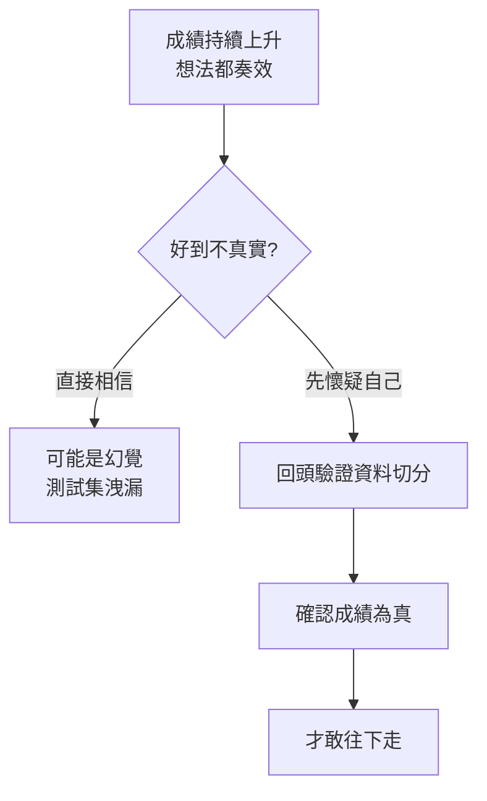

「它幾乎好到讓人覺得太簡單了。感覺太多想法都奏效了。」

這是 AlphaFold 團隊的一位研究者，回顧開發過程時說出的第一句話。成績一路往上走，他記得去找工程負責人 Tim，說的不是「我們成功了」，而是一句幾乎相反的話：

> 「這感覺實在太順了，我們也太成功了。這個問題不可能這麼簡單吧？我們是不是洩漏了測試集（leaking the test set）？我們是不是犯了那個最經典的機器學習罪過（the classic machine learning sin）？」

這段自述值得任何做模型的人記下來。

## 好到不真實，是一種警訊

在機器學習裡，最容易讓人自我感覺良好、也最容易騙過自己的，就是測試集洩漏——訓練資料和評估資料之間有了不該有的重疊，於是模型在「考卷」上拿到高分，但那個高分不代表真實能力。

AlphaFold 團隊當時的處境很微妙：想法一個接一個成立，指標持續上升。對多數人來說這是好消息，但對一個成熟的團隊來說，**過於順利本身就是一個需要被解釋的異常**。他們沒有先慶祝，而是先假設自己犯了錯，然後回頭去驗證這份成績是不是真的。

這個直覺——「當結果好到不真實時，優先懷疑是自己搞錯了」——是把研究做紮實與把研究做成幻覺之間的分水嶺。

## 「影響十億人」是什麼尺度

訪談中提出一個很大的命題：**在 20 年內，幾乎每一個能接觸到現代醫療的人，都會受惠於某個由 AlphaFold 影響過的工具、診斷或藥物。**

這位研究者對這個說法的回應，沒有停在「我做了一個很厲害的模型」，而是回到身為研究者最原始的動機：

> 「我喜歡這個念頭——身為研究者，我可以做出一個工具，幫助十萬人、幫助一百萬人，在足夠長的時間裡，幫助十億人保持健康。」

從十萬、到百萬、到十億，這是一條關於「影響尺度」的階梯。而他給 AlphaFold 下的具體註腳其實很克制：

> 「我想 AlphaFold 也許讓結構生物學——生物學的主要領域之一——快了 5% 或 10%。而那已經非常了不起了。」

注意這個數字的謙遜。不是「解決了一切」，而是把一整個學科的推進速度往前挪了 5～10%。當底數是整個領域時，個位數的百分比就是巨大的絕對量。這是一種更誠實、也更有說服力的成就描述方式。

## 它能「很有自信地給出錯誤答案」嗎

訪談最後只有一問一答，但這是整段裡最重要的一句：

> 「它會不會很有自信地給出錯的答案（confidently incorrect）？」
>
> 「會。」

沒有辯解、沒有淡化，就是一個字：會。

這對任何部署模型的人都是關鍵提醒。一個模型的危險，往往不在於它會錯，而在於它**錯得很有把握**——在應該表達不確定的地方，反而給出高信心的輸出。對 AlphaFold 這種會被拿去指導真實生物實驗、甚至藥物研究的工具來說，「知道自己什麼時候可能是錯的」和「預測本身」幾乎一樣重要。

能夠公開承認模型會自信地犯錯，是一種成熟。它意味著團隊沒有把工具當成神諭，而是清楚它的能力邊界在哪裡。

## 小結

這段簡短的自述其實沒有談架構、沒有談參數，卻示範了做出這種等級成果的團隊，內在是怎麼運作的：

- 成績太好時，先懷疑自己是不是洩漏了測試集，而不是先慶祝。
- 描述影響時保持克制——「讓一個領域快 5～10%」比「解決了一切」更可信、也更有份量。
- 正視模型會「自信地犯錯」，而不是假裝它不會。

對工程師而言，真正可以借走的不是 AlphaFold 的模型，而是這種對自己成果的懷疑態度與誠實。

## 參考資料

- [原始影片 — AlphaFold（YouTube Shorts）](https://www.youtube.com/shorts/VQ2bV58QbH0)
- [AlphaFold — Google DeepMind](https://www.deepmind.com/research/highlighted-research/alphafold)
- [AlphaFold Protein Structure Database](https://alphafold.ebi.ac.uk/)
