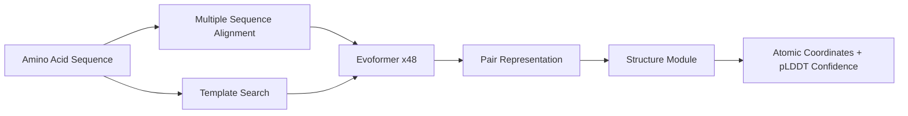

In 2024, the Nobel Prize in Chemistry went to David Baker, Demis Hassabis, and John Jumper for their breakthrough contributions to protein structure prediction and design. Hassabis and Jumper represent DeepMind's AlphaFold team. In the AI research community, almost nobody was surprised.

## TL;DR

AlphaFold uses deep learning to solve the "protein folding problem" — given an amino acid sequence, predict the molecule's actual three-dimensional shape. This problem stumped structural biologists for over 50 years. AlphaFold2's performance at the 2020 CASP14 competition left every other method in the dust and fundamentally changed the field.

## What is the Protein Folding Problem

Proteins are chains of amino acids where sequence determines structure and structure determines function. The problem: between sequence and 3D structure lies an astronomical number of possible folding configurations (Levinthal's paradox). Experimental methods like X-ray crystallography and cryo-EM are expensive and slow — a single protein can take years to resolve structurally.

Computational methods tried to infer unknown structures from known ones, but accuracy was never close to experimental standards. Before AlphaFold2, the best computational methods scored around 60–70 on GDT (Global Distance Test, where 100 is perfect) for difficult proteins. AlphaFold2 jumped straight to 90+, nearly matching experimental accuracy.

## AlphaFold2's Technical Core

AlphaFold2 isn't just "dump a sequence into a neural network and see what comes out." Its architecture is purpose-built for this problem.

**Multiple Sequence Alignment (MSA) as input**

Evolutionary pressure is a natural compressor of structural information. When proteins across different species are evolutionarily related, amino acids at corresponding positions tend to mutate together (co-evolution). AlphaFold2 treats cross-species sequence alignment matrices as a core input, letting the model infer which residues are spatially close to each other in 3D.

**The Evoformer**

AlphaFold2's backbone is the Evoformer — a Transformer stack that alternately updates sequence representations (MSA representation) and residue-pair representations (pair representation). Sequence information updates distance estimates between residue pairs; pair information refines sequence attention patterns. This iterates across 48 layers.

**Structure Module**

Geometric information extracted from the pair representation feeds into a module that represents each amino acid as a rigid body with a defined orientation, directly outputting atomic coordinates. The entire process is end-to-end differentiable and can be trained directly against experimental structures.

## Why This Actually Matters

**Drug discovery acceleration**: Many drug targets are proteins. Previously, confirming a protein's structure meant waiting for experimental results. With AlphaFold, researchers get high-confidence structural predictions in minutes, dramatically compressing early-stage drug discovery timelines.

**The AlphaFold Database**: DeepMind partnered with EMBL-EBI to predict structures for over 200 million proteins spanning nearly every known species — all freely accessible. This effectively multiplied the structural biology knowledge base by orders of magnitude overnight.

**From prediction to design**: AlphaFold's successors — RFdiffusion, ProteinMPNN — reverse the problem: design sequences for a target structure. This is David Baker's core contribution. AI in molecular biology has moved from observer to designer.

## Differences from Traditional Methods

| Method | Scope | Accuracy | Time Cost |
| --- | --- | --- | --- |
| X-ray crystallography | Most proteins | Highest (atomic-level) | Months to years |
| Cryo-EM | Large complexes | High (sample-dependent) | Weeks to months |
| Homology modeling | Proteins with similar templates | Medium (template-dependent) | Hours |
| AlphaFold2 | Nearly all single-chain proteins | High (pLDDT > 90 reliable) | Minutes to hours |

AlphaFold isn't replacing experimental methods — it lets researchers quickly screen and prioritize, reserving expensive experiments for the most worthwhile targets.

## Summary

AlphaFold winning the Nobel Prize signals not just a model's success, but the maturity of deep learning as a scientific tool. It proves AI can make genuine breakthroughs on deeply structured scientific problems — not just perception tasks. What to watch next: AlphaFold3's impact on drug-molecule binding prediction, and whether AI can replicate this success across other biochemical prediction challenges.

## References

- [AlphaFold2 Paper - Nature 2021](https://www.nature.com/articles/s41586-021-03819-2)
- [AlphaFold Database](https://alphafold.ebi.ac.uk/)
- [2024 Nobel Prize in Chemistry Announcement](https://www.nobelprize.org/prizes/chemistry/2024/summary/)
- [AlphaFold3 Paper - Nature 2024](https://www.nature.com/articles/s41586-024-07487-w)
