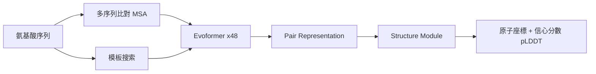

2024 年，諾貝爾化學獎頒給了 David Baker、Demis Hassabis 和 John Jumper，表彰他們在蛋白質結構預測和設計上的突破性貢獻。其中 Hassabis 和 Jumper 代表的正是 DeepMind 的 AlphaFold 團隊。這個結果，在 AI 研究圈裡幾乎沒有人覺得意外。

## TL;DR

AlphaFold 用深度學習解決了「蛋白質折疊問題」——給定一條氨基酸序列，預測其在三維空間中的實際形狀。這個問題困擾結構生物學家超過 50 年，AlphaFold2 在 2020 年的 CASP14 競賽中以壓倒性的精準度讓其他方法相形失色，改變了整個領域的走向。

## 蛋白質折疊問題是什麼

蛋白質是由氨基酸序列組成的分子，序列決定結構，結構決定功能。問題在於：從序列到三維結構之間存在天文數字的可能摺疊方式（Levinthal's paradox），實驗方法（X 光晶體學、冷凍電子顯微鏡）費時費力，一個蛋白質可能需要數年才能完成結構解析。

長期以來，計算方法試圖從已知結構「推算」未知蛋白，但精準度遠不如實驗。AlphaFold2 出現之前，最好的計算方法在困難蛋白上的 GDT 分數（全域距離測試，100 為完美）大約落在 60–70，而 AlphaFold2 直接跳到 90+，幾乎追平實驗精準度。

## AlphaFold2 的技術核心

AlphaFold2 不是單純把「序列丟進神經網路看看輸出什麼」，它的架構針對這個問題有深度的設計：

**多序列比對（MSA）作為輸入**

演化壓力是結構資訊的天然壓縮。如果兩個生物的蛋白質在演化上相關，同一位置的氨基酸往往一起突變（共演化）。AlphaFold2 把跨物種的序列比對矩陣當作核心輸入，讓模型能「讀出」哪些位置在三維空間中彼此靠近。

**Evoformer 模組**

AlphaFold2 的骨幹是 Evoformer，一個交替更新序列表示（MSA representation）和殘基對表示（pair representation）的 Transformer 堆疊。序列資訊更新殘基對的距離估計，殘基對資訊反過來精煉序列的注意力模式，兩者在 48 層中反覆迭代。

**結構模組（Structure Module）**

從 pair representation 中提取的幾何資訊，進入一個以剛體（rigid body）表示每個氨基酸朝向的模組，直接輸出原子座標。整個過程是端對端可微分的，可以用實驗結構直接監督訓練。

## 為什麼這件事真的重要

**藥物開發的加速**：很多藥物靶點是蛋白質。以前要確認一個蛋白的結構，必須等實驗結果，現在用 AlphaFold 可以在幾分鐘內得到高可信度的預測結構，大幅縮短早期藥物發現的週期。

**AlphaFold Database**：DeepMind 和 EMBL-EBI 合作，用 AlphaFold 預測了超過 2 億個蛋白質的結構，涵蓋幾乎所有已知物種的蛋白組，全部開放免費存取。這相當於一夜之間把結構生物學的知識庫擴大了幾十倍。

**擴展到蛋白質設計**：AlphaFold 的後繼者 RFdiffusion、ProteinMPNN 等工具，開始反過來做「從目標結構設計序列」，這是 David Baker 獲獎的核心貢獻。從預測到設計，AI 在分子生物學的角色從旁觀者變成了設計師。

## AlphaFold3 和後續發展

2024 年 AlphaFold3 發布，將預測範圍從蛋白質擴展到 DNA、RNA、配體（小分子）等，可以預測蛋白質與其他分子的複合物結構。這對於理解藥物如何與靶點結合特別關鍵。不過 AlphaFold3 的完整程式碼並未像 AlphaFold2 一樣完全開源，引發了一些學術界的討論。

## 跟傳統方法的差別

| 方法 | 適用範圍 | 精準度 | 時間成本 |
| --- | --- | --- | --- |
| X 光晶體學 | 大多數蛋白 | 最高（原子級） | 數月至數年 |
| 冷凍電子顯微鏡 | 大型複合物 | 高（依樣本而定） | 數週至數月 |
| 同源建模（傳統計算） | 有相似模板的蛋白 | 中（模板依賴） | 數小時 |
| AlphaFold2 | 幾乎所有單鏈蛋白 | 高（pLDDT > 90 可信） | 數分鐘至數小時 |

AlphaFold 不是要取代實驗方法，而是讓研究者能夠快速篩選和優先排序，把昂貴的實驗資源用在最值得驗證的目標上。

## 小結

AlphaFold 獲得諾貝爾獎，代表的不只是一個模型的成功，而是深度學習作為科學工具的成熟。它證明了 AI 可以在有深度結構的科學問題上——而不只是感知任務——做出真正突破性的貢獻。接下來值得觀察的是 AlphaFold3 的影響，以及 AI 是否能在其他生物化學預測任務（酵素功能、藥物毒性）上複製同樣的成功。

## 參考資料

- [AlphaFold2 論文 - Nature 2021](https://www.nature.com/articles/s41586-021-03819-2)
- [AlphaFold Database](https://alphafold.ebi.ac.uk/)
- [2024 諾貝爾化學獎公告](https://www.nobelprize.org/prizes/chemistry/2024/summary/)
- [AlphaFold3 論文 - Nature 2024](https://www.nature.com/articles/s41586-024-07487-w)
