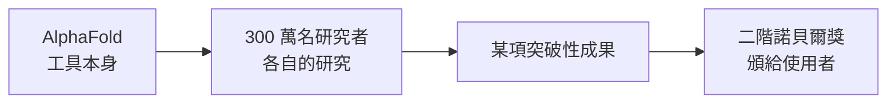

一段訪談短片裡，有人向 AlphaFold 團隊拋出一個有意思的問題：會不會出現一座「二階諾貝爾獎」（second-order Nobel Prize）？

這裡的「二階」不是指團隊自己再得一次獎，而是指**另一位研究者用 AlphaFold 完成了自己的突破性研究，然後拿下屬於他的諾貝爾獎**。工具本身不會再上台領獎，但它會透過別人的研究，間接促成下一座獎。

## 什麼是「二階諾貝爾獎」

一般我們談一項工具或發現的影響力，會看它自己得到什麼肯定。但一個真正基礎、被廣泛採用的工具，影響力其實會**往下游擴散**：它讓別人得以完成原本做不到的研究，而那些研究可能才是最終被表彰的對象。

受訪者在短片中把這種可能性稱為一個「really interesting idea（很有意思的想法）」。他的判斷是：以 AlphaFold 現在的普及程度，這種衍生式的獲獎並非天方夜譚。

## 關鍵數字：超過 300 萬名使用者

受訪者給出的核心依據，是使用者規模——**目前已有超過 300 萬名研究者在使用 AlphaFold**。

他強調，這些人「都在做非常重要、非常有影響力的工作（incredibly important work and impactful work）」。這正是「二階諾貝爾獎」這個想法能成立的前提：當使用者基數大到這個程度，其中只要有一個人，靠著 AlphaFold 完成了值得諾貝爾等級肯定的研究，這件事就會發生。

換句話說，影響力不再取決於單一團隊做了什麼，而取決於**這麼多人拿它去做了什麼**。

## 「John 說得對」

短片中，受訪者提到 John（John Jumper，AlphaFold 團隊的核心成員之一）也持相同看法：「I guess John's right（我想 John 說得對）」，並補了一句——「That may happen at some point.（這總有一天會發生。）」

他對這個前景的評價很直接：「That would be an amazing moment.（那會是很了不起的一刻。）」

## 小結

這段對話沒有給出時間表，也沒有點名任何具體研究，它只提出了一個框架：**衡量一個工具的份量，看的不只是它自己得到什麼，而是它讓多少人得以走得更遠。**

當使用者數字站上 300 萬，「二階諾貝爾獎」就從一句玩笑，變成一個受訪者願意認真說「有可能」的預測。

## 參考資料

- [原始短片 - YouTube Shorts](https://www.youtube.com/shorts/MOviZKtFeHM)
