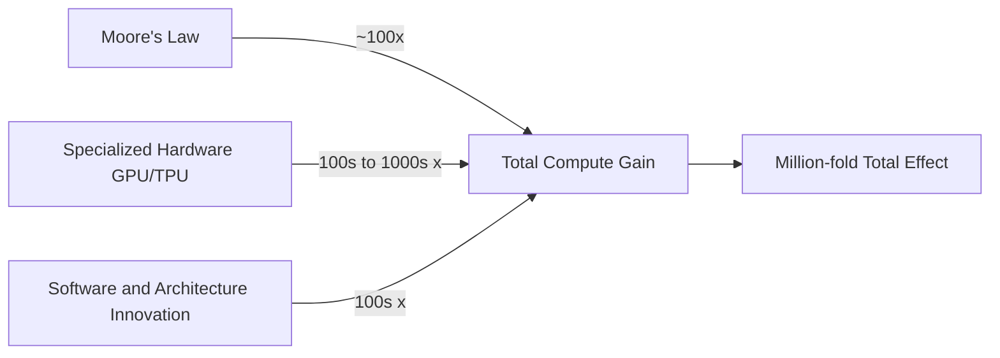

Jeff Dean co-founded Google Brain and now serves as a research director at Google DeepMind, continuing to push the frontier of AI research. In a recent public talk, he took a closer look at a claim that sounds like marketing copy but has genuine technical substance: AI computing power has increased by a million-fold over the past decade. What does that actually mean for the future?

## TL;DR

The million-fold compute growth in AI comes from three parallel technical tracks: specialized hardware (GPU to TPU), distributed training frameworks at the software layer, and efficiency improvements in model architectures themselves. The compounding effect of these three tracks means training a large language model today operates at an entirely different efficiency level than ten years ago. The next question isn't whether growth will continue, but which direction it should go.

## Where the Million-Fold Came From

Moore's Law alone — transistor counts doubling every two years — contributed roughly 100x of improvement over this period. The million-fold figure comes largely from elsewhere:

**Hardware specialization**

General-purpose CPUs are inefficient at matrix multiplication. GPU's massively parallel cores provided a 10–100x speedup for deep learning training. But GPUs are still general-purpose accelerators designed for graphics. Google's TPUs, designed from 2016 onward, made more aggressive optimizations specifically for neural network matrix operations, with substantially better energy efficiency than GPUs.

**Distributed training systems**

Training a modern large language model may use thousands to tens of thousands of accelerators simultaneously. This requires solving hard engineering problems: how to partition the model (pipeline parallelism, tensor parallelism), how to synchronize gradients (AllReduce communication), how to prevent a single node failure from crashing the entire training run. Google's Pathways system and the Jax/XLA compiler stack are outputs of this work.

**Architecture efficiency**

The Transformer architecture itself is more parallelizable than previous RNN/LSTM approaches. Techniques like Flash Attention optimize memory access patterns for the attention mechanism, enabling longer sequence training at the same compute budget. Mixed-precision training (FP16/BF16) fits more parameters into the same memory.

## What This Scale of Compute Enables

Dean's talk isn't about "compute is impressive" — it's about specific scientific problems that were previously intractable and are now becoming solvable:

**Protein structure prediction**: AlphaFold2 is the clearest example. But Dean emphasizes the problems that come after — protein dynamics (the folding pathway, not just the end state), protein-small molecule interactions, protein design. These require even greater compute than AlphaFold itself.

**Climate modeling**: Earth's climate is a complex system of coupled physical PDEs. Traditional supercomputer climate models are resolution-limited by compute budgets. AI models like Google's GraphCast can run higher-resolution predictions in shorter time and now surpass traditional numerical methods on many accuracy metrics.

**Medicine and genomics**: Predicting disease risk from genomic sequences, predicting treatment outcomes from EHR data — these require training large models on massive datasets, where compute scale directly determines achievable accuracy.

## The Next Phase: Smarter Allocation, Not Just Bigger

Dean points to a key shift: from "train one huge model, use fixed compute at inference" to "dynamically allocate inference compute based on problem difficulty."

Mixture of Experts (MoE) architecture is one direction: the model has many expert sub-networks, with only a small subset activated per token. Total parameter count is large but actual compute remains manageable. This lets you scale the model's knowledge capacity without proportionally scaling compute costs.

Another direction is "thinking time" at inference: letting models spend more reasoning steps on hard problems (chain-of-thought, MCTS search) rather than outputting in one pass. OpenAI's o1/o3 and Google's Gemini Thinking are exploring this space.

## What This Means for Engineers

If you're building AI applications, Dean's talk carries an implicit message worth noting: the democratization of compute lags far behind frontier research. The compute scale big companies use today won't reach typical developers for another three to five years. This means applications you build now will have dramatically lower compute costs in a few years — making things that seem "too expensive to run" today become viable.

On the other side, compute scarcity makes "achieving better results with less compute" a persistently valuable research direction. Quantization, distillation, and fine-tuning small models on specific tasks will remain engineering-valuable for the foreseeable future.

## Summary

AI's million-fold compute growth isn't a marketing exaggeration — it's the real compounding result of three tracks: hardware, software, and architecture. Jeff Dean's perspective is worth particular attention because he has been a direct contributor to Google's TPU design, TensorFlow/Jax, and large-scale scientific AI projects like AlphaFold. His predictions describe things he helped build.

## References

- [Jeff Dean at Stanford HAI (2024)](https://hai.stanford.edu/events/hai-seminar-jeff-dean)
- [Google TPU technical overview](https://cloud.google.com/tpu/docs/intro-to-tpu)
- [GraphCast climate prediction paper](https://www.science.org/doi/10.1126/science.adi2336)
- [Pathways: Asynchronous Distributed Dataflow for ML](https://arxiv.org/abs/2203.12533)
