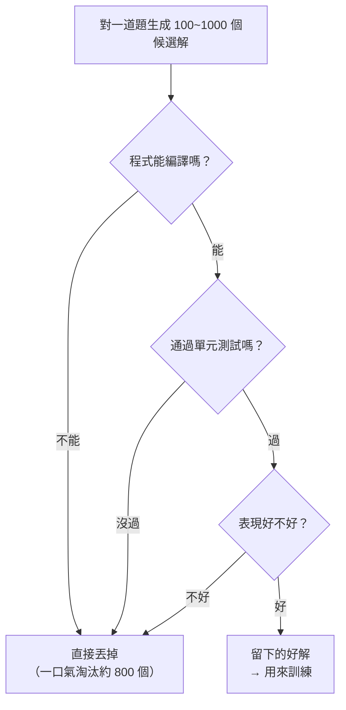

「大家都說我們快把訓練 LLM 的資料用完了，但你說其實還有很多資料。」在一場輕鬆的訪談裡，主持人這樣問 Google 首席科學家 Jeff Dean。

Jeff Dean 是這行的傳奇人物：他領導過 Google Brain，共同打造了 MapReduce——讓上千台電腦像一台機器一樣協作——也共同開發了 TensorFlow。同事甚至幫他編了不少「Chuck Norris 式」的玩笑，例如公司內部曾有一個叫「Data Centers on fire（資料中心失火）」的聊天群，裡頭會出現「一顆遙遠的超新星爆炸、一道宇宙射線打中記憶體、把一個 0 翻成 1」這種故障故事。這種一位號稱「computer science 界的 Chuck Norris」的人怎麼看 AI 的資料瓶頸，特別值得聽。

以下把訪談中兩個核心問題整理成重點。

## LLM 真的快沒資料可訓練了嗎？

Jeff Dean 承認一件事：世界上公開的**文字**資料，我們確實已經用掉相當多。但他不認為「資料見底」會成為前進的阻礙，理由有幾個：

- **影片資料還沒真正拿來訓練。** 網路上有大量有價值的影片資料，目前還沒被拿去做訓練，這是一塊還沒動用的來源。
- **合成資料（synthetic data）。** 有很多方式可以生成合成資料，再拿去訓練。
- **對既有資料做更多次的利用。** 對手上已有的資料多跑幾遍（more passes），可以持續逼出更有能力的模型。
- **更好的演算法。** 想辦法從每一筆資料裡榨出更多資訊，讓同一份資料發揮更大的價值。

換句話說，「資料量」不是唯一的變數；**如何從資料中萃取資訊**同樣關鍵。Jeff Dean 的態度是：可以做的事情還很多很多，他並不太擔心資料會是進展的天花板。

## 用 AI 生成的資料去訓練 AI，會不會愈訓愈糊？

主持人接著追問一個更尖銳的問題：如果愈來愈多資料是 AI 生成的，然後又拿去餵給另一個 AI，大家最後不就都在同一批東西上學習嗎？

他也分享了自己的實務直覺：論點大概是「只要算力夠，就能翻遍大量資料，即使有用的訊號只是大海裡的一根針，系統也有辦法學到」——但他自己「以前那些很爛的小實驗」完全不是這麼回事，反而必須**對資料非常小心**。

Jeff Dean 的回答是：**整體來說，這是成立的**，但有「很多細節要做對」，才能真的變成現實。他舉了一個具體例子來說明「細節」長什麼樣。

## 關鍵例子：RL rollouts 解程式題

想像你在做 RL 訓練，用 rollouts 去解一道以高階描述給出的程式問題。做法大致是：對同一道題，探索 100 種、甚至 1,000 種不同的解法生成路徑。這些候選解不會照單全收，而是套上一層層過濾條件：

Jeff Dean 的重點是：光是「能不能編譯」這一關，就能把大部分候選（例如 1,000 個裡的 800 個）當場刷掉；再過「有沒有通過單元測試」「跑得好不好」等關卡，你就能一步步**收斂到真正好的那幾個解**。

這正是「合成資料為什麼有用」的機制核心——生成本身會製造大量雜訊，但如果你有可靠、可自動判斷的**過濾條件**（編譯、測試、效能），就能把海量的自我生成內容篩成高品質的訓練訊號。合成資料的價值不在於「生成」，而在於「生成 + 篩選」這一整套流程做得夠細。

## 小結

Jeff Dean 對「資料見底」的看法可以濃縮成一句話：與其擔心資料的**總量**，不如去想怎麼從資料裡萃取**更多資訊**。未動用的影片資料、合成資料、對既有資料的重複與更聰明的利用，都還有很大空間。而合成資料要真的有用，關鍵不在能不能生成，而在有沒有一套能自動判斷好壞的過濾機制——RL rollouts 解程式題就是最直接的示範：生成上千個解、用編譯與測試層層淘汰，剩下的才是值得學習的訊號。

## 參考資料

- [Jeff Dean 訪談原始影片（YouTube）](https://www.youtube.com/watch?v=yz6I23VRbdg)
