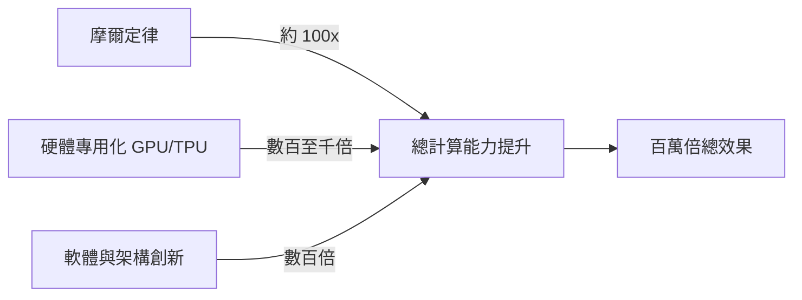

Jeff Dean 是 Google Brain 的共同創辦人，現在以 Google DeepMind 研究主任的身分持續推進 AI 前沿研究。他最近在一場公開演講中，重新審視了一個聽起來像行銷說詞但其實有嚴謹技術含義的問題：AI 計算能力過去十年真的提升了一百萬倍，這對未來意味著什麼？

## TL;DR

AI 計算能力的百萬倍成長，來自三條平行的技術路線：專用硬體（GPU → TPU）、軟體層的分散式訓練框架、以及模型架構本身的效率改善。這三者的複利效果，讓今天訓練一個大型語言模型的計算效率，和十年前已經不是同一個數量級。接下來的問題不是「能不能繼續增長」，而是「增長的方向要往哪裡走」。

## 百萬倍從哪裡來

單純的摩爾定律（電晶體數量每兩年翻倍）這十年貢獻了大約 100 倍左右的計算改善。但 AI 計算能力的百萬倍成長，大部分來自其他地方：

**硬體專用化**

通用 CPU 在矩陣乘法上效率低落。GPU 的大量平行計算核心讓深度學習訓練速度提升了幾十倍。但 GPU 仍是為圖形設計的通用加速器，Google 從 2016 年開始自行設計的 TPU（Tensor Processing Unit）針對神經網路矩陣運算做了更激進的最佳化，在能效比上大幅領先 GPU。

**分散式訓練系統**

一個現代大型語言模型的訓練，可能同時使用數千到數萬個加速器。這需要解決一系列困難的工程問題：如何切分模型（流水線並行、張量並行）、如何同步梯度（AllReduce 通訊）、如何避免一個節點故障讓整個訓練崩潰。Google 的 Pathways 系統、Jax/XLA 編譯器，都是這個方向的成果。

**架構效率**

Transformer 架構本身，就比之前的 RNN/LSTM 更容易平行化。Flash Attention 等技術把注意力機制的記憶體存取模式最佳化，在相同算力下能訓練更長的序列。混合精度訓練（FP16/BF16）讓同樣的記憶體可以放更多參數。

## 這個規模的計算能力帶來什麼

Dean 的演講重點不是「計算能力很厲害」這種廢話，而是具體指出哪些曾經不可能的科學問題，現在開始變得可解：

**蛋白質結構預測**：AlphaFold2 是最直接的例子。但 Dean 更強調的是 AlphaFold 之後的問題——蛋白質動態行為（folding 的路徑而非只是終態）、蛋白質與小分子的交互、蛋白質設計。這些問題需要的計算規模還比 AlphaFold 大很多。

**氣候建模**：全球氣候系統是一個複雜的物理偏微分方程組。傳統超級電腦的氣候模型解析度受限於計算預算，AI 模型（如 Google 的 GraphCast）可以在更短的時間內運行更高解析度的預測，而且在很多指標上精準度已超越傳統數值方法。

**醫療與基因組學**：從基因序列預測疾病風險、從 EHR 紀錄預測治療效果，這些都需要在龐大的資料集上訓練大型模型，計算規模直接決定了能做到的精準度。

## 下一個階段：不只是更大，而是更聰明地分配算力

Dean 提到一個關鍵的轉變：從「訓練一個超大模型，推理時用固定大小的計算」到「依問題難度動態分配推理計算」。

Mixture of Experts（MoE）架構是一個方向：模型有很多專家子網路，每個 token 只激活其中一小部分，總參數量大但實際計算量可控。這讓你可以在不成比例地增加計算成本的情況下擴大模型的知識容量。

另一個方向是「思考時間」的計算：讓模型在回答困難問題時，花更多的推理步驟（chain-of-thought、MCTS 搜索）而不是一次性輸出。OpenAI 的 o1/o3、Google 的 Gemini Thinking 都在這個方向探索。

## 對工程師的實際意義

如果你在做 AI 應用開發，Dean 的演講有一個隱含訊息值得注意：計算能力的民主化速度遠遠落後於最前沿的研究。今天大公司在用的計算規模，是三到五年後才可能普及到一般開發者的。這意味著你現在做的應用，在幾年後的計算成本會大幅下降，讓很多今天看起來「算不起」的應用變得可行。

另一方面，算力的稀缺性也讓「如何用更少的計算達到更好的效果」持續是一個值得投入的研究方向。量化（quantization）、蒸餾（distillation）、小模型在特定任務上的精調，這些技術在可預見的未來都還有很大的工程價值。

## 小結

AI 計算能力的百萬倍成長不是一個誇張的行銷數字，而是硬體、軟體、架構三條線複利增長的真實結果。Jeff Dean 的視角特別值得重視，因為他同時參與了 Google TPU 的設計、TensorFlow/Jax 的開發、以及 AlphaFold 等大型科學 AI 專案。他的預測不是在賣夢，而是在描述自己親手建造的東西。

## 參考資料

- [Jeff Dean at Stanford HAI (2024)](https://hai.stanford.edu/events/hai-seminar-jeff-dean)
- [Google TPU 技術白皮書](https://cloud.google.com/tpu/docs/intro-to-tpu)
- [GraphCast 氣候預測論文](https://www.science.org/doi/10.1126/science.adi2336)
- [Pathways: Asynchronous Distributed Dataflow for ML](https://arxiv.org/abs/2203.12533)
