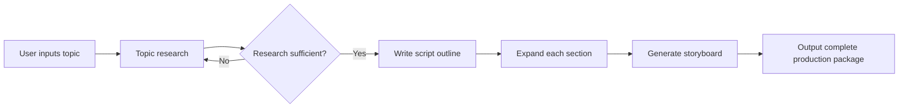

Building an AI Agent is fundamentally different from making a regular LLM API call. A regular call is stateless and single-step; an Agent needs to maintain state across multiple steps, make decisions based on tool results, and handle mid-execution failures. LangGraph wraps this complexity into a directed graph, letting you define Agent workflows declaratively.

This is lesson 3 of the "AI Programming in Practice" series. The goal: build a video production AI Agent that takes a topic as input and automatically produces research notes, a script outline, section-by-section scripts, and storyboard descriptions.

## TL;DR

Building a video production Agent with LangGraph means: (1) defining a clear State structure, (2) writing each task as an isolated node function, (3) using conditional edges to handle retry logic and branching. Don't try to build this with OpenCV + TensorFlow — that's the wrong abstraction. A video production Agent's core is LLM reasoning and tool calls, not traditional ML training.

## Prerequisites

```bash
pip install langgraph langchain-openai langchain-community
```

You'll need:
- An OpenAI API key (or any compatible LLM API)
- Python 3.10+
- Basic understanding of Python async/await

## Overall Agent Design

The video production workflow breaks down into clear steps, each with well-defined inputs and outputs:



## Step 1: Define the State

The core of LangGraph is the State — a data structure that flows through the entire workflow:

```python
from typing import TypedDict, List, Optional
from langgraph.graph import StateGraph, END

class VideoProductionState(TypedDict):
    topic: str
    research_notes: Optional[str]
    outline: Optional[List[str]]
    script_sections: Optional[List[str]]
    storyboard: Optional[List[str]]
    error: Optional[str]
    retry_count: int
```

Each node receives this state, modifies it, and returns an updated version. This makes state flow fully traceable.

## Step 2: Implement Node Functions

Each node is a function that receives a state and returns a state:

```python
from langchain_openai import ChatOpenAI

llm = ChatOpenAI(model="gpt-4o-mini", temperature=0.7)

def research_node(state: VideoProductionState) -> VideoProductionState:
    topic = state["topic"]
    
    response = llm.invoke([
        {"role": "system", "content": "You are a professional video content researcher."},
        {"role": "user", "content": f"Research the topic '{topic}' and provide 5 key points with supporting facts."}
    ])
    
    return {**state, "research_notes": response.content, "retry_count": 0}

def outline_node(state: VideoProductionState) -> VideoProductionState:
    notes = state["research_notes"]
    
    response = llm.invoke([
        {"role": "system", "content": "You are a video script planner."},
        {"role": "user", "content": f"Based on these research notes, plan the outline for a 5-minute video:

{notes}"}
    ])
    
    outline = [line.strip() for line in response.content.split('
') if line.strip()]
    return {**state, "outline": outline}
```

## Step 3: Add Conditional Edges

Conditional edges let the graph choose different next steps based on node execution results:

```python
def should_retry_research(state: VideoProductionState) -> str:
    notes = state.get("research_notes", "")
    retry_count = state.get("retry_count", 0)
    
    if len(notes) < 200 and retry_count < 2:
        return "retry"
    return "continue"

builder = StateGraph(VideoProductionState)

builder.add_node("research", research_node)
builder.add_node("outline", outline_node)

builder.set_entry_point("research")

builder.add_conditional_edges(
    "research",
    should_retry_research,
    {
        "retry": "research",
        "continue": "outline"
    }
)
```

## Step 4: Assemble and Run

```python
graph = builder.compile()

initial_state = VideoProductionState(
    topic="The future of quantum computing",
    research_notes=None,
    outline=None,
    script_sections=None,
    storyboard=None,
    error=None,
    retry_count=0
)

result = graph.invoke(initial_state)
print(result["script_sections"])
```

## Common Issues

**Q: Why not just use LangChain's AgentExecutor?**

AgentExecutor works well for tool-calling Agents (ReAct pattern), but for workflows with a defined step sequence, LangGraph gives you much better visibility — you can see exactly which step the Agent is on and what the inputs/outputs are at each step.

**Q: How do you handle LLM call failures?**

Wrap node logic in try/except, record the error in the state's `error` field, then use a conditional edge to decide whether to retry or terminate.

**Q: How do you give the Agent external tools like web search?**

Use LangChain's `@tool` decorator to define tools, then call them directly inside node functions, or use `ToolNode` to wrap tools as graph nodes.

## References

- [LangGraph official documentation](https://langchain-ai.github.io/langgraph/)
- [LangGraph concepts: State Management](https://langchain-ai.github.io/langgraph/concepts/low_level/)
- [LangChain tools guide](https://python.langchain.com/docs/modules/agents/tools/)
