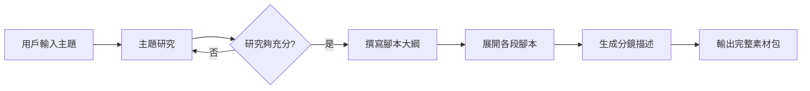

AI Agent 的開發和普通 LLM API 呼叫有本質的差別：普通呼叫是無狀態的單次請求，而 Agent 需要維護跨步驟的狀態、根據工具回傳的結果做決策、並且處理中途失敗的情況。LangGraph 把這個複雜性包裝成有向圖（directed graph），讓開發者用聲明式的方式定義 Agent 的工作流程。

這篇文章是「AI 程式開發實戰」系列的第三課，目標是建構一個影片製作 AI Agent：輸入一個主題，Agent 自動完成主題研究、腳本撰寫、分鏡描述等步驟，輸出完整的影片製作素材。

## TL;DR

用 LangGraph 建構影片製作 Agent 的核心是：(1) 定義清楚的 State 結構，(2) 把每個任務寫成獨立的節點函數，(3) 用條件邊處理失敗重試和分支邏輯。不要用 OpenCV + TensorFlow 去「訓練」Agent，那是錯誤的抽象——影片製作 Agent 的核心是 LLM 推理和工具呼叫，不是傳統的機器學習訓練。

## 前置條件

```bash
pip install langgraph langchain-openai langchain-community
```

需要：
- OpenAI API key（或任何相容的 LLM API）
- Python 3.10+
- 基本的 Python async/await 理解

## Agent 的整體設計

影片製作流程可以拆解成幾個明確的步驟，每個步驟有清楚的輸入和輸出：



## 步驟一：定義 State

LangGraph 的核心是 State——一個貫穿整個工作流程的資料結構：

```python
from typing import TypedDict, List, Optional
from langgraph.graph import StateGraph, END

class VideoProductionState(TypedDict):
    topic: str
    research_notes: Optional[str]
    outline: Optional[List[str]]
    script_sections: Optional[List[str]]
    storyboard: Optional[List[str]]
    error: Optional[str]
    retry_count: int
```

每個節點接收這個 state，修改它，然後回傳更新後的版本。這讓狀態的流向完全可追蹤。

## 步驟二：實作各節點

每個節點是一個接收 state 回傳 state 的函數：

```python
from langchain_openai import ChatOpenAI

llm = ChatOpenAI(model="gpt-4o-mini", temperature=0.7)

def research_node(state: VideoProductionState) -> VideoProductionState:
    topic = state["topic"]
    
    response = llm.invoke([
        {"role": "system", "content": "你是一個專業的影片內容研究員。"},
        {"role": "user", "content": f"請針對「{topic}」進行深入研究，提供5個關鍵論點和相關事實。"}
    ])
    
    return {**state, "research_notes": response.content, "retry_count": 0}

def outline_node(state: VideoProductionState) -> VideoProductionState:
    notes = state["research_notes"]
    
    response = llm.invoke([
        {"role": "system", "content": "你是一個影片腳本策劃師。"},
        {"role": "user", "content": f"根據以下研究筆記，規劃一個5分鐘影片的大綱：

{notes}"}
    ])
    
    # 簡單解析：把每行當成一個大綱項目
    outline = [line.strip() for line in response.content.split('
') if line.strip()]
    return {**state, "outline": outline}
```

## 步驟三：加入條件邊

條件邊讓 graph 可以根據節點的執行結果選擇不同的下一步：

```python
def should_retry_research(state: VideoProductionState) -> str:
    notes = state.get("research_notes", "")
    retry_count = state.get("retry_count", 0)
    
    # 如果研究筆記太短，且還沒重試超過 2 次，就重試
    if len(notes) < 200 and retry_count < 2:
        return "retry"
    return "continue"

# 建構 graph
builder = StateGraph(VideoProductionState)

builder.add_node("research", research_node)
builder.add_node("outline", outline_node)
# ... 其他節點

builder.set_entry_point("research")

builder.add_conditional_edges(
    "research",
    should_retry_research,
    {
        "retry": "research",   # 回到自己
        "continue": "outline"  # 繼續下一步
    }
)
```

## 步驟四：組裝和執行

```python
graph = builder.compile()

# 執行
initial_state = VideoProductionState(
    topic="量子計算的未來",
    research_notes=None,
    outline=None,
    script_sections=None,
    storyboard=None,
    error=None,
    retry_count=0
)

result = graph.invoke(initial_state)
print(result["script_sections"])
```

## 常見問題

**Q：為什麼不直接用 LangChain 的 AgentExecutor？**

AgentExecutor 適合工具呼叫型 Agent（ReAct 模式），但對於有明確步驟順序的工作流程，LangGraph 的可見性更好——你能清楚看到 Agent 走到哪一步、每步的輸入輸出是什麼。

**Q：如何處理 LLM 呼叫失敗？**

在節點函數裡包 try/except，失敗時把錯誤記錄到 state 的 `error` 欄位，然後用條件邊決定要重試還是終止：

```python
def research_node(state: VideoProductionState) -> VideoProductionState:
    try:
        # ... 正常邏輯
        return {**state, "research_notes": response.content}
    except Exception as e:
        return {**state, "error": str(e)}
```

**Q：如何讓 Agent 使用外部工具（如網路搜索）？**

用 LangChain 的 tool decorator 定義工具，然後在節點裡直接呼叫，或者使用 `ToolNode` 把工具包裝成 graph 節點。

## 參考資料

- [LangGraph 官方文件](https://langchain-ai.github.io/langgraph/)
- [LangGraph 概念文件：State Management](https://langchain-ai.github.io/langgraph/concepts/low_level/)
- [LangChain 工具使用指南](https://python.langchain.com/docs/modules/agents/tools/)
