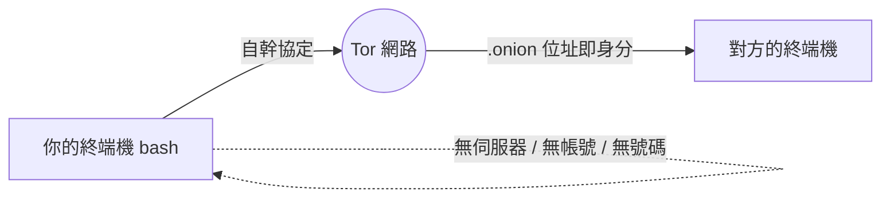

打開 GitHub 動態，畫面幾乎被 AI 佔滿——AI agent 在審查另一個 AI agent 的 pull request，最多星星的 repo 其實只是一堆教你怎麼跟機器人講話的 markdown 檔。但在這層「AI 廢水」底下，還是有一群真人在做著瘋狂、漂亮、而且深度沒必要的軟體。

這篇整理自 The Code Report（2026 年 5 月 26 日那一集），挑出裡面幾個「本來就不該存在、卻真的有人做出來」的開源專案。它們的共通點不是實用，而是那種明知代價很高、還是硬要做的偏執。

## Ratty：游標是一隻旋轉 3D 老鼠的終端機

Ratty 是一個用 Rust 寫、靈感來自 TempleOS 的終端機模擬器，作者是 Warren Parmacksis。

它跟一般終端機最大的不同是：**它不只是渲染文字，而是用 Bevy 遊戲引擎渲染一整個 GPU 加速的 3D 場景**。游標本身是一隻旋轉的 3D 老鼠。你可以按 `Ctrl + Alt + Enter` 把整個終端機在 3D 空間裡傾斜，像在玩 PS2 遊戲一樣「飛」過去；甚至可以把自己用 Blender 做的爛 3D 模型丟進來。

唯一的代價是它會吃掉 300MB 的 RAM——而現在的 RAM 並不便宜。作者自己也很清楚這有多離譜，他的原話是：

> 「一切都是有代價的，尤其是那隻旋轉的老鼠游標。」

## Terminal Phone：跑在 Tor 上的終端機電話

想像你人在終端機裡，Vim 開著、tmux 疊了三層 pane，這時要接電話——你不用解鎖手機，直接從 bash 裡打。

Terminal Phone 是一個開源的**按鍵通話（push-to-talk）語音與文字 app，整個以 shell script 的形式完全跑在 Tor 之上**。沒有伺服器、沒有帳號、沒有電話號碼，你的身分就是一個 `.onion` 位址，所以一切都是短暫的（ephemeral）且端對端加密。

作者在二月時把這個專案上線，協定是從零自幹的。這大概就是 1995 年那些 cypherpunk 承諾我們、卻等了三十年才有一個瘋子真的做出來的東西。

## They Live 風格的擋廣告器

1988 年，在網際網路都還沒普及之前，John Carpenter 拍了一部電影：主角戴上一副墨鏡，眼前每一塊看板、每一本雜誌、每一則廣告，都被揭露成外星人的心智控制宣傳，叫你「服從、消費、結婚、生小孩」。

開發者 David Lawrence 意識到，這其實是實作一個擋廣告器**在美學上最正確**的方式。他早在 2015 年就有這個點子，放了整整十年，最近才終於做出來——它是 uBlock Origin Light 的一個 fork。

它不只是把廣告擋掉，而是把整個上網體驗變成一部 80 年代的科幻恐怖片。

## CUDA Oxide：用 Rust 寫 GPU kernel（Nvidia 官方出品）

前面那些都出自地下室駭客，但 CUDA Oxide 不一樣——它是市值五兆美元的 Nvidia 上週悄悄丟到 GitHub 上的，而且它解決的是一個很實際的問題。

要寫 CUDA kernel（跑在 GPU 上的程式碼），你得小心翼翼地雕 C++，然後祈禱 compiler 不要 segfault，因為只要一個 pointer 寫錯，就能把你價值四萬美金的 GPU 叢集變成一塊廢鐵。

CUDA Oxide 想解決這件事：**讓你用純 Rust 寫 GPU kernel**。只要在函式上標註 `kernel`，你就有了能真正跑在 GPU 上的 Rust 程式碼，而且它會**直接編譯成 PTX**——中間完全沒有 FFI（foreign function interface），也沒有任何 C++。

## Wario Synth：把任何歌變成 Game Boy 芝麻音

每個很酷的專案都該有自己的主題曲，Wario Synth 就是幹這個的：你貼進一首歌，它把整首歌吐回來，變成 Game Boy 的 chiptune。

它底層用的是 Web Audio API，靠兩個 pulse wave、一個 wave channel 跟一個 noise channel，把整首歌重新合成成聽起來像從 1989 年 Game Boy 裡跑出來的聲音——而且這一切都直接在瀏覽器裡完成。

## 小結

這幾個專案沒有一個是為了「生產力」而做的。它們的價值在於：在滿是 AI agent 互相 review 的 GitHub 動態底下，還是有人願意花力氣做一隻旋轉老鼠游標、一支跑在 Tor 上的電話、一個把網頁變成恐怖片的擋廣告器。明知代價很高、明知沒必要，卻還是做了——這本身就是最高等級的讚美。

## 參考資料

- [The Code Report — 影片原始來源](https://www.youtube.com/watch?v=qPuzWFvRajk)
