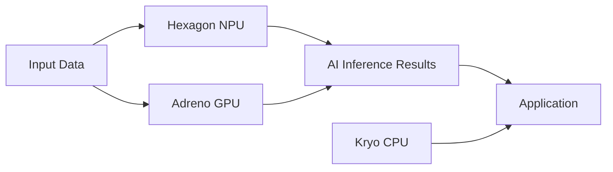

In discussions about AI chips, NVIDIA and AMD capture most of the attention. But one company is pursuing a fundamentally different AI strategy — and it's increasingly worth engineers paying attention to. That's Qualcomm.

Qualcomm isn't trying to compete with NVIDIA head-on in data center model training. Its bet is in a different direction: running AI on the phone in your pocket, the PC on your desk, the car on the road, and the robots soon to be mass-produced.

## TL;DR

Qualcomm's AI strategy is centered on **edge inference**, not cloud training. The Snapdragon X Elite's NPU lets 7B-parameter models run locally on a laptop. 6G's core design goals include low-latency AI inference loops. Physical AI is the vision of integrating perception, decision-making, and actuation onto a single chip. All three point in the same direction: AI that runs in real time on-device without requiring a network connection.

## The Business Logic of Edge AI

Why run AI on the device rather than in the cloud? There are clear reasons:

**Latency**: Having a self-driving car's decision system query cloud AI for every decision is infeasible. On-device inference can bring latency from hundreds of milliseconds down to single digits.

**Privacy**: More users and enterprises don't want to send data to the cloud. On-device AI makes "data never leaves the device" possible.

**Cost**: API call costs at scale are substantial. The marginal cost of running a local model approaches zero.

**Offline capability**: Remote areas, underground, on aircraft — many scenarios lack stable network connectivity.

Qualcomm's Snapdragon X Elite integrates CPU, GPU, and NPU (Neural Processing Unit), optimized for on-device LLM inference. According to Qualcomm, it can run a quantized version of Llama 3 70B at approximately 30 tokens/second on a Windows laptop.

## Snapdragon's AI Architecture

Snapdragon X Elite's NPU is called the Hexagon NPU, delivering 45 TOPS (Tera Operations Per Second) of AI compute. This figure became the marketing benchmark for "AI PCs" in 2024 — Microsoft requires Copilot+ PCs to have at least 40 TOPS NPU capability.

Qualcomm is also advancing Qualcomm AI Hub on Snapdragon, letting developers deploy models from Hugging Face directly to Snapdragon devices without manual model optimization.

## 6G: AI-Native Communications

6G isn't just "faster 5G." Qualcomm emphasizes several AI-native design goals in 6G standards work:

**AI-assisted radio resource management**: Base stations can use AI to predict user movement trajectories and proactively allocate bandwidth and handoff — rather than reacting after signal degrades.

**Sensing integration**: 6G base stations can simultaneously handle communication and environmental sensing, using radio signals to build a 3D map of surroundings. This matters for autonomous vehicles and robot localization.

**Ultra-low latency**: Target end-to-end latency below 1ms, making remote AI inference assistance for local decision-making viable.

6G is expected to see commercial deployment around 2030. Qualcomm's patent portfolio from 5G gives it significant leverage in 6G standard-setting.

## Physical AI: From Perception to Action

Physical AI means AI directly controlling physical-world machines — robots, drones, industrial equipment. Qualcomm's entry point is providing the edge compute platform these devices need.

Traditional robot control systems and perception systems are often separate: camera images go somewhere for processing, results come back to control motors. This loop's latency and power consumption are serious problems for mass-market hardware.

Qualcomm's Robotics RB platform series (based on Snapdragon) integrates:
- Multi-camera inputs
- Computer vision NPU
- Low-latency CPU cores for real-time control
- 5G connectivity

Boston Dynamics and multiple Chinese humanoid robot manufacturers are using or evaluating Snapdragon-series chips as the compute core for their robots.

## Qualcomm vs. NVIDIA

| Dimension | NVIDIA | Qualcomm |
| --- | --- | --- |
| Main battleground | Data center training and inference | Edge device inference |
| Core product | H100/H200 GPU + CUDA | Snapdragon SoC |
| Power consumption | 300–700W | 5–20W |
| Price | $10,000–$40,000/chip | $50–$200 (SoC at volume) |
| AI software ecosystem | CUDA near-monopoly | Weaker, actively building |

These two aren't direct competitors — they serve different markets. In edge AI, Qualcomm's closer competitors are Apple (A18 Pro, M-series) and MediaTek.

## Summary

Qualcomm's AI strategy has a clear logic: use AI to strengthen its existing core capabilities (low-power SoC design and wireless communications), rather than attacking NVIDIA's data center market. 6G and Physical AI are extensions of this logic, not buzzword-chasing.

For engineers, Snapdragon's edge AI capabilities are now at a level worth serious consideration. If you're building applications that need on-device AI inference — privacy protection, low latency, offline capability — Qualcomm AI Hub and Snapdragon's NPU are options you can actually test today.

## References

- [Qualcomm Snapdragon X Elite specs](https://www.qualcomm.com/products/mobile/snapdragon/pcs-and-tablets/snapdragon-x-series/snapdragon-x-elite)
- [Qualcomm AI Hub](https://aihub.qualcomm.com/)
- [6G vision whitepaper - Qualcomm](https://www.qualcomm.com/research/6g)
- [Qualcomm Robotics RB platform](https://www.qualcomm.com/products/internet-of-things/industrial/robotics)
