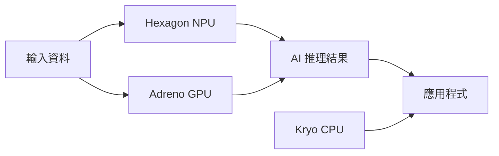

在 AI 晶片的討論裡，NVIDIA 和 AMD 搶走了大部分的注意力。但有一家公司在 AI 浪潮中的策略完全不同，而且正越來越值得工程師關注——那就是高通（Qualcomm）。

高通不打算在資料中心訓練大模型的競爭裡跟 NVIDIA 硬碰硬。它的賭注是另一個方向：把 AI 跑在每個人口袋裡的手機上、桌上的 PC 上、路上的汽車裡、和即將量產的機器人身上。

## TL;DR

高通的 AI 策略核心是 **邊緣推理（edge inference）**，而不是雲端訓練。Snapdragon X Elite 的 NPU 讓 70 億參數的模型可以在筆電上本機執行；6G 的核心設計目標之一是低延遲的 AI 推理迴路；Physical AI 則是把感知、決策、執行整合到同一顆晶片上的願景。這三件事指向同一個方向：讓 AI 不依賴網路連線，在裝置端實時運行。

## 邊緣 AI 的商業邏輯

為什麼要把 AI 跑在裝置上而不是雲端？有幾個明確的原因：

**延遲**：讓一個自駕車的決策系統每次都去雲端問 AI 是不可行的。本機推理的延遲可以從百毫秒降到個位毫秒。

**隱私**：越來越多用戶和企業不希望把資料送到雲端。本機 AI 讓「資料不離開裝置」成為可能。

**成本**：API 呼叫的費用在大規模應用下會非常可觀。本機跑模型的邊際成本接近零。

**離線能力**：偏遠地區、地下、飛機上——很多場景沒有穩定的網路連線。

高通的 Snapdragon X Elite 晶片，整合了 CPU、GPU 和 NPU（Neural Processing Unit），針對本機 LLM 推理做了優化。根據高通的資料，它可以在 Windows 筆電上以約 30 token/秒的速度執行 Llama 3 70B 的量化版本。

## Snapdragon 的 AI 架構

Snapdragon X Elite 的 NPU 稱為 Hexagon NPU，提供 45 TOPS（Tera Operations Per Second）的 AI 算力。這個數字在 2024 年成為「AI PC」的行銷標準——微軟要求 Copilot+ PC 至少有 40 TOPS NPU。

高通同時在 Snapdragon 上推進 Qualcomm AI Hub，讓開發者可以把 Hugging Face 上的模型直接部署到 Snapdragon 裝置上，不需要手動做模型最佳化。

## 6G：AI Native 的通信標準

6G 不只是「比 5G 快」。高通在 6G 標準的制定工作中強調幾個 AI Native 的設計目標：

**AI 輔助的無線資源管理**：基地台可以用 AI 預測用戶移動軌跡，提前分配頻寬和切換基地台，而不是等到信號變差才反應。

**感知（Sensing）整合**：6G 基地台可以同時做通信和環境感知，用無線信號建立周圍環境的 3D 地圖，這對自駕車和機器人定位很有意義。

**超低延遲**：目標是讓端對端延遲降到 1ms 以下，讓遠端 AI 推理輔助本機決策成為可行。

6G 預計 2030 年左右商業部署。高通在 5G 的專利積累讓它在 6G 標準制定中有強大的談判籌碼。

## Physical AI：從感知到行動的整合

Physical AI 是指讓 AI 直接控制物理世界的機器——機器人、無人機、工業設備。高通的切入點是提供這些設備所需的邊緣計算平台。

傳統機器人的控制系統和感知系統往往是分離的：攝影機的影像送到某個地方處理，處理結果再回來控制馬達。這個迴路的延遲和功耗在量產硬體上是大問題。

高通的 Robotics RB 系列平台（基於 Snapdragon）整合了：
- 多路攝影機輸入
- 電腦視覺 NPU
- 即時控制的低延遲 CPU 核心
- 5G 連線能力

波士頓動力、多家中國人形機器人廠商，都在使用或評估 Snapdragon 系列晶片作為機器人的計算核心。

## 跟 NVIDIA 的差別

| 面向 | NVIDIA | Qualcomm |
| --- | --- | --- |
| 主戰場 | 資料中心訓練和推理 | 邊緣裝置推理 |
| 核心產品 | H100/H200 GPU + CUDA | Snapdragon SoC |
| 功耗 | 300–700W | 5–20W |
| 價格 | $10,000–$40,000/顆 | $50–$200（SoC 批量價） |
| AI 軟體生態 | CUDA 幾乎壟斷 | 相對薄弱，努力建構 |

兩者不是正面競爭，而是分處不同市場。在邊緣 AI 的市場，高通的競爭對手更接近 Apple（A18 Pro、M 系列）和 MediaTek。

## 小結

高通的 AI 版圖有清晰的邏輯：用 AI 強化自己最強的核心能力（低功耗 SoC 設計和無線通信），而不是去打 NVIDIA 的資料中心市場。6G 和 Physical AI 是這個邏輯的延伸，而不是跟風 AI 趨勢的口號。

對工程師來說，Snapdragon 平台的邊緣 AI 能力已經到了值得認真考慮的水準：如果你在做需要本機 AI 推理的應用（隱私保護、低延遲、離線能力），Qualcomm AI Hub 和 Snapdragon 的 NPU 是一個現在就可以實際動手測試的選項。

## 參考資料

- [Qualcomm Snapdragon X Elite 規格](https://www.qualcomm.com/products/mobile/snapdragon/pcs-and-tablets/snapdragon-x-series/snapdragon-x-elite)
- [Qualcomm AI Hub](https://aihub.qualcomm.com/)
- [6G 願景白皮書 - Qualcomm](https://www.qualcomm.com/research/6g)
- [Qualcomm Robotics RB 平台](https://www.qualcomm.com/products/internet-of-things/industrial/robotics)
