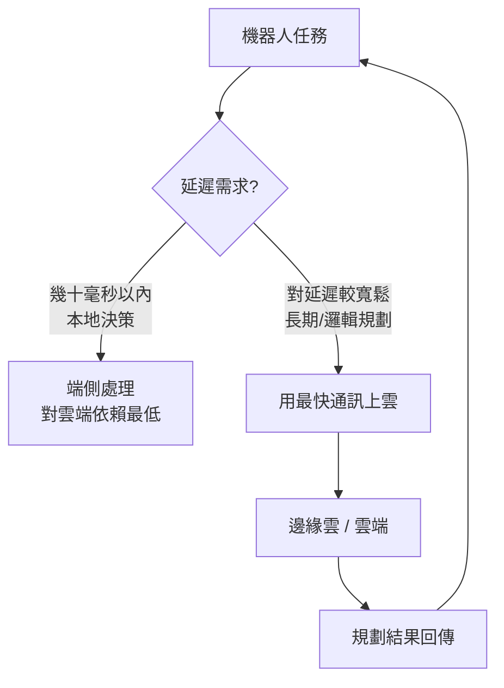

在這一輪 AI 週期裡，前沿大模型在檯面上互相廝殺，但水面下有一個容易被忽略的贏家：高通。過去一年高通股價大漲約 60%，並在五月底創下歷史新高。推動力來自「Physical AI」概念在今年走進主流——AI 手機、AI PC、XR 眼鏡、汽車、機器人這些**邊緣裝置**的需求開始起量，再加上市場對 6G 的期待，讓佈局通訊與晶片多年的高通，旗下的驍龍（Snapdragon）產品被寄望成為「邊緣 AI」生態的核心供應商。

這篇文章整理自高通在北京舉辦的「驍友會五週年派對」現場，與高通公司全球副總裁徐晧的對談，拆解高通對每一類終端的技術判斷與佈局邏輯。

## 明線與暗線：AI 從雲端往端側落地

用一個觀察來開場：今年的 AI 有兩條線。**明線**是大家還在卷最強、最 SOTA 的大模型；**暗線**則是端側模型是否已經好到能有更好的應用落地。

徐晧的判斷是：AI 最早的發展一定以雲端為主，因為大家想先摸清人工智慧的能力邊界在哪；但到了現在這個階段，越來越多應用其實需要終端的支持。從智慧手機開始，到 XR 眼鏡、車的自動駕駛與車內娛樂、再到各種機器人——這些都是把原本在雲端做的事情，慢慢落地到端側。這是一個可能有百億、千億體量的應用市場，所以高通非常積極地推動 AI 在端側的落地。

## 讓 AI 上端側，難點是模型還是算力？

真正的技術難點，其實同時卡在「手機上能放多大的模型」和「怎麼把模型優化到又省電、算力又夠、記憶體又用得少」。

值得注意的是一個大趨勢：**模型正在變小**。高通做過一個研究——2024 年最好的 Llama 模型可能是一百多 billion 甚至幾百 billion 參數；但不到一年之內，只有 4 billion 或幾十 billion 的小模型，就能在同樣功能下達到相同、甚至更好的效果。

支撐這個趨勢的是幾類反覆迭代的技術：

- **蒸餾（distillation）**：用大模型去訓練一個體量小很多的模型，更適合在端側跑。
- **量化（quantization）**：把雲端常用的浮點運算轉成定點運算，好處有兩個——運算更快，且降低對晶片儲存的需求。
- **LoRA Adaptation（低秩適配）**：保留一個大模型，另外掛一個小模型去適配當下要做的任務。
- **MoE（Mixture of Experts，混合專家）**：養很多個專項專家，靠一個總調度按問題類型調用對應的專家。

再加上模型優化、減少記憶體與功耗，才能在端側打造出「節能、算力好、記憶體用得少」的架構。

## 手機：從影像處理到 AI agent

手機上的 AI 應用大致經歷了三代演進：

1. **影像處理**：最早是拍照，所以高通做了大量的 image processing 與 camera optimization。
2. **語言對話**：大語言模型出現後，使用者開始直接跟 AI 軟體對話、問任何問題。
3. **Agentic 應用**：這是現在最明顯的趨勢——不需要先裝 App，直接跟手機講你要什麼，它就根據能找到的所有資訊把事情做出來。

這也是為什麼會說「AI is the new UI」。從鍵盤、按鍵到語音指揮，從「選 App」到「不用選 App」，互動方式正在轉變。

現場一個代表性的例子是**榮耀的 Robot Phone**，其中「隨音而舞」的特性：你告訴它想聽音樂放鬆，它用榮耀自帶的音樂識別能力把整體節拍抓出來，再調用雲台控制演算法，生成一系列擬人化的雲台動作——攝影機會跟著節拍點頭、擺動，換一個節拍動作就不一樣。它開創了一種新的終端形態：直板手機配上一顆可移動、可翻轉的雲台攝影機。

支撐這些的是高通的**異構架構**：CPU、GPU、NPU 各自發揮所長，每年的旗艦產品支援的 AI 演算法也越來越多。

至於「AI 手機」形態，目前有兩條並行的技術路線：

- **整機即 agent**：從按下電源鍵開始，所有交流都用語音，像跟一個人對話一樣指揮它。
- **Super App**：仍是現在的手機，但裝一個能打通所有 App 的超級應用，你直接告訴它要什麼。Google 某種程度上就是這種形態——它本身就有 Map、Email、Google Pay、Google Travel。

哪一條會跑出來還不好說：第一種需要打通整個生態、需要時間養；第二種則看你的體量是否足夠大，能把所有人吸引到你的平台上。這更多是需要時間驗證的問題，而不是純技術問題。（也不排除有做 AI 的新公司帶著全新理念進場。）

## 機器人：算力更強、延遲更低

作為傳統晶片廠，高通給機器人的晶片有幾個特點：算力需要比手機更強（因為要規劃的事情更多）；能承載更大的面積、對能耗的要求也比手機寬鬆；因此可以做更大、更強的晶片，並支援更好的大語言模型與 **VLA（Vision-Language-Action，視覺-語言-行動）**、world model。產品線從低端只負責運動控制，到高端具備「大腦」與 VLA 能力，再到業界頂尖算力去支撐最複雜的應用。

現場兩個機器人都跑在高通**驍龍 QCS8550** 平台上：

- **加速進化 K1**：端側 AI 算力很強，提供語義理解與自主感知，現場示範了點球動作。
- **阿加犀「通天曉」**：阿加犀與高通聯合打造的具身智慧機器人。CPU 支撐流暢的舞蹈與環境互動動作；GPU 同時處理多路攝影機的影像；NPU 同時跑 ASR（語音辨識）、TTS（語音合成）與端側 LLM 推理——在純端側環境下達到相對即時的本地推理，做到「能懂、能動、還能聊」。

機器人對**低延遲**特別敏感，尤其當任務越來越複雜、與人的互動越來越緊密時。高通的優勢在於把三件事結合起來：通訊、AI、機器人。

原則就是：能在端側解決就在端側解決，端側算力做不到的大規劃，再用最快的通訊手段送到邊緣雲或雲端。現在 5G 從基站到手機大約是毫秒級，所以延遲要求在幾十毫秒以外的可以放雲端；幾十毫秒以內的就在端側做。而 6G 的目標是把這個延遲進一步壓到更短。

## 6G：AI-native 的下一代通訊

6G 預計商用時間點在 **2029 到 2030 年之間**。它跟 5G 最大的區別，是要更多地考慮**人工智慧原生（AI-native）**的設計——因為過幾年 AI 產生的流量需求可能佔到整體流量的 30% 到 40%，6G 網路必須撐得住。

6G 也會納入一些全新的元素：

- **智能體之間如何連接**：當手機、手錶、眼鏡、甚至未來的指環等端側終端越來越多，它們彼此、以及和網路之間怎麼最有效地連接。
- **通感一體化（integrated sensing and communication）**：通訊與感知合一。無線訊號打出去後會從不同物體反彈回來，透過接收與理解這些訊號，可以建立一張由無線訊號產生的地圖。這個「感知的世界」加上攝影機、加上地圖，就能構建一個物理世界，用來做 AI 訓練、物理世界的理解與監測。
- **低空經濟與空管**：未來滿街都是無人機在飛時，怎麼控制、怎麼追蹤，也是 6G 要考慮的設計元素。

至於延遲，難點往往不在基站到手機這一段，而在雲端 / IP 端到端的調度與傳輸。5G 有一個 **TSN（Time Sensitive Network，時間敏感網路）**，會在每個封包上打時間戳，保證端到端延遲可控——這個思路在 6G 也會延續，盡量把延遲壓到幾毫秒到十幾毫秒範圍。

## 汽車：一顆數位底盤統管全車

車上有兩個系統，需求不同：

- **自動駕駛**：需要對周圍環境有很好的理解、判斷再決策，要求**高算力、快速度**；相對地，對能耗的要求沒有機器人和手機那麼緊，記憶體可以多給一點。
- **車載娛樂（infotainment）**：大螢幕、環繞音響——現在很多人不在客廳看電視了，全到車裡看。

高通的做法是 **Snapdragon Ride** 與業界首個提出的「驍龍數位底盤」概念：用一個統一規劃的底盤，把車上所有感測器（雷達、視訊、光達、揚聲器）都連上去統一調度，並且懂得**優先級**。例如零跑用兩顆晶片分別支撐智駕與娛樂，但這兩顆也可以結合——自動駕駛需要大算力時，把大部分算力調給它；娛樂系統有需求、而智駕不吃那麼多算力時，再勻一些過去。

現場的旗艦車型是**零跑 D19**，全球首批搭載**雙驍龍 8797** 晶片。相比上一代平台，8797 的 GPU、CPU 提升接近 **3 倍**，NPU 的 AI 算力提升更達 **12 倍**。它帶來幾個變化：座艙、空間、車機系統深度融合成「中央集算模式」，優化電氣線路、節約成本、提升整車協調性與反應速度；座艙實現「五屏聯動」（中控、儀表、前擋屏、後排娛樂屏、風扇操作屏）；乘客用 AI 大模型的同時，駕駛可享受 VLA 多模態輔助駕駛；並支援全車 40 個以上攝影機、含光達在內共 28 個精密感測硬體協同，還能 OTA 線上升級——為未來 L3、L4 甚至更高級的輔助駕駛提供平台。（北京車展上甚至有車企在車上「養龍蝦」，也是在用這股 AI 算力。）

車的下一個難點，更多是**生態的打通**：出停車場時車的付費系統有沒有跟停車場打通、在車上能不能直接叫外送到家。這些屬於 **MCP、A2A（Agent-to-Agent）** 層面的東西，需要生態繼續發展。徐晧也點出這裡有很多創業機會——你的車庫門、周邊充電系統、家裡的機器人，是不是也都夠智慧、能彼此互動。

## XR 眼鏡：空間最小、卻是最難的端側 AI

XR 眼鏡長期有「雞生蛋、蛋生雞」的問題：要有人願意戴，才會有更多應用；要有應用，別人才願意買。近幾年的進步主要在體驗與外形——從很重的 XR 眼鏡，做到和一般眼鏡差不多的厚度。

但從某些角度看，眼鏡反而是**最難的端側 AI**：空間就這麼一點，能放晶片的地方比手機還小，還要塞攝影機、收語音、藏晶片，電池幾乎沒地方放。高通的解法有兩層——一方面把整合晶片做到越小越好，算力剛好夠處理眼鏡上該處理的事；另一方面把它連到手機或算力更強的終端。這裡用到一個叫 **split rendering（分離式渲染）**的技術：一部分成像在眼鏡上做、一部分在手機上做，把最耗能的事丟給手機，盡量把眼鏡上的能耗與算力降到最小。目前業界大部分 XR 眼鏡都用高通的 XR 晶片。

現場的**千問 S1 眼鏡**搭載高通 **AR1 平台**，雙目 3D 顯示，喚醒詞是「你好千問」。導航示範中說「導航去國貿」，眼鏡上就顯示出地圖與步行路線（10.5 公里、2 小時 41 分），反應速度很快；日常還能拍照、做會議記錄。

有 AI 加持後，眼鏡出現一些新應用：

- **See what you can see（見你所見）**：把你看到的東西快速、遠端地讓親友看到，或直接發到雲端做即時直播——需要攝影機加上快速連接。
- **視覺記憶**：眼鏡平時定時觀察周遭、壓縮記下來存到手機。你隨時可以問「我的鑰匙放哪了」，它會回你「幾秒鐘前看到在桌上」。
- **隱私**：只要在錄影就會亮一個紅點——這是設計時必須考慮的問題。

## AI PC 是偽命題嗎？

關於「AI PC 是不是偽命題」，徐晧的回答是否定的。高通前幾年就推出了第一款支援 AI 應用的 PC 晶片架構，當時還做過用 AI PC 指揮一支機械臂當「調酒師（bartender）」的演示——你跟 PC 說要什麼飲料，機械臂就從後面拿過來遞給你。

現階段 **AI 商業化最強的用例是 coding（寫程式）**，大家目前多半調用雲端算力與 token。但有些東西使用者想留在本機：處理視訊、相片、Email 這類個人資料，可能就希望它留在 PC 上而不是傳上雲端。所以 AI PC 其實有很多應用空間。

## 端側的「不可能三角」與個性化

端側裝置長期面對一個「不可能三角」：**記憶體、功耗、性能**。高通的平衡思路是**結果導向**——先看要給使用者什麼體驗，再回頭決定端雲怎麼分工。

一個關鍵設計是**本地個性化資料庫（local personalized library）**：在手機端側對個人資訊做預處理，把最重要的資訊簡化、壓縮，作為 local memory 存在端側——你的偏好、常訂哪家飯店、買什麼航班、去哪玩、行事曆、最近跟誰交流、關注什麼、想到哪買東西。要做大規劃時，手機能做就在手機做；做不到就把某些資訊提供給雲端、由雲端規劃再傳回來。這就是所謂 **AI agent / personalized agent** 的意義——一個個性化、專為個人適配、再與雲端結合的智能體。

這樣做同時解決了幾件事：用戶體驗與性能、把能耗降到最小（配合前面的模型壓縮技術）、以及盡量把價格壓下來。也正因如此，高通會針對車、手機、PC、機器人各自不同的算力與價位需求，量身訂做不同的晶片設計。

## 小結

把整場對談串起來，高通的邏輯很清楚：它不去正面打雲端訓練，而是用自己最強的兩項核心能力——低功耗 SoC 設計與無線通訊——去卡住端側推理這個位置。手機、機器人、汽車、XR 眼鏡、PC 各有不同的算力、功耗、延遲與價位需求，高通用一套「異構架構 + 模型壓縮 + 端雲協同」的方法論逐一覆蓋，並用 6G 把端與雲之間的延遲繼續壓短。

對工程師來說，真正值得記住的不是某顆晶片的規格，而是這個趨勢：**模型在變小、算力在下沉、延遲敏感的決策正往端側走**。而端側能不能成，很多時候卡的不是技術，而是生態與時間——這也正是徐晧反覆提到「有非常多創業機會」的地方。

## 參考資料

- [原始影片：高通驍龍的 AI 佈局（對話高通全球副總裁徐晧）](https://www.youtube.com/watch?v=eAYx6CHstNw)
