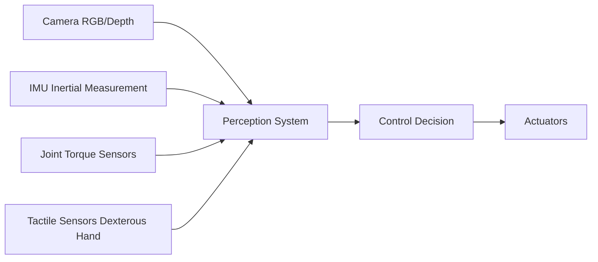

Boston Dynamics' Atlas backflip video amazed the world in 2017. What few people knew: that backflip used hydraulic actuators — extremely high power consumption, complex maintenance, essentially impossible to mass-produce. Seven years later, humanoid robots are genuinely moving toward mass production, but the bottleneck has shifted from "can it move?" to a completely different set of problems.

This post dissects humanoid robot hardware — from actuator selection to supply chain realities — to answer why "doing a backflip" and "working reliably in a factory for 10,000 hours" are problems of entirely different difficulty.

## TL;DR

The mass production bottleneck for humanoid robots isn't AI — it's hardware: high-precision harmonic drives are in short supply, dexterous hand tactile sensors aren't mature, and battery energy density limits working hours. The leading manufacturers (Figure, Tesla Optimus, Unitree H1) have chosen different technical paths, and no single design will dominate in the near term.

## Design Philosophy: The Performance-Manufacturability-Cost Triangle

Humanoid robot hardware design doesn't optimize a single objective — it navigates three conflicting ones:

**Performance**: high torque density, fast response, precise control — pointing toward hydraulics or high-torque motors.

**Manufacturability**: standardized parts, simplified assembly, high reliability — pointing toward electric drive, avoiding hydraulic plumbing complexity.

**Cost**: reducing per-joint manufacturing cost — pointing toward standard components rather than custom parts.

The current mainstream approach is **electric motor + harmonic drive**, trading hydraulic power density for manufacturability and reasonable cost.

## Core Subsystem Breakdown

### Actuators: The Most Expensive Parts

Actuators convert electrical energy into joint motion. Each joint in a humanoid robot needs one or more actuators.

**Harmonic drives** are currently the most common choice. They provide high reduction ratios (100:1 is typical) in a small package, turning low-torque motor output into the high torque joints need. The problems:
- Global supply of high-precision harmonic drives is heavily concentrated — key suppliers are Japan's Harmonic Drive and Nabtesco, plus a handful of Chinese manufacturers
- Expensive: a high-precision harmonic drive can cost hundreds to thousands of dollars
- A humanoid robot has 20–40 joints, so this cost directly determines the BOM

**Quasi-direct drive motors** — promoted by MIT's Cheetah and subsequent robots — are another direction: low reduction ratios, high backdrivability, letting the robot sense external force inputs (force control). They sacrifice torque density for more natural dynamic behavior.

### Sensors: Letting the Robot "Feel" the World

**Proprioception** (joint position, velocity, torque) is the foundation of stable walking control. High-precision joint encoders are necessary, but long-term reliability in high-vibration environments is an engineering challenge.

**Dexterous hand tactile sensing** is currently the weakest link. A human hand has over 17,000 tactile receptors. Existing robot finger tactile sensors are either too low-resolution, too fragile, or too expensive. "Catching a falling leaf" requires sensing extremely light forces — technically far harder than a backflip.

### Structural Materials: Weight vs. Rigidity

Humanoid robots need to balance self-weight against load capacity:

| Material | Advantages | Disadvantages | Application |
| --- | --- | --- | --- |
| Carbon fiber composite | Lightweight, high stiffness | Hard to machine, expensive, hard to mass produce | Limb structural parts |
| Aluminum alloy | Mature processing, reasonable cost | Heavier | Main structural components |
| Titanium alloy | High strength-to-weight ratio | Very expensive | High-stress joints |
| Engineering plastics | Lightest, easy to mass produce | Low strength | Shells, non-load-bearing parts |

## The Real Mass Production Bottlenecks

### Supply Chain Concentration Risk

High-precision harmonic drives, high torque density motors, 6-axis force/torque sensors — these key components come from highly concentrated supplier bases.

In 2024, as Figure, Physical Intelligence, Unitree, and Zhiyuan all moved toward mass production simultaneously, harmonic drive lead times began extending. This is a "everyone competing for the same suppliers at the same time" problem.

### Assembly and Quality Consistency

Humanoid robot assembly is far more complex than automotive: joints need precise clearance control, cable management in high-DOF structures is a nightmare, and sealing and waterproofing need to hold up under repeated bending. Boston Dynamics spent over a decade building its manufacturing capabilities.

### Battery and Energy Density

Current humanoid robots typically run 1–3 hours per charge. Lithium battery energy density limits how much energy can be stored within a given space and weight budget. If solid-state batteries commercialize between 2027–2030, the impact on robotics could be as significant as AI model improvements.

## Overall

Humanoid robot hardware engineering is going through a critical inflection: from "can it work?" to "can it be mass-produced?" This transition requires not just better AI, but an entire hardware supply chain — actuators, sensors, materials — all reaching production quality simultaneously.

For engineers, the challenges and opportunities in this space are very concrete. If you're working on sensor fusion, joint control, or supply chain engineering, humanoid robotics is a domain where both technical requirements and market scale are growing rapidly.

## References

- [Boston Dynamics Atlas technical blog](https://bostondynamics.com/atlas/)
- [MIT Leg Lab - Cheetah](https://biomimetics.mit.edu/)
- [Unitree H1 specifications](https://www.unitree.com/h1/)
- [Figure 01 official page](https://www.figure.ai/)
