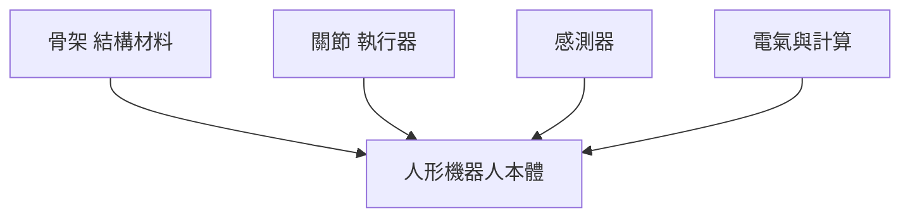

從轉手絹、扭秧歌，到高難度空翻、武術，再到半程馬拉松跑出打破人類世界紀錄的成績——人形機器人的「本體」在這兩年進化得異常快。有人說，人形機器人幾乎每天都要承受車禍等級的衝擊力，還動不動被人類「圍毆」，它到底是怎麼撐下來的？

《硅谷101》主持人陳茜為此訪談了幾位業內人士，試圖回答一個看似簡單的問題：造機器人的門檻真的不高嗎？公司的護城河又在哪裡？這篇文章依據那場訪談，把機器人的身體拆開來看。

機器人身上的硬體種類繁多，可以粗略分成四個系統：

- **骨架**：撐起整個架構
- **關節（執行器）**：驅動骨架運動
- **感測器**：感知環境與自身狀態
- **電氣與計算**：指揮全身的中樞

下面就從骨架開始，一路拆到晶片。

## 骨架：扛下幾十個 g 的衝擊，卻只賺「辛苦費」

一輛車以時速 60 公里撞向假人，巨大的衝擊力會把假人撞得七零八落。而對人形機器人來說，承受這種衝擊力已經是「日常」——受訪者表示，機器人每一次空翻觸地，身上承受的加速度可能比汽車、航太都要高，他們測過，跟汽車撞牆差不多，有幾十個 g。

這對結構材料提出了矛盾的要求：要翻得起來，身體就得夠輕；要扛下衝擊，強度又得夠大，否則一個空翻零件就飛出去了。材料的演進正是沿著這條線走：

- 世界上第一台全尺寸機器人 **WABOT-1** 以鋼材為主，體重約 160 公斤，跳一下大概就能把地板砸個坑，更別說翻跟頭。
- 從本田的 **ASIMO**、波士頓動力早期的液壓版 **Atlas**，到第一代特斯拉 **Optimus**，**鋁合金**成為主流，密度只有鋼的三分之一。
- 現在業界開始探索**鎂合金**，密度比鋁又低了三分之一；在膝關節、腳踝等經常承受衝擊的部位，則局部使用強度更高的**鈦合金**。

有意思的是，這些硬骨架幫機器人扛下衝擊，供應商賺的卻只是「辛苦費」。受訪者直言，骨架最後的賣價扣掉金屬含量、扣掉拋掉的廢料，加工費佔比其實很低很低——說到底還是賣金屬加加工費，沒什麼太大門檻，一旦量起來，加工費會趨近於一個很低的水準。

至於**外觀件**，可分兩類：一類是裝飾保護件，用在胸、背、頭部，材料從塑膠、仿皮 TPU 到織物五花八門，主要為了降低磨損、讓觸感更親人（有些看起來像金屬機身的，其實是塑膠外殼做了金屬噴漆）；另一類是讓機器人像真人的仿生皮膚，皮下還要植入觸覺感測器。

## 關節：整台機器人成本最高、技術最密集的部分

真正讓機器人做出高難度動作的是關節，這也是整個硬體裡故事最多的部分。幾年前看波士頓動力 Atlas 後空翻還覺得驚豔，現在習以為常，背後原因是關節從**液壓系統轉向了馬達**。受訪者說，以前造不出這麼好的關節，性能都很差，其實很難翻得起來；最近這一兩年關節技術進步非常大。

關節在業內稱為**執行器（actuator）**，分為**旋轉執行器**與**直線執行器**。以肩膀為例，它有三個自由度——前後擺（俯仰）、上下抬（滾轉）、內外旋（偏航），本質上都是旋轉，靠三個旋轉執行器組合，手臂就能朝 X、Y、Z 三個方向自由活動；膝關節一般只需要一個自由度，一個旋轉或直線執行器就夠了。

兩種執行器內部都有一套**伺服系統**，由馬達、編碼器、驅動器、感測器組成。最大的區別在於：旋轉執行器是**伺服馬達＋減速器**，直線執行器是**伺服馬達＋絲槓**。

### 為什麼需要減速器：拿速度換力量

馬達天生「高轉速、低扭矩」，轉速輕鬆上萬轉，但輸出力矩小。機器人的關節卻需要在只轉幾度的同時搬動重物，所以要靠減速器降轉速、提扭矩。減速比越大，速度降得越多，輸出扭矩就越高。業界最常用三種：

| 減速器 | 結構特點 | 特性 | 常用部位 |
| --- | --- | --- | --- |
| 行星減速器 | 中心齒輪帶動行星輪，再帶動外圈大齒輪 | 結構小、成本低，但減速比小、輸出扭矩較低 | 手部關節 |
| 諧波減速器 | 波發生器把柔輪撐成橢圓，與鋼輪只差 2 齒嚙合 | 減速比大、輸出扭矩強、精度高；但柔性結構抗衝擊較差 | 肘、肩關節 |
| RV 減速器 | 第一級行星齒輪＋第二級擺線針輪，多齒同時嚙合 | 剛性好、抗衝擊強 | 髖、膝、腰等抗衝擊部位 |

前面提到後空翻時關節承受的力相當於汽車撞擊，這也解釋了為什麼諧波減速器的柔性結構撐不住那些部位，得換上剛性更好的 RV 減速器。

減速器是非常精密的部件，加工難度高，長期磨損下的穩定性更難保證——這是整個關節裡最難的一環。受訪者形容它是個「不可能三角」：當你大批量製造，齒輪精度與長時間運行的穩定性要求都很高，用了一千個小時就出現各種異響、性能下降，機器人走路可能就沒以前好、甚至逐漸走歪；做極限動作又可能把裡面的小齒輪撞壞。**造一個減速器不難，難的是造出一萬個性能一致、又耐用、摔倒還抗得住衝擊的減速器。**

### 直線執行器：最像肌肉，卻還不適合大規模量產

直線執行器可以說是最像人體肌肉的——手臂擺動時，並不是關節主動旋轉，而是連接兩端骨骼的肌肉在收縮。它只做推拉一種運動，有些機器人的膝關節就用它模仿膝部肌肉；多個直線執行器透過特定結構組合，還能實現手腕、腳踝的旋轉。

最簡單的直線執行器是液壓裝置，波士頓動力老版 Atlas 就以直線液壓缸為主，具有高爆發、抗衝擊、功率密度大的優勢。但液壓系統複雜、容易漏油、控制精度也不如馬達，所以新版 Atlas 也轉向了馬達驅動。

馬達只能旋轉，要輸出直線運動就得靠**絲槓**：絲槓軸上有螺紋，旋轉時帶動螺母做直線運動，像拧螺絲一樣。為了減小摩擦，內部會加入滾珠（滾珠絲槓），或把滾珠換成滾柱，壽命更長、承載與剛性更好（行星滾柱絲槓），此外還有 T 型絲槓。目前用得較多的是滾柱絲槓，對加工精度要求非常高，且長行程內的一致性要非常好。

不過整體來看，直線執行器在業界應用較少，主要有三個原因：動態性能差、製造難、成本高。它的優點是載荷能做得更大、不供電也能自鎖保持姿態；缺點是載荷大、減速比大導致動態性能沒那麼敏捷，而且很難低成本大批量製造。目前量產最多的仍是旋轉關節。

### 馬達：發熱、體積與 TN 曲線

機器人身體常用的是**無框力矩馬達**——沒有外殼和軸承，只保留核心部件，好直接嵌進關節內部縮小尺寸。靈巧手比較特殊，用體積更小的**空心杯馬達**，輸出功率也就沒那麼高（受訪者指出，靈巧手的難度甚至比整個本體還高）。

馬達的難點集中在三塊：

**能效與散熱。** 一旦過熱，控制系統只能降功率，可能空翻到一半突然「腿軟」倒地。受訪者說最早期的樣品，這些極限動作十分鐘內只能做一次，因為做完轉速轉矩的性能曲線整個就變了，得先冷卻降溫才能繼續。這裡的關鍵是發熱不是線性的：關節做一次極限動作，瞬時電流可能是平時的 3～5 倍，發熱量就是額定狀態的 9～25 倍，做一次空翻關節溫度可能從溫升 10 度直接跳到 50 度。所以能效 3% 和 5% 之間差異巨大，會直接限制敢不敢把性能往上抬。目前多數關節靠被動散熱——機身大量金屬可當成巨大散熱片，只有腿部這類大功率關節才額外加風冷或液冷。

**體積。** 工程師想方設法縮小關節馬達，一方面為了減重降本，更重要的是體積越大轉動慣量越大，改變運動狀態越難——就像甩繩子，繩子越長轉得越慢、要停下來緩衝時間也越長。

**性能穩定性（TN 曲線）。** 也就是輸入多少電流時，轉速多少、能輸出多大扭矩。走過不平路面時，腳踝的六維力矩感測器感知起伏，需要動態調整電流控制扭矩；如果 TN 曲線不穩，同樣的指令輸出扭矩卻有偏差，結果就是摔倒。TN 曲線也影響演算法訓練——機器人演算法先在模擬系統裡訓練，如果模擬的曲線和現實差太多，現實表現就會走樣。最難的動作往往要求極高速度下還有極高爆發力，這時 TN 曲線一旦在高轉速下掉性能，動作就做不了。

要精確控制馬達，還需要伺服系統：**編碼器**測量轉子的角度、速度、位置（因為關節裡有減速器，必須用**雙編碼器**同時知道輸入端與輸出端的位置才能精確控制）；**驅動器**依編碼器回饋與「小腦」指令調整電壓電流；再加上力矩、溫度等**感測器**。

### 執行器為何是降本關鍵：自研 vs 採購

據美國銀行測算，執行器是機器人身上成本最高的部件，約佔 **51%**。受訪者打了個比方：馬達（肌肉）加控制器，比骨骼、比眼睛（感測器）、腦子（晶片）、心臟（電池）都要貴，所以執行器是未來量產降本的關鍵。

最主要的推力是中國供應鏈太「捲」了——不少原本要在其他國家精加工的部件，現在國內都能找到替代：做馬達的**臥龍電驅**，做減速器的**綠的諧波、雙環傳動、中大力德**，甚至能直接提供完整執行器的**三花智控、拓普**等。

既然市面上買得到現成執行器，機器人公司為什麼還要自己苦哈哈研發？兩種模式各有取捨：

- **採購成品**：降低研發成本、提升開發效率，但物料成本更高、難以按需客製、性能也有所不足——供應商賣的是標準件，不會專門為你設計。團隊人少、關節積累不夠的公司，買別人的會更快。
- **自研**：能更好匹配需求與演算法、性能更強，但要付出大量研發精力。

據受訪者調查，目前頭部機器人公司更偏向自研，甚至會進駐供應商那邊參與設計。因為關節不只是把零件裝在一起，而是要在極小體積內同時平衡力量、精度、耐久、成本、重量——這是整個身體最難的部分。原因在於這是新興產業，供應鏈此前並不成熟，很多產線設備業內原本沒有，得自己設計。

## 感測器：讓機器人站得穩、感知世界

不論人類怎麼「圍毆」，機器人大多很難摔倒，這靠的是身上一整套感測器。

- **本體感知**：前述馬達伺服系統，透過關節裡的編碼器與力矩感測器，即時感知每個關節的位置與受力，以每秒上千次的頻率調整輸出。
- **IMU（慣性測量單元）**：相當於人的內耳前庭系統，感知身體的傾斜與旋轉。核心是**加速度計**（測 X、Y、Z 三軸加速度）與**陀螺儀**（測俯仰、偏航、滾轉三軸角速度），再加上當電子羅盤用來校準的**磁力計**。被踹一腳時，身體瞬間獲得加速度並前後左右倒，IMU 偵測到變化後把資料傳給「小腦」，算出各關節該增減多少扭矩把身體拉回來。這類部件在手機、汽車上用得很多，技術相對成熟。
- **視覺系統**：常見方案是攝影機＋光達＋毫米波雷達的多感測器融合，和汽車自駕很像；例外是特斯拉 Optimus，馬斯克是堅定的純視覺派，只用攝影機。

值得注意的是，同一種感測器，機器人的規格和汽車大不相同。以較貴的**光達**為例：

1. **測距**：汽車要跑高速，得看到 150～200 公尺外的障礙；機器人主要在室內，10～20 公尺就夠，測距短意味著功率、體積、成本都能更低。
2. **點雲密度與掃描方式**：汽車辨識車、人、路障這些大物體，密度可以低一些；機器人要在桌上拿螺絲起子、在地上撿硬幣，需要更密的點雲。受訪者用的是非重複掃描——原地站一會兒點雲會變得更密，這對慢慢操作的機器人很有利。
3. **安裝位置與體積**：車可裝在車頂、保險桿，機器人身體小，必須用更小的模組。
4. **可靠性**：汽車常年在室外，工作溫度要求 -40℃～85℃；機器人現階段不需要這麼寬，但受到的衝擊更大，對抗震性要求更高——汽車出車禍的加速度，才達到機器人日常空翻一次的加速度。

所以汽車光達很多為可靠性做的設計，在機器人看來是冗餘的。雖然汽車光達已很成熟，機器人光達仍處於非常早期——想要體積更小、點雲更密、距離更短但 FOV 更大，這些需求都還沒被滿足。

在攝影機上，一位前特斯拉 AI 硬體負責人告訴《硅谷101》：他們選了車規攝影機，目前方案是 500 萬畫素。早期堆了很多不同畫素的攝影機，還降幀率、提畫素——因為馬斯克提了「穿針引線」的要求，當時算下來得超過 1500 萬畫素才看得見；但一旦改畫素、改攝影機，重新訓練模型的時間與工作量就太大，於是又考慮加自動對焦、後來又覺得未必需要，方案一直在變。

### 觸覺：2025 年幾乎沒人用，2026 年才看到量產希望

觸覺主要有四種途徑：**壓阻式**（把壓力轉成電阻，電子秤在用）、**電容式**（施壓時電極距離變小、電容值變化）、**壓電式**（材料受力直接產生電壓，如打火機放電那個小元件）、**光學式**（表面彈性材料受力形變，用攝影機捕捉，是目前最熱門的方式）。

觸覺最好是三維的——不只感受壓力，還能感受平面上的摩擦。比如拿起一罐飲料往上抬，手指若感受到向下滑的摩擦力，就會加大捏的力度避免滑落。但這對材料和演算法都是大挑戰：任何材料都很難在 X、Y、Z 三個方向上很好地解耦，精度比一維力難得多；這麼複雜的三維資料怎麼跟操作模型結合，也很難，因為整體資料量還非常少。

因此，2025 年量產的產品裡幾乎不搭載觸覺——受訪者說整個行業都用得很少，原因是不穩定：長期抓東西時稍微變形，輸出信號可能就完全不一樣，還要避免性能漂移、形狀位置不能破損，材料又要柔軟又要耐磨，本身就很矛盾。到了 2026 年情況似乎有變化，受訪嘉賓表示看到了規模化生產的希望，接下來就是如何在資料採集訓練中讓觸覺系統更好地結合。整體而言，觸覺這個行業還非常早期。

除此之外，機器人身上還有溫度、濕度、六維力矩感測器、UWB 等，這些都比較成熟。

## 電氣與計算：大腦與小腦的分工

要讓感測器和關節結合，還需要一個中樞。演算法上業界發展出 **System 1 + System 2** 的雙系統架構（System 1 操控四肢、System 2 做複雜思考），在晶片上也對應「小腦＋大腦」的組合。為什麼不用一顆晶片幹所有事？因為需求相反：

- **大腦晶片**思考「該怎麼做事」，需要高算力、大記憶體，最好能在端側跑大模型，延遲個幾秒基本沒影響。目前絕大多數機器人大腦選 **NVIDIA Orin**；2025 年 NVIDIA 推出性能更高、專為機器人與物理 AI 設計的 **Thor**，預計成為未來主流。特斯拉 Optimus 例外——用自研晶片，而且是雙晶片。有趣的是，馬斯克起初覺得機器人不像自駕有安全考量，一顆就夠；後來一想不對，機器人的世界模型對算力的需求遠高於自駕（自駕兩顆都夠嗆），又改回兩顆。今年初 CES 上，高通也發布了機器人大腦晶片 **Dragonwing IQ10**，並宣布與 Figure 合作。
- **小腦晶片**操控身體，不需要特別高的算力，但即時性、穩定性、響應速度必須高，延遲個幾毫秒就可能摔倒。機器人空翻、跳舞基本是用提前錄好的動作，但它腳下那些碎步，就是小腦在動態調節平衡，像人類的本能反應——小腦頻率可能達到 1K Hz。小腦晶片通常是 MCU，主流選擇有意法半導體 **STM32**、恩智浦 **i.MX RT**、瑞薩 **RZ** 等系列。

現在有個新趨勢：把大腦和小腦晶片整合在一起。特斯拉比較前沿，一開始走的就是這條路——用 Hardware 4 的自研晶片，大腦小腦集中在同一顆上，一個 SOC 裡既有算力 ASIC、又有多核 CPU（CPU 處理小腦，頻率高、延遲低）。此外，靈境智源在今年 3 月發布了**德沃夏克架構**，在一塊晶片上整合「大腦、小腦、皮層」三個功能。整合的好處：整個胸腔的體積與走線更簡潔；大腦小腦之間的協調越往後越重要（像有人朝你扔飛鏢，看軌跡、做預測是大腦，伸手去抓是小腦，兩者通訊越快越有利於完成高難度動作），做在一起晶片間通訊會非常快。不過業內看法是，統一大小腦晶片還處於很早期，要等出貨夠多、市場夠大，機器人公司才會像現在的智慧汽車公司一樣逐漸轉向一體化自研晶片。

最後是為全身供能的**電池**，像機器人的心臟，核心需求是在更小的體積密度下把容量做高，主要供應商有寧德時代、LG、億緯鋰能等；還有遍布全身的**線束**，像神經與血管，負責通信與供電，主要供應商有立訊精密、TE Connectivity、Amphenol 等。

## 組裝與量產：「能動」和「好用」之間的鴻溝

前段時間的機器人半程馬拉松上，有的隨地大小坐、有的跑著跑著腳崴了、手臂掉了、衝上綠化帶、被減速帶絆倒後「粉身碎骨」；但也有表現亮眼的——**榮耀**的機器人不僅包攬前六名，還刷新了人類的半馬紀錄。連手機廠商做機器人都能這麼好，是不是意味著這行業沒什麼門檻？業內人士的回答是「Yes and No」。

**Yes 的部分：** 前面提到的各零部件，供應商和手機、汽車行業高度重合；再往上，演算法也有部分能和自駕複用。這正是榮耀、小米、特斯拉、小鵬會下場做機器人的原因。受訪者估算，電氣與計算的供應商重合度可達 90% 以上，機械結構就算模具不同、供應商也大同小異，感測器也一樣——唯一和汽車相關性沒那麼高的是電驅（車裡不需要提供這麼大扭矩的東西），但減速器、齒輪這類汽車裡多得是。整體 80% 以上的東西是可以同質的，理論上只要認識這些供應商，就能自己搓出一台機器人。

**No 的部分：** 「能動」和「好用」之間隔著一道巨大鴻溝。比如組裝後重量分布不均，重心就偏，走路為了平衡某些關節得額外出力，功耗增加、續航減少，甚至影響步態穩定；你為了散熱或減重做的每個選擇，都會讓另一端的性能變差——想讓它更輕，就承受不了多少重量。實驗室裡跑一小時沒問題，放到真實環境跑一百小時，各種毛病就出來了：某個螺絲鬆了、某根線磨損了、某個關節的潤滑脂乾了、某個感測器開始漂移，這些都得靠不斷調試才能找到平衡點。

正如受訪者所說：把每個零部件拆給各家供應商，單看難度都不高，**最後系統整合才是最難的**。你用人形把它框住之後，還要在力矩大小與精密度上達到人類的高度，這才是難點，更多是工程路徑上的權衡。市面上買到的標品往往離演算法應用的要求有差距，所以核心零部件得自己動手做；而要做出可商業化、能量產的機器人，還會面臨一致性問題——因為每一台的關節，都必須性能一致。

看到這裡，你大概已經明白怎麼「拼」出一台機器人。但真正的護城河，從來不是認識哪家供應商，而是在人形這個嚴苛約束下，把力量、精度、耐久、成本、重量一次次調到平衡，並且一萬台都一樣。

## 參考資料

- [《硅谷101》：拆解人形機器人的本體（YouTube）](https://www.youtube.com/watch?v=DZIhQeFEdXI)
