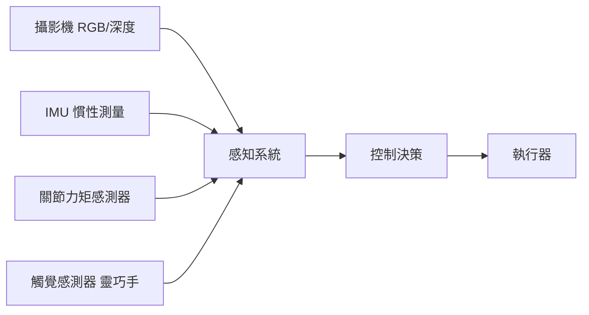

波士頓動力的 Atlas 後空翻影片在 2017 年驚艷了全世界。但很少人知道的是，做出那個後空翻用的是液壓執行器，功耗極高、維護複雜、幾乎不可能大規模量產。七年後，人形機器人開始真正走向量產，但瓶頸從「能不能動」變成了完全不同的一組問題。

這篇文章拆解人形機器人的硬體架構，從執行器選型到供應鏈現實，試圖回答：為什麼「會翻跟頭」和「能在工廠裡工作一萬小時」是兩件難度完全不同的事。

## TL;DR

人形機器人的量產瓶頸不在 AI，而在硬體：高精度的諧波減速器供應緊缺、靈巧手的觸覺感測器尚未成熟、電池能量密度限制了工作時長。目前走在最前面的廠商（Figure、Tesla Optimus、宇樹 H1）都選擇了不同的技術路線，短期內不會有「一種設計統治全部」的結果。

## 設計哲學：效能、量產性、成本的三角

人形機器人的硬體設計不是最佳化一個目標，而是在三個相互衝突的目標中做取捨：

**效能**：高力矩密度、快速響應、精準控制——這指向液壓或高扭矩電機。

**量產性**：零件標準化、組裝簡化、可靠性高——這指向電機驅動，避免液壓的複雜管路。

**成本**：降低每個關節的製造成本——這指向盡量使用通用零件而非定制件。

當前主流方向是 **電機 + 諧波減速器**，放棄了液壓的高爆發力，換取可量產性和相對合理的成本。

## 核心子系統拆解

### 執行器：整個機器人最貴的零件

執行器（actuator）是把電能轉換成關節運動的核心元件。人形機器人的每個關節需要一個或多個執行器。

**諧波減速器**是目前最主流的選擇。它能在小體積內提供高減速比（100:1 常見），讓普通電機的低扭矩輸出變成關節需要的高扭矩。問題是：
- 全球高精度諧波減速器的產能高度集中，主要供應商是日本的 Harmonic Drive、納博特斯克，以及少數中國廠商
- 成本高：一個高精度諧波減速器可能要幾百到幾千美元
- 人形機器人有 20–40 個關節，這個成本直接決定整機的 BOM

**準直驅電機**是 MIT Cheetah 和後續一代機器人推廣的另一個方向：低減速比、高反向驅動性，讓機器人可以感知外部力的輸入（force control）。犧牲了扭矩密度，換來了更自然的動態行為。

### 感測器：讓機器人「感覺」世界

**本體感知**（關節位置、速度、力矩）是控制穩定行走的基礎。高精度的關節編碼器是必要的，但在高振動環境下的長期可靠性是工程挑戰。

**靈巧手的觸覺感測**是目前最薄弱的環節。人的手有超過 17,000 個觸覺受體。現有的機器人手指觸覺感測器要麼解析度太低，要麼太脆弱，要麼太貴。「接住一片落葉」需要感知極輕微的力，這個技術難度比後空翻高很多。

### 結構材料：重量和剛性的取捨

人形機器人需要在自重和承載能力之間取得平衡。主流材料選擇：

| 材料 | 優點 | 缺點 | 應用部位 |
| --- | --- | --- | --- |
| 碳纖維複合材料 | 輕量、高剛性 | 加工困難、成本高、量產困難 | 肢體結構件 |
| 鋁合金 | 加工成熟、成本合理 | 重量較重 | 主要結構件 |
| 鈦合金 | 強度重量比高 | 成本很高 | 高應力關節 |
| 工程塑膠 | 最輕、量產容易 | 強度低 | 外殼、非承力件 |

## 量產的真正瓶頸

### 供應鏈集中風險

高精度諧波減速器、高扭矩密度電機、六維力/力矩感測器——這幾個關鍵零件的供應商高度集中。

2024 年，隨著 Figure、Physical Intelligence、宇樹、智元等多家公司同時進入量產階段，諧波減速器的供貨週期已經開始拉長。這是一個「大家同時搶同一批供應商」的問題。

### 組裝和品質一致性

人形機器人的組裝比汽車複雜很多：關節需要精準的間隙控制，線纜管理在高自由度結構裡是噩夢，密封和防水需要在反復彎曲的部位維持。波士頓動力花了超過十年建立自己的製造能力。

### 電池和能量密度

目前人形機器人的工作時長普遍在 1–3 小時。鋰電池的能量密度限制了在有限空間和重量預算內能攜帶的能量。固態電池如果在 2027–2030 年間商業化，對機器人的影響可能不亞於 AI 模型的進步。

## 整體來說

人形機器人的硬體工程正在經歷一個關鍵轉折：從「能做到」到「能量產」。這個轉折需要的不只是更好的 AI，而是一整條尚未成熟的硬體供應鏈——從執行器到感測器到材料——全部同時達到量產品質。

對工程師來說，這個領域現在的挑戰和機會都非常具體：如果你在做感測器融合、關節控制、或供應鏈工程，人形機器人是一個技術需求和市場規模都在快速增長的方向。

## 參考資料

- [波士頓動力 Atlas 硬體技術部落格](https://bostondynamics.com/atlas/)
- [MIT 腿部機器人實驗室 - Cheetah](https://biomimetics.mit.edu/)
- [宇樹機器人 H1 技術規格](https://www.unitree.com/h1/)
- [Figure 01 官方頁面](https://www.figure.ai/)
