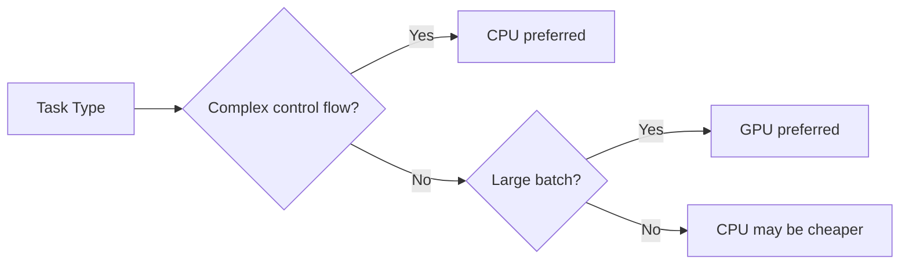

Hardware selection was simple before the AI application explosion: CPU for most work, GPU if you need graphics processing. Now it's significantly more complex — you also need to know when to use a TPU, and when running on a GPU is actually slower than CPU (and why).

## TL;DR

CPU has a few powerful cores, excellent at sequential logic and complex control flow. GPU has thousands of weak cores, excellent at doing massive amounts of identical computation simultaneously. TPU is Google's ASIC designed specifically for neural network matrix multiplication — on specific workloads, both performance and energy efficiency far exceed GPU. Choosing wrong isn't just a performance problem; at scale the cost differences are substantial.

## CPU: General-Purpose King, But Not Universal

Modern CPUs (Intel Xeon, AMD EPYC) are designed to let each core execute arbitrary instruction sequences as fast as possible. This requires sophisticated mechanisms:

**Out-of-order execution**: CPUs don't strictly execute in program order — as long as data dependencies allow, they execute future instructions early.

**Branch prediction**: CPUs guess if/else branch outcomes and start executing ahead, rolling back on wrong predictions. This dramatically reduces latency, but wrong predictions have costs (Spectre/Meltdown exploited this).

**Cache hierarchy**: L1/L2/L3 caches keep data as close to cores as possible, avoiding main memory waits (DRAM is roughly 100x slower than L1 cache).

These mechanisms make CPUs excellent at complex control flow: web servers, database queries, complex business logic. But for tasks requiring massive identical computation simultaneously, CPU core counts (typically 8–64) become the bottleneck.

**CPU-appropriate AI workloads**:
- Small model fast inference (batch size 1 real-time serving)
- Pre/post-processing (tokenization, data cleaning)
- CPU inference for small transformer models is sometimes comparable to GPU and significantly cheaper

## GPU: Training Workhorse, But Often Misunderstood

GPU design philosophy is the opposite of CPU: use thousands of simple compute cores to execute the same operation simultaneously.

An NVIDIA H100 has 16,896 CUDA cores (plus many more Tensor Cores). These cores aren't good at complex logic, but for regular operations like matrix multiplication, their massive parallel execution capability gives throughput that far exceeds CPU.

**GPU-appropriate scenarios**:
- Deep learning training (massive matrix multiplication)
- Batch inference (large batch sizes that can fill GPU cores)
- Scientific computing (fluid dynamics simulation, molecular dynamics)
- Graphics rendering (the original design purpose)

**Common GPU misuse**:
- Real-time inference for individual requests (batch size 1) — GPU can be slower than CPU because data transfer overhead exceeds compute time
- Control-flow heavy logic (many if/else branches) — GPU's SIMT architecture degrades severely under branch divergence

## TPU: Google's ASIC for TensorFlow

TPUs (Tensor Processing Units) are AI accelerators Google has been building internally since 2016. Not a general-purpose accelerator — purpose-built for the most common operation in neural network training and inference: matrix multiplication.

**TPU's key design: the Systolic Array**

Traditional GPUs doing matrix multiplication have each compute unit reading data from memory. Systolic arrays let data "flow through" an array of compute units — data passes between units, each doing computation as data passes through, without repeated memory reads/writes. This dramatically reduces memory bandwidth pressure.

**TPU-appropriate scenarios**:
- Large-scale deep learning training (Google trains PaLM and Gemini with TPU Pods)
- Batch inference for JAX/TensorFlow workloads
- Models with dense matrix operations and simple control flow

**TPU limitations**:
- No native PyTorch support; requires XLA compilation
- Not suitable for small batch, high control-flow models
- Only accessible through Google Cloud TPU; can't purchase hardware

## Real Cost Comparison

This is the part most articles skip. Using Google Cloud pricing as an example (2024 pricing, subject to change):

| Hardware | Specs | Hourly Cost | Best For |
| --- | --- | --- | --- |
| n2-standard-8 CPU | 8 vCPU, 32GB RAM | ~$0.38 | Small model inference, pre/post-processing |
| T4 GPU | 16GB VRAM | ~$0.35–$0.70 | Medium model inference |
| A100 GPU | 40/80GB VRAM | ~$2.93–$3.67 | Large model training and inference |
| H100 GPU | 80GB VRAM | ~$6–$10 | Latest large model training |
| TPU v4 | 32GB HBM | ~$3.22 | Large-scale JAX/TF training |

The key is utilization: if your GPU utilization is only 30%, you're wasting 70% of your spend. The `gpu_util` field in `nvidia-smi` is the first metric to check.

## Which Scenario Gets Which Hardware

**Online inference service (low latency requirements)**:
- Small batch services: CPU may be sufficient, or T4 GPU
- Low-latency large model serving: A100/H100, but verify GPU utilization

**Training large models**:
- JAX/TF workloads: TPU v4/v5 on Google Cloud is the optimal choice
- PyTorch workloads: H100 clusters

**Local development and experimentation**:
- Apple Silicon M-series chips' unified memory architecture (CPU and GPU sharing memory) gives surprisingly strong advantages for medium-sized model inference
- Consumer GPUs (RTX 4090) match A100 training efficiency for workloads that fit in VRAM at a fraction of the cost

## Summary

CPU vs GPU vs TPU selection is ultimately a function of "your workload's computation pattern" and "cost budget." No single hardware is optimal in all scenarios. What engineers need to do is understand which pattern their workload falls into, then match appropriate hardware — not reach for GPU by default because "GPU runs AI."

## References

- [Google Cloud TPU documentation](https://cloud.google.com/tpu/docs/intro-to-tpu)
- [NVIDIA H100 whitepaper](https://www.nvidia.com/en-us/data-center/h100/)
- [In-Datacenter Performance Analysis of a Tensor Processing Unit (2017)](https://arxiv.org/abs/1704.04760)
- [Making Deep Learning Go Brrrr From First Principles](https://horace.io/brrr_intro.html)
