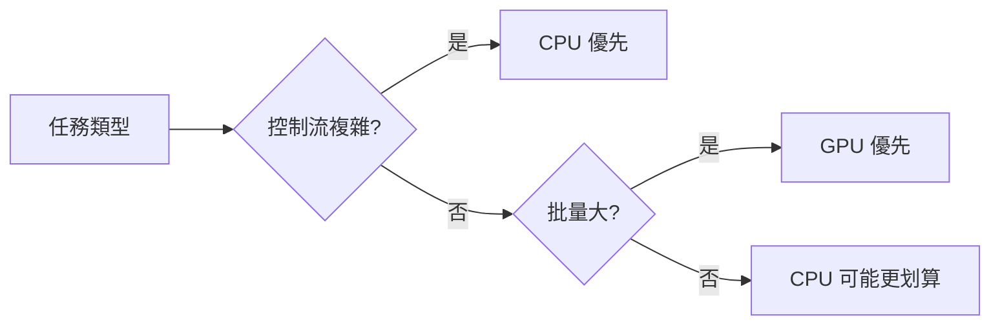

選硬體的問題在 AI 應用爆炸之前其實很簡單：大多數工作用 CPU，需要圖形處理就加 GPU。但現在這個問題複雜了很多——你還需要知道什麼時候用 TPU，什麼時候在 GPU 上跑反而比 CPU 慢（以及為什麼）。

## TL;DR

CPU 有少量強大的核心，擅長序列邏輯和複雜控制流；GPU 有數千個弱核心，擅長同時做大量相同計算；TPU 是 Google 針對神經網路矩陣乘法設計的 ASIC，在特定負載下效能和能效都遠超 GPU。選錯了不只是效能差，成本差異在規模化之後非常顯著。

## CPU：通用計算的王者，但不是萬能的

現代 CPU（Intel Xeon、AMD EPYC）的設計哲學是：讓每個核心盡可能快速地執行任意指令序列。為此它有複雜的機制：

**亂序執行（Out-of-order execution）**：CPU 不需要嚴格按照程式碼順序執行，只要資料相依性允許，就可以提前執行後面的指令。

**分支預測（Branch prediction）**：CPU 猜測 if/else 分支的結果，提前開始執行，猜錯了再回滾。這讓延遲大幅降低，但猜錯的代價也存在（Spectre/Meltdown 就是利用了這個機制）。

**快取層次（Cache hierarchy）**：L1/L2/L3 快取把資料放在離核心盡可能近的地方，避免等待主記憶體（DRAM 比 L1 快取慢約 100 倍）。

這些機制讓 CPU 在控制流複雜的任務上表現優異：Web 伺服器、資料庫查詢、複雜業務邏輯。但在需要同時做大量相同計算的任務上，CPU 的核心數（通常 8–64 個）是瓶頸。

**適合 CPU 的 AI 工作負載**：
- 小模型的快速推理（batch size 1 的即時服務）
- 前後處理（tokenization、資料清洗）
- CPU 推理對某些小型 transformer 模型並不比 GPU 慢，還省錢

## GPU：AI 訓練的主力，但誤解很多

GPU 的設計哲學和 CPU 完全相反：用成千上萬個簡單的計算核心，同時執行相同的操作。

NVIDIA H100 有 16,896 個 CUDA 核心（加上更多的 Tensor Core）。這些核心不擅長複雜的邏輯判斷，但在做矩陣乘法這樣的規律操作時，同時平行執行的能力讓吞吐量遠超 CPU。

**GPU 適合的情境**：
- 深度學習訓練（大量矩陣乘法）
- 批量推理（batch size 大，可以填滿 GPU 核心）
- 科學計算（流體動力學模擬、分子動力學）
- 圖形渲染（本來的設計初衷）

**GPU 常見的誤用**：
- 單個請求的即時推理（batch size 1），GPU 可能比 CPU 慢，因為資料傳輸的 overhead 高過計算
- 控制流複雜的邏輯（大量 if/else），GPU 的 SIMT 架構在分支發散時效能劇降

## TPU：Google 為 TensorFlow 打造的 ASIC

TPU（Tensor Processing Unit）是 Google 從 2016 年開始自研的 AI 加速器。它不是通用加速器，而是專門針對神經網路推理和訓練中最常見的操作——矩陣乘法——做了極致優化。

**TPU 的核心設計**：

脈動陣列（Systolic Array）是 TPU 的關鍵架構。傳統 GPU 在做矩陣乘法時，每個計算單元都要從記憶體讀取資料。脈動陣列讓資料「流過」計算單元陣列——資料在計算單元間傳遞，每個單元都在資料經過時做計算，不需要反覆讀寫記憶體。這大幅降低了記憶體頻寬的壓力。

**TPU 的適用情境**：
- 大規模深度學習訓練（Google 用 TPU Pod 訓練 PaLM、Gemini）
- 支援 TensorFlow/JAX 框架的批量推理
- 矩陣運算密集、控制流簡單的模型

**TPU 的限制**：
- 不支援 PyTorch（原生），需要 XLA 編譯
- 不適合小 batch、高控制流的模型
- 只能通過 Google Cloud TPU 使用，不能自購

## 實際成本比較

這是大多數文章沒有認真說的部分。以 Google Cloud 為例（2024 年定價，可能有變化）：

| 硬體 | 規格 | 每小時費用 | 適合場景 |
| --- | --- | --- | --- |
| n2-standard-8 CPU | 8 vCPU, 32GB RAM | ~$0.38 | 小模型推理、前後處理 |
| T4 GPU | 16GB VRAM | ~$0.35–$0.70 | 中等模型推理 |
| A100 GPU | 40/80GB VRAM | ~$2.93–$3.67 | 大模型訓練和推理 |
| H100 GPU | 80GB VRAM | ~$6–$10 | 最新大模型訓練 |
| TPU v4 | 32GB HBM | ~$3.22 | 大規模 JAX/TF 訓練 |

關鍵是利用率：如果你的 GPU 利用率只有 30%，你付的費用有 70% 是在浪費。`nvidia-smi` 的 `gpu_util` 欄位是第一個要看的指標。

## 什麼情境選什麼

**線上推理服務（低延遲要求）**：
- batch size 小的服務：CPU 可能就夠了，或者 T4 GPU
- 需要低延遲的大模型：A100/H100，但要確認 GPU 利用率

**訓練大模型**：
- 有 JAX/TF 工作負載：TPU v4/v5 在 Google Cloud 是最優解
- PyTorch 工作負載：H100 叢集

**本機開發和實驗**：
- Apple Silicon M 系列晶片的統一記憶體架構，讓 CPU 和 GPU 共享記憶體，對中等大小的模型推理有出乎意料的優勢
- 消費級 GPU（RTX 4090）在 VRAM 夠的情況下，訓練效率接近 A100 但價格只有幾分之一

## 小結

CPU vs GPU vs TPU 的選擇，最終是「你的工作負載的計算模式」和「成本預算」的函數。沒有任何一種硬體在所有情境下都是最優解。工程師需要做的，是理解自己的工作負載屬於哪種模式，然後對齊合適的硬體，而不是因為「GPU 跑 AI」就一律用 GPU。

## 參考資料

- [Google Cloud TPU 文件](https://cloud.google.com/tpu/docs/intro-to-tpu)
- [NVIDIA H100 白皮書](https://www.nvidia.com/en-us/data-center/h100/)
- [In-Datacenter Performance Analysis of a Tensor Processing Unit (2017)](https://arxiv.org/abs/1704.04760)
- [Making Deep Learning Go Brrrr From First Principles](https://horace.io/brrr_intro.html)
