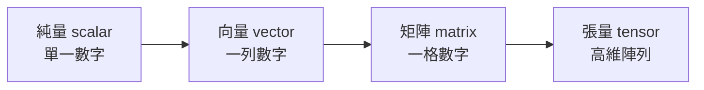

同樣一段運算，在 CPU 上是一種跑法，換到 GPU 又完全不同，有時候在 TPU 上還能更快。為什麼？

答案很單純：每一種晶片，都是為了不同「類型的計算」而最佳化的。CPU 處理通用任務，GPU 擅長大量平行的數學運算，TPU 則針對特定的機器學習工作負載做了最佳化。正因為三者針對的計算型態不同，同一個問題在它們身上就會表現得很不一樣。

## CPU：為彈性而生的通用處理器

CPU 是通用型處理器，它的設計目標是**彈性**。網頁伺服器、資料庫、作業系統、應用程式邏輯——這些都是它的守備範圍。

這類工作有一個共同特徵：**每一步都可能不一樣**。收到一個請求、檢查身份驗證、查資料、套用商業規則、回傳結果——過程中充滿大量的分支判斷與決策。CPU 正是為了這種工作而生。

為此，CPU 採取的策略是：用**少量但強大的核心**，讓每個核心都能有效率地處理各式各樣不同的任務。

## GPU：把同一種數學重複做很多次

接著看另一種截然不同的工作負載：**對大量資料，反覆執行同一種數學運算**。

這樣的場景其實很多：

- **圖形渲染**：許多像素可以各自獨立地計算。
- **科學計算**：同一個數值運算被套用到一個龐大的資料集上。
- **影片處理**。
- **機器學習**：同一種數學，被重複套用到一大批（batch）輸入上。

這正是 GPU 登場的地方。相較於 CPU，GPU 塞進了**多出許多的算術運算單元**，因此非常適合這種高吞吐量的平行工作。

要理解 GPU 為什麼對 AI 這麼有用，得先談談**矩陣乘法**。

## 矩陣乘法：神經網路底層的重複勞動

矩陣，其實就是一格一格排好的數字。例如一個 2×3 的矩陣，就是兩列、三行的數字方格。

矩陣乘法，是把兩個「尺寸相容」的數字方格結合成一個新的方格——做法是一列對一行，把數字相乘再相加。聽起來很簡單，但當矩陣變得非常龐大時，它就變成了**海量而重複的數學運算**。

而這種數學，在機器學習裡不斷出現。當一個神經網路處理輸入時，它底層做的很多事情就是矩陣乘法：

- 輸入是一大組數字；
- 模型權重是另一大組數字；
- 模型透過矩陣乘法把兩者結合，產生下一組輸出；
- 然後在許多層之間，一次次重複這個過程。

這就是為什麼 GPU 對 AI 如此有用——它非常擅長**把同一種運算平行地做很多次**。

## 張量：從純量到高維陣列

要理解 TPU，得先認識**張量（tensor）**。這個詞聽起來嚇人，其實它只是一些熟悉概念的推廣：

- 一個數字 → 純量（scalar）
- 一列數字 → 向量（vector）
- 一格數字 → 矩陣（matrix）
- 更高維度的數字陣列 → 張量

舉例來說，一張彩色影像就可以用張量來表示：它有高度、寬度，以及色彩通道。如果你把很多張影像放在一批裡一起處理，那就成了一個更大的張量。

## TPU：專為張量運算而生

這就帶到了 TPU——**Tensor Processing Unit（張量處理單元）**。

CPU 是通用的，GPU 高度平行但仍算相當通用，而 **TPU 則更為專用**。它是為機器學習工作負載——尤其是像大型神經網路的訓練與推論這種「張量密集」的工作——而專門設計的。

舉例來說：

- 當你在**服務一個大型語言模型（LLM）**時，推論過程中有一部分工作，是龐大的張量運算；
- 當你在**訓練一個 transformer 模型**時，這種在巨大張量上進行的矩陣乘法，佔比更是壓倒性地高。

這類任務，正是 TPU 能發光發熱的地方。

## 那為什麼不乾脆全部都用 TPU？

因為**專用化本身就是一種取捨**：硬體越專用，效率可以越高，但彈性也越低。

- CPU 幾乎什麼事都能做得還不錯；
- GPU 對許多平行工作負載都表現優異；
- TPU 對符合它設計初衷的機器學習工作負載，可以極度高效——但也僅限於此。

所以在實務上，現代系統往往是**用不同的晶片，去負責工作中的不同環節**：CPU 負責控制流程與整體調度（orchestration），而 TPU（或 GPU）則承接大規模的平行運算。

## 小結

CPU、GPU、TPU 之間沒有絕對的優劣，只有「合不合適」。三者分別對應三種計算型態：

- **CPU**——彈性，擅長充滿分支與決策的通用任務；
- **GPU**——平行吞吐量，擅長把同一種數學重複做很多次；
- **TPU**——專用，為機器學習的張量運算而生。

理解你的工作負載屬於哪一種計算型態，再對齊合適的硬體，而不是一句「AI 就是要用 GPU」把所有情境一概而論——這才是真正該做的判斷。

## 參考資料

- [CPU vs GPU vs TPU（原始影片）](https://www.youtube.com/watch?v=MUWAbpg1xLo)
