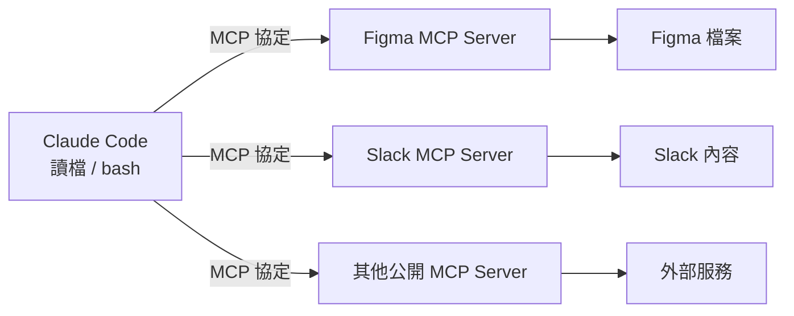

Claude Code 開箱能做兩件事：**讀取檔案**、**執行 bash 指令**。這已經足夠讓它在你的專案裡打轉——看程式碼、跑測試、改檔案。

但工程師的世界不只有本機檔案。你的設計稿在 Figma、討論串在 Slack、資料散落在各種外部服務裡。這些東西 Claude Code 預設是碰不到的。

要把這些外部工具接進來，靠的就是 **MCP（Model Context Protocol）**。

## MCP 是什麼

MCP 是一個**開放協定**，讓任何人都能打造工具、並把這些工具**暴露給 AI agent** 使用。

換句話說，它定義了一套「工具作者」與「AI agent」之間的共通語言。工具作者按照這個協定把能力包成一台 MCP server，AI agent 只要會講 MCP，就能發現並呼叫這台 server 上的工具——雙方不需要為彼此寫客製化的整合程式碼。

對 Claude Code 來說，這代表它的能力邊界不再被「讀檔 + bash」框死，而是可以往外延伸到任何有 MCP server 的服務。

## 加一台 MCP server 會發生什麼

流程很直接：**你新增一台 MCP server，Claude 就取得這台 server 所暴露的全部工具**。

- 接上一台 Figma 的 MCP server → Claude 能存取你的 Figma 檔案
- 接上一台 Slack 的 MCP server → Claude 能讀取 Slack 的內容

你不需要一個一個去教 Claude「Figma 的 API 長怎樣」「Slack 要怎麼呼叫」。這些細節都封在 server 那一側；Claude 只是照著 MCP 協定，把 server 說「我有這些工具」的清單拿過來用。

## 數千台現成的 server

MCP 之所以實用，關鍵在於生態：**你能立刻接上數千台公開可用的 MCP server**。

也就是說，多數情況下你根本不必自己寫。想讓 Claude 連上某個常見服務時，先看看社群有沒有現成的 MCP server——通常都有。你要做的只是把它接上去，Claude 就多了一整組新工具。

而因為 MCP 是開放協定，這些 server 不是綁死在單一 AI 應用上的：同一台 server，任何支援 MCP 的 agent 都能共用。工具作者維護一份實作，整個生態都受惠。

## 小結

Claude Code 本體只有讀檔和跑 bash，但 MCP 把這個邊界打開了。它的核心概念只有三句話：

1. MCP 是開放協定，任何人都能打造並暴露工具給 agent。
2. 加一台 MCP server，Claude 就拿到它暴露的所有工具。
3. 已經有數千台公開 server 可以直接接。

對工程師最實際的起點，就是找找你天天在用的服務（Figma、Slack、資料庫……）有沒有現成的 MCP server，接上一兩台，親自感受一下 Claude Code 從「本機助手」變成「連得上你整個工具生態」是什麼感覺。

## 參考資料

- [MCP in Claude Code（原始影片）](https://www.youtube.com/shorts/VMF4InsZm9I)
- [Introducing the Model Context Protocol - Anthropic](https://www.anthropic.com/news/model-context-protocol)
- [Connect Claude Code to tools via MCP - Claude Code Docs](https://code.claude.com/docs/en/mcp)
- [MCP Servers - GitHub](https://github.com/modelcontextprotocol/servers)
