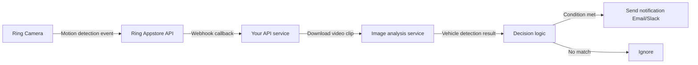

"Driveway Derby" is a specific home scenario: you live at the end of a cul-de-sac, and neighborhood kids like to play in your driveway. You're not trying to surveil people — you just want to get notified when a vehicle or specific movement pattern enters your driveway, and you want to distinguish "my family's car returning" from "unknown vehicle entering."

This turns out to be a good showcase for Ring Appstore API capabilities.

## TL;DR

The Ring Appstore API lets developers subscribe to camera motion events, download video clips, and add custom logic in webhook endpoints. Combined with computer vision (this case uses OpenCV for vehicle detection), you can achieve precise control: only notify when specific conditions are met. Authentication uses OAuth2; webhooks require a public HTTPS endpoint.

## Background and Challenge

Ring's built-in notification feature is too broad: any motion triggers alerts, including passing pedestrians, leaves blowing in the wind. You can't use the official app to configure "only notify me when a vehicle with an unrecognized license plate enters."

Ring's 2024 Appstore API changes this, letting developers:
- Subscribe to camera motion detection events
- Retrieve the video clip that triggered the event
- Add arbitrary post-processing logic in their own service

The challenges:
1. OAuth2 authentication requires a public endpoint (local dev needs ngrok or similar)
2. Ring's image API has download rate limits
3. Computer vision accuracy degrades in low-light environments like driveways

## Solution Design

The overall architecture has three layers:



## Implementation Details

### Step 1: Apply for Ring Developer Account and App

The Ring Appstore developer program requires an application (partner.ring.com), with review times ranging from days to weeks. You'll need to describe your app's purpose.

Upon approval, you receive a `client_id` and `client_secret` for OAuth2 authorization.

### Step 2: OAuth2 Authorization Flow

```python
import requests
from urllib.parse import urlencode

# Step 1: Direct user to Ring authorization page
auth_params = {
    "client_id": CLIENT_ID,
    "response_type": "code",
    "redirect_uri": "https://your-app.example.com/callback",
    "scope": "devices:read events:read media:read"
}

auth_url = f"https://oauth.ring.com/oauth2/authorize?{urlencode(auth_params)}"

# Step 2: After user authorizes, Ring calls your redirect_uri with a code
# Step 3: Exchange code for access_token
def exchange_code_for_token(code: str) -> dict:
    response = requests.post(
        "https://oauth.ring.com/oauth2/token",
        data={
            "grant_type": "authorization_code",
            "client_id": CLIENT_ID,
            "client_secret": CLIENT_SECRET,
            "code": code,
            "redirect_uri": "https://your-app.example.com/callback"
        }
    )
    return response.json()
    # Returns access_token, refresh_token, expires_in
```

### Step 3: Subscribe to Motion Events

```python
def subscribe_to_device_events(access_token: str, device_id: str):
    headers = {"Authorization": f"Bearer {access_token}"}
    
    response = requests.post(
        f"https://api.ring.com/v1/devices/{device_id}/subscriptions",
        headers=headers,
        json={
            "event_types": ["motion", "ding"],
            "webhook_url": "https://your-app.example.com/ring-webhook"
        }
    )
    return response.json()
```

### Step 4: Webhook Endpoint

```python
from fastapi import FastAPI, Request
import hmac
import hashlib

app = FastAPI()

@app.post("/ring-webhook")
async def handle_ring_event(request: Request):
    # Verify webhook signature
    signature = request.headers.get("X-Ring-Signature")
    body = await request.body()
    
    expected = hmac.new(
        WEBHOOK_SECRET.encode(),
        body,
        hashlib.sha256
    ).hexdigest()
    
    if not hmac.compare_digest(signature, expected):
        return {"error": "Invalid signature"}, 403
    
    event = await request.json()
    
    if event["type"] == "motion":
        # Async processing — don't do slow operations in the webhook handler
        await queue_video_analysis(event["recording_url"])
    
    return {"status": "ok"}
```

### Step 5: Vehicle Analysis Logic

```python
import cv2

def analyze_driveway_video(video_path: str) -> dict:
    cap = cv2.VideoCapture(video_path)
    bg_subtractor = cv2.createBackgroundSubtractorMOG2()
    
    detected_objects = []
    while True:
        ret, frame = cap.read()
        if not ret:
            break
            
        fg_mask = bg_subtractor.apply(frame)
        contours, _ = cv2.findContours(
            fg_mask, cv2.RETR_EXTERNAL, cv2.CHAIN_APPROX_SIMPLE
        )
        
        for contour in contours:
            area = cv2.contourArea(contour)
            if area > 5000:  # Filter small motion (leaves, insects)
                detected_objects.append({
                    "area": area,
                    "timestamp": cap.get(cv2.CAP_PROP_POS_MSEC)
                })
    
    cap.release()
    
    # Determine if it's a vehicle based on area size and motion pattern
    is_vehicle = any(obj["area"] > 50000 for obj in detected_objects)
    
    return {"is_vehicle": is_vehicle, "objects": detected_objects}
```

## Results

Actual system performance:
- End-to-end latency from motion detection to notification: ~3–8 seconds (including video download and analysis)
- Detection accuracy for normal-sized vehicles (sedans, SUVs) in the driveway: ~90%+
- Nighttime or strong backlight conditions: accuracy drops to ~70%

The biggest improvement was dramatically reduced false positives: passing pedestrians, cats, or minor branch movement no longer trigger notifications.

## Lessons Learned

**Ring API rate limits are real**: The video download API gets throttled with many requests in a short period. Design with queues and retry mechanisms from the start.

**ngrok for local dev, replace for production**: ngrok's free tier has request limits and changes URLs on restart — not suitable for stable operation.

**Lighting conditions heavily affect computer vision**: Ring cameras in night vision mode output grayscale images; analysis logic needs to account for this.

**OAuth2 refresh tokens need proper management**: When access tokens expire, you need refresh tokens to get new ones, or the system will silently fail.

## References

- [Ring Developer Program](https://partner.ring.com/)
- [Ring API documentation](https://developer.ring.com/)
- [OpenCV background subtraction documentation](https://docs.opencv.org/4.x/d2/d55/group__bgsegm.html)
- [FastAPI webhook handling](https://fastapi.tiangolo.com/tutorial/request-forms/)
