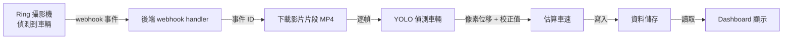

這次不做平常的系統設計主題，而是把一台 Ring 攝影機改造成車道的迷你偵測器。

起心動念很生活化：作者的姪子姪女每次來訪，都愛把玩具車在車道上開來開去、上上下下衝刺，而他們的「煞車技術」還在練習中。這讓作者想到：能不能用攝影機偵測任何「以一定速度」衝上車道的東西——無論是玩具車還是真的車輛？於是他決定動手做一個。

這台攝影機真正有意思的地方不在硬體，而在新的 **Ring App Store**。透過這個商店，Ring 開放了一個 developer 功能：可以透過 partner API 訂閱攝影機事件。這等於把攝影機變成一個 app 平台——第三方開發者可以註冊事件，當攝影機偵測到 motion、vehicle detection 或 package detection 時，攝影機的雲端服務就會對你的後端發出一個 HTTP request。

這篇的目標是訂閱 **vehicle detection** 事件：當車子開上車道，我們收到事件、下載一段影片片段、跑機器學習模型偵測車輛、估算它的速度，並把結果全部呈現在 dashboard 上。

## 安裝與設定

第一步是把攝影機裝在能清楚看到車道的位置。當車輛進入這個區域，攝影機就會送出事件。

完成 onboarding、把攝影機連結進帳號後，就能啟用新的整合功能。在 portal 裡：

- 註冊一個 webhook URL
- 選擇想訂閱的事件——這裡選的是「車道區（driveway zone）的 vehicle detection」

之後只要有車輛進入這個區域，平台就會發出一個事件。

## 整體架構

在看程式碼之前，先看高層次的資料流。整個 loop 其實很直接：



一句話總結：**攝影機看到東西 → webhook 觸發 → 後端做重活 → dashboard 呈現結果。**

## 關鍵程式路徑

### 註冊 webhook 與接收事件

partner API 提供一個 endpoint 讓你註冊 webhook。設定完成後，事件就會開始送到 `/webhook` handler。

事件的 payload 內含幾個欄位：

- **event type**（事件類型）
- **camera ID**
- **timestamp**
- **event ID**——之後用它來取回對應的影片片段

handler 的職責是：**驗證簽章 → 解析 JSON → 回覆（acknowledge）request → 把工作排入佇列。** 真正的重活放到背景處理，這樣 handler 才能快速回應。

概念上的流程如下（示意）：

```python
@app.post("/webhook")
async def handle_event(request):
    # 1. 驗證簽章
    if not verify_signature(request):
        return 403

    event = await request.json()
    # event 內含 event_type / camera_id / timestamp / event_id

    # 2. 快速回應，重活丟到背景
    enqueue_processing(event["event_id"])
    return {"status": "ok"}
```

### 下載影片片段

拿到事件後，用 event ID 去下載與之關聯的影片片段。API 會回傳一個**臨時連結**指向該片段的 MP4 檔案。這段片段通常涵蓋偵測前後的幾秒鐘——對估算移動來說已經足夠。

### 用 YOLO 偵測車輛

速度偵測用的是 YOLO 家族的模型。YOLO 是 *You Only Look Once* 的縮寫，是很受歡迎的即時（real-time）物件偵測模型，會看每一個 frame、告訴你物件在哪裡。

這裡不做什麼花俏的事，只是用它在**每一幀定位車輛**，好追蹤車輛在畫面中如何移動。

### 從像素位移換算車速

當車輛沿著車道移動，它會在畫面上移動一定數量的像素。搭配一個簡單的**校正值（calibration value）**——把「像素」對應到「公尺」——就能把像素位移換算成速度估計。

輸出就是一個乾淨的數字：車輛經過攝影機、開上車道時的速度有多快。

## Dashboard

dashboard 從後端讀取資料並顯示每一筆偵測結果。我們可以看到：

- 家人的車輛
- 它們各自的速度
- 觸發事件的實際影片片段

點選某一筆偵測，dashboard 就會下載並播放那段片段。這把所有東西串在一起：**攝影機看到了什麼、模型偵測到什麼、車輛開得多快。**

## 為什麼這個模式重要

把事件以 webhook 的形式對外開放，讓這台攝影機變成了一個**可程式化的平台**。今天雖然只是拿來做一個好玩的 demo，但真正的潛力在於**主動式安全（proactive safety）**：

- 車輛開進車道速度太快時即時告警
- 確保小朋友沒有太靠近馬路
- 在意外發生前就介入預防

而且這個能力可以延伸到家庭以外的場景。企業可以用它做：

- 零售的人流（foot traffic）分析
- 竊盜偵測
- 職場安全告警——例如即時偵測倉庫裡的堆高機（forklift）是否超速

本質上，它把一台攝影機從「被動錄影」變成一個**主動解決問題的角色**。

## 參考資料

- 原始影片：[Turning a Ring Camera Into a Driveway Detector](https://www.youtube.com/watch?v=5kHpeVvO7cY)
- 申請 Ring App Store early access：developer.amazon.com/ring
