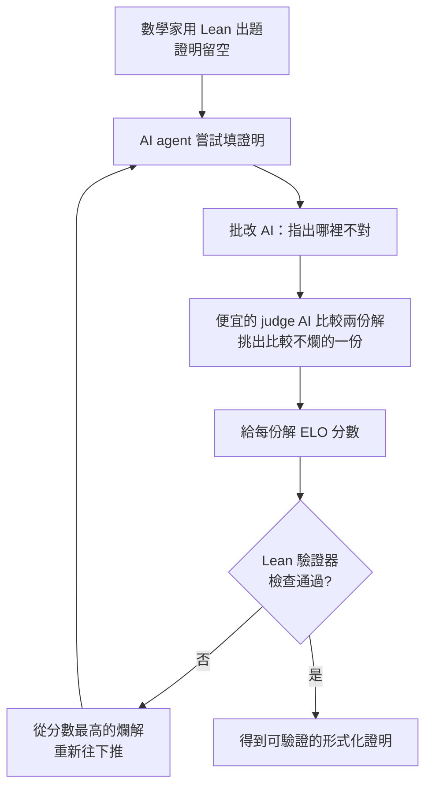

大部分人對「AI 解數學題」的直覺是：語言模型會在多步推導中間跳步、胡說八道，算出錯誤答案卻信心滿滿。DeepMind 最新的 AlphaProof Nexus 展示了一條繞過這個問題的路——它去挑戰匈牙利傳奇數學家 Paul Erdős 留下的開放難題，這些是幾十年來沒有任何人解開的問題。

而真正有意思的地方，不在於模型變得多聰明，而在於它外面那一圈迴圈（harness）。

## TL;DR

- Paul Erdős 生前留下超過一千道開放問題給世界去解。
- AlphaProof Nexus 挑戰了其中約 350 道，**解出了九道**，官方提到失敗率約 95.7%，每題成本大約幾百美元。
- 這些是數十年來無人解開的老問題，能解出九道已經相當驚人。
- 突破點是「把不可靠的 AI 放進一個嚴謹的迴圈裡」，最後產出可被機器逐步檢查的形式化證明。

## 為什麼直接問 AI 助理沒用

如果你直接叫某個 AI 助理去證這些題，它多半解不出來——因為它會 hallucinate、會把東西掰出來，看起來煞有其事，但站不住腳。

DeepMind 的做法是強迫它用 **Lean**：一種形式化的數學語言，任何一步推導都能被電腦自動判定合不合法，要麼過、要麼不過，沒有模糊地帶。這一點本身並不新鮮——現在大家都在這樣做。

那新的到底是什麼？答案在 Lean 外面那一圈。

## 新東西：把「不可靠的零件」組成「可靠的系統」

整個流程可以拆成這幾步：

1. **人先出題**：一位數學家把問題和「要證什麼」寫成 Lean，但證明本身留空。
2. **AI 嘗試**：AI agent 去填那段證明。當然，通常會失敗——題目太難了。
3. **另一個 AI 批改**：它不只說「這不行」，還會說出「為什麼不行」。
4. **一個便宜的 judge AI 比大小**：這是關鍵。它讀兩份先前的解答，挑出比較好的那一份。**兩份可能都是錯的**，但它挑出「稍微沒那麼爛」的那個。

這裡的精髓，是把每一份解答都當成一名棋手，給它一個 **ELO 分數**（沒錯，Elo 評分也是匈牙利人 Arpad Elo 發明的）。有時候人也會餵進一些解答。於是每份證明都有了分數。

然後**重新開始，但不是從零開始**——而是從「分數最高的那份爛解」接著往下推。這就變成了一場錦標賽，一輪一輪跑下去，直到 Lean 驗證器說「這份沒問題」，我們就得到了一份形式化證明。

這套設計之所以厲害，是因為它**接受核心 AI 會說謊、會胡扯**——但只要讓它跑夠多次、外面套一個好的裁判和錦標賽機制，最後還是能擠出一個可靠的結果。**用不可靠的零件，組出一個可靠的系統。**

## 故事變了：不是讓模型更聰明，而是把迴圈收得更緊

過去幾年 AI 的敘事一直是「把模型做得更聰明」。這次的故事變了：**你不一定要讓模型更聰明，而是要把它外面的 harness 收得更緊。**

給它一個好裁判，讓它跑上一千次，它就會慢慢磨出極難問題的正解。這裡的智慧不只在模型裡，而是在**環繞它的那個迴圈裡**。目前大家都在實驗各種不同形狀的迴圈，這件事本身就很好玩。

對工程師來說，這是一個值得記下的轉向：面對會出錯的模型，與其死磕「換更強的模型」，不如去設計外圍的驗證、評分與重試機制——很多時候，可靠性是在迴圈裡長出來的，不是在權重裡。

## 這技術也不是萬能的：兩個要注意的限制

主流報導不太會提的兩點：

- **選題有偏差**：Erdős 的開放問題其實有約 1200 道，這次只挑了約 350 道——很可能是**比較容易形式化（寫成 Lean）的那個子集**。這算問題嗎？其實還好，總要從某個地方開始。但要知道這不是「全部題目」的成績。
- **小模型直接掛零**：換成比較小的模型去跑，解出的題目數是**零，一題都沒有**。也就是說，核心仍然需要一個夠強的大模型——光有迴圈、沒有夠力的引擎，一樣跑不出來。

第二點特別值得留意：很多 benchmark 上，又快又便宜的小模型看起來只落後前沿模型幾個百分點，但一旦真正拿去解硬問題，差距往往比帳面上大得多。

## 換個角度看這個成績

值得提醒的是這條「移動的門檻」：

- 四年前，大家說 GPT-3「連加法都算不可靠」。
- 兩年前，大家說它「連高中競賽題都解不穩」。
- 一年前，大家說它「連數學奧林匹克金牌都拿不到」。
- 今天，大家說它「連五十年沒人解開的難題都解不穩」。

門檻一路被往上推。用「論文第一定律」來看：別只盯著現在在哪裡，想想再過兩篇論文之後會在哪裡。從這個角度，AlphaProof Nexus 能在數十年無解的難題上啃下九道，是相當驚人的一步。

## 參考資料

- [DeepMind's New AI Found A Strange New Way To Think（Two Minute Papers, YouTube）](https://www.youtube.com/watch?v=Dkqzqw8rxXI)
- [AI achieves silver-medal standard solving International Mathematical Olympiad problems - Google DeepMind](https://deepmind.google/discover/blog/ai-solves-imo-problems-at-silver-medal-level/)
