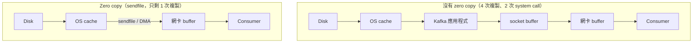

[第一部分](./2026-06-14-why-is-kafka-fast-part-1.md)談的是 Kafka 效能的第一根支柱：sequential I/O（循序讀寫）。這一篇要講第二個設計選擇——**效率（efficiency）**，也就是 Kafka 如何盡可能消除資料搬移時的多餘複製。

## Kafka 的本質是「搬資料」

Kafka 做的事情，本質上就是把大量資料從 network 搬到 disk，再從 disk 搬回 network。當你每秒要搬動一頁又一頁（pages and pages）的資料時，**「在 disk 與 network 之間搬移時，消除多餘的複製」** 就變得至關重要。這就是 zero copy 原則登場的地方。

現代的 Unix 作業系統，本來就針對「把資料從 disk 送到 network、而不做過多複製」這件事做了高度最佳化。要理解 zero copy 的價值，先看看**沒有** zero copy 時，一份資料是怎麼被送到 consumer 的。

## 沒有 zero copy：4 次複製、2 次 system call

當 Kafka 要把一頁位於 disk 上的資料送給 consumer，而完全不使用 zero copy 時，流程是這樣的：

1. 資料從 **disk** 載入到 **OS cache**。
2. 資料從 OS cache 複製進 **Kafka 應用程式**。
3. 資料從 Kafka 複製到 **socket buffer**。
4. 資料從 socket buffer 複製到**網路介面卡（NIC）buffer**。
5. 最後，資料透過網路送到 consumer。

這條路徑顯然很沒效率：一份資料被複製了 **4 次**，還牽涉 **2 次 system call**。中間那兩次進出 Kafka 應用程式的複製，其實對「把 disk 上的 bytes 送到網路」這個目標毫無貢獻——資料只是原封不動地被搬進搬出使用者空間而已。

## 有 zero copy：只剩 1 次複製

zero copy 的路徑，第一步完全相同：

1. 資料頁一樣從 **disk** 載入到 **OS cache**。

差別在第二步。Kafka 應用程式改用一個叫做 **`sendfile`** 的 system call，直接告訴作業系統：把資料從 **OS cache** 直接複製到**網卡 buffer**。

在這條最佳化過的路徑上，**唯一的一次複製就是從 OS cache 到網卡 buffer**——資料完全不必再繞進 Kafka 應用程式與 socket buffer。

而且在配備現代網卡的機器上，這唯一的一次複製是透過 **DMA（Direct Memory Access，直接記憶體存取）** 完成的。使用 DMA 時，**CPU 根本不需要參與**，讓整個搬移過程更加高效。

## 為什麼這是效能的基石

把這一篇的重點與第一部分收攏起來：**sequential I/O 與 zero copy 原則，是 Kafka 高效能的兩塊基石（cornerstones）。**

- sequential I/O 讓 disk 的讀寫接近它的物理極限；
- zero copy 讓資料從 disk 到 network 的搬移過程，省下多餘的記憶體複製與 system call，並在有 DMA 的情況下連 CPU 都不必動用。

在這兩塊基石之上，Kafka 還運用了其他技巧，把現代硬體的每一分效能都榨乾。這也是為什麼一台機器就能撐起 Kafka 令人驚訝的吞吐量——不是靠什麼魔法，而是把「不做多餘的事」貫徹到底。

## 參考資料

- [What makes Kafka so performant?（原始影片）](https://www.youtube.com/shorts/la8tzEyg-hY)
