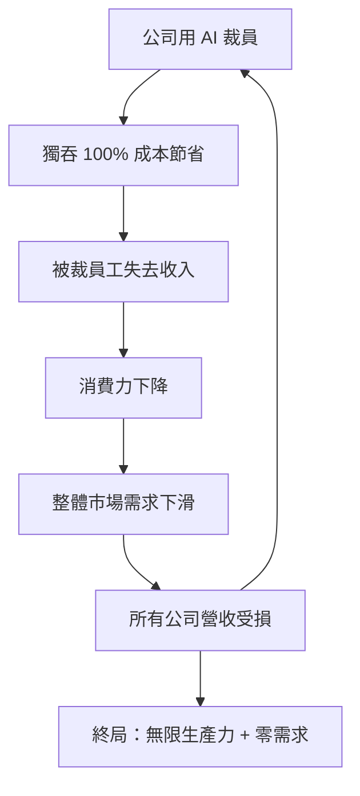

如果你在 AI 圈工作，2026 年 6 月初這一週大概讓你有點錯亂。Anthropic 一方面正式成為這場 AI 競賽的頭號玩家——估值超越 OpenAI，並申請要在今年稍晚以「兆元級」規模公開上市（IPO）；另一方面，他們卻拋出一個聽起來很瘋狂的提議：也許我們該停一下，暫停所有 AI 開發，因為 AI 正危險地逼近**遞迴自我改善（recursive self-improvement）**。

對軟體工程師來說，Anthropic 拿下領先並不意外——Claude 這幾年一直是最強的 AI 程式設計工具。真正弔詭的是：在數十億美元資金湧入、IPO 箭在弦上的當口，這家公司卻同時在喊煞車。這篇就把這個矛盾，以及它背後的幾種可能走向整理清楚。

## 一邊衝刺，一邊喊踩煞車

Anthropic 的內部智庫丟出一份報告，核心論點只有一句：**AI 正危險地逼近遞迴自我改善**。

換句話說，模型已經聰明到可以改寫自己的程式碼、在一個沒有人類參與的迴圈裡不斷升級自己。整個產業現在是「全油門、沒煞車」（all gas, no brakes），而 Anthropic 想號召所有人一起坐下來，做出一塊「煞車踏板」。

問題在於：**Anthropic 沒辦法單方面暫停**。只要 OpenAI、DeepMind、xAI 還在全速衝刺，它一停就落後。所以「單邊暫停」是不可能的選項——要嘛大家一起停，要嘛沒人停，而且這裡的「大家」還包含中國（至於歐盟，基本上沒人擔心）。

## 為什麼「全球暫停」對領先者最方便

這裡有個值得留意的角度：**呼籲全球暫停，對市場領先者來說其實非常划算**。

因為暫停並不會抹掉 Anthropic 的領先，反而是在它即將靠 IPO 賺進數十億美元的這一刻，把它的領先優勢**原地冷凍**起來。你領先，大家一起停，那你就永遠領先。

這套劇本並不新。2019 年，OpenAI 在釋出 GPT-2 之前也做過同一件事：先說模型「太危險，不能公開」，吊足胃口，然後真的放出來——結果一切都好好的。而 Anthropic 現在對 Claude Mythos 玩的正是同一招。

值得提醒的是：GPT-2 是七年前的東西，如今看起來已經像古董。當年被形容成「太危險」的模型，回頭看不過如此。這是判讀今天這波「太危險」說法時，該放進腦子裡的歷史尺標。

## Claude Mythos 的「比人類更會做研究」主張

如果我們願意相信那些「trust-me-bro」等級的 benchmark，現代的 Claude 模型在做研究這件事上已經遠勝人類——影片引用的數字是：**大約 64% 的情況下，Claude Mythos 表現得比人類更好**。

再加上一個更具體的例子：OpenAI 最近推翻了離散幾何（discrete geometry）裡一個核心猜想，而這是數學家過去 80 年都沒能做到的事。

真正讓人不安的不只是能力本身，而是我們**已經**在把資料中心、機器人、乃至能炸死人的武器交到 AI 手上。剩下的劇情，看過《駭客任務》和《魔鬼終結者》的人大概都能腦補。

## 第二種結局：自動化的死亡螺旋

就算 AI 是善良的、不會造反殺光人類，也還有一種更蠢、更平庸的爛結局。波士頓大學（Boston University）的經濟學家在論文《The AI Layoff Trap》裡算了一筆帳：

- 當一家公司用 AI 取代一名員工，它**獨吞了 100% 的成本節省**。
- 但被裁掉的員工同時也是一個消費者，他消失的消費力，傷害的**不只是裁掉他的那家公司，而是所有在賣任何東西的人**。
- 需求因此下降。終局就是：所有公司一路自動化到「無限生產力、零需求」。

這篇論文還主張，UBI（無條件基本收入）和「再培訓／upskilling」都救不了這個局。他們認為唯一的解法是**對自動化課稅**——就像我們對污染課稅一樣，讓「裁人」變得更貴，好讓那筆數學帳不再一面倒地獎勵 AI 軍備競賽。

（當然，影片作者也酸了一句：關於經濟學家，我學到的一件事是他們幾乎每次都算錯。）

## 第三種結局：也許 AI 根本沒那麼強

還有第三種可能，而且它一點都不科幻：**AI 其實沒有大家想的那麼強，而且可能永遠都不會**。

這是「Wall-E 情境」——我們拼命追逐越來越多的自動化，結果只是蓋出越來越多資料中心、把地球給搞爛。

支持這個劇本的一項證據是：過去這幾年，隨著巨型 AI 崛起，iOS App Store 上的**新 app 上架數量幾乎翻倍**。但看起來根本沒人在用這些 app——上架量暴增，實際使用卻沒有跟上。換句話說，產能（做出東西的能力）被 AI 拉高了，但需求（有人真的要用）並沒有。

這其實和前面那條死亡螺旋遙相呼應：AI 讓「生產」變得便宜，卻沒讓「有人買單」變多。

## 該怎麼看這一週

把三種劇本擺在一起，Anthropic 這一週的矛盾就沒那麼難理解了：

- 如果你相信**遞迴自我改善**近在眼前，那「暫停」是理性的——但由即將 IPO 的領先者來喊，動機永遠可疑。
- 如果你相信**AI Layoff Trap**，那真正的戰場不在模型能力，而在稅制與需求。
- 如果你相信**AI 其實沒那麼神**，那這整套「太危險」敘事，看起來就更像 2019 年 GPT-2 劇本的重演。

三種結局互相矛盾，但它們有一個共同點：沒有人——包括喊煞車的 Anthropic 自己——真的踩得下那塊煞車。

## 參考資料

- [Anthropic is starting to panic… — The Code Report (2026-06-09)](https://www.youtube.com/watch?v=0pgCBV8CTZY)
