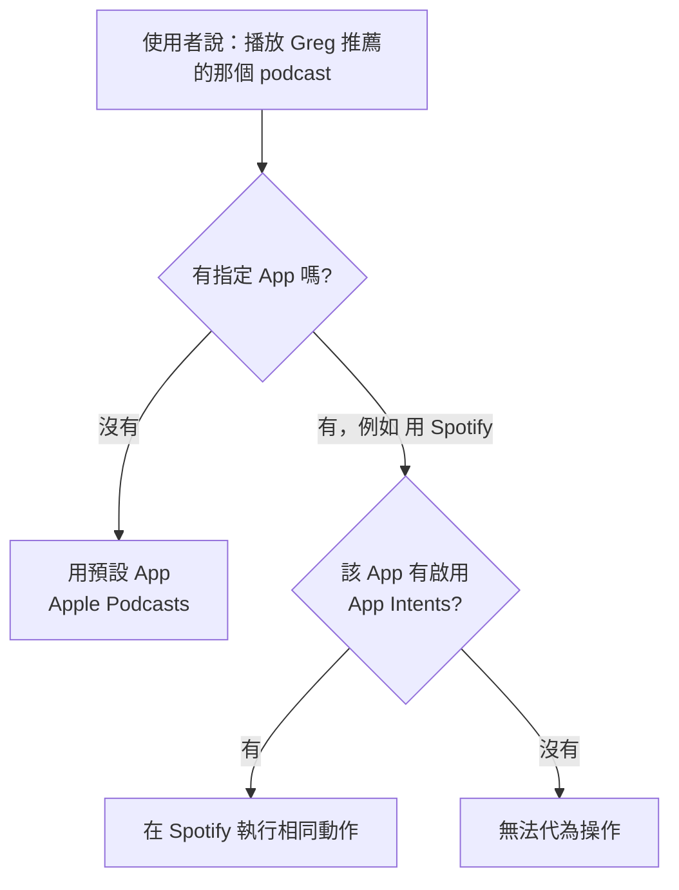

今年的 WWDC（Apple Worldwide Developers Conference）給人的印象大概可以濃縮成一句話：「嗯，差不多就是這樣。」沒有讓人驚呼的大招，但也沒有讓人失望的跳票。Apple 這次很快帶過各系統的更新，把 keynote 的重心放在兩件事上：**兒少的信任與安全（Trust and Safety）**，以及大家等最久的**新 Apple Intelligence 與新 Siri**。

## TL;DR

- 系統更新（iOS 27、iPadOS 27、watchOS、tvOS，以及新名字叫 **Golden Gate** 的 macOS）大多是「底層打磨」，外觀看起來差不多，但更順、更快。
- 中段花了不少篇幅講兒少安全：專屬兒童帳號、更細的螢幕使用時間控管、家長可控管可下載的 App、可造訪的網站與可聯絡的對象。
- 新 Siri 走安全牌：對話式問答、會引用來源、跨裝置同步對話紀錄；能讀你的訊息／照片／行事曆並執行基本動作，但不做全自動的 agentic 操作。
- 最強的 on-device Siri 模型只支援 **iPhone Air 與 iPhone 17 Pro**（因為只有這兩支有 12GB RAM）。

## 這次選擇「把細節做好」

過去幾輪更新（像 Liquid Glass 這類偏視覺、戲劇化的改版）老實說偶爾會有點「粗糙」的感覺——電池變差、效能怪怪的、可讀性之類的小 bug。這次 Apple 沒有一直丟「新功能、新功能、視覺大改」，而是回頭把一些一直需要關注、卻沒被好好照顧的細節梳理過一遍。

橫跨各系統的打磨包括：

- 動畫更順、App 開啟更快
- 微調的 App 圖示、統一的圓角半徑（corner radius）
- 側邊欄圖示**找回顏色**
- Liquid Glass 新增一條**透明度／著色滑桿**，讓你自己決定要多透明或多有色（甚至可以調到更透明——大概沒人要求過，但選項就是在那了）
- Spotlight 索引更完整、更徹底
- **AirDrop 傳輸快 80%**

另外幾個亮點：Vision Pro 終於可以把**你自己拍的全景照**當成環境背景（以前只有 Apple 內建那幾個，像 Mars、Yosemite、Mount Hood）；還有大家喊很久的 **AirPods 自訂 EQ** 終於來了——這在市面上最熱門的耳機上，比別家晚了好幾年才補上。

這一段感覺像是一堆「順手塞進來、確保有東西可以宣布」的雜項，因為主秀其實是 AI。但如果代價是換來這些早該有的細節，那我覺得很值得。

## 兒少安全：控制權交給家長

keynote 中段整段在講兒少安全，核心訊息大致是：對小孩來說，最好的體驗是一支「由家長控制」的自己的裝置。

具體功能包括：

- **專屬兒童帳號**：家長帳號可控管小孩能下載哪些 App、能造訪哪些網站、能和誰聯絡。
- **更細的螢幕使用時間**：可以看到小孩一天怎麼分配時間，並用排程器調整他們在特定類型 App 上可以花多少時間。週末看部電影沒問題，但本該上課時間刷三小時 Instagram，就不行。

正面看，這確實直接回應了家長對內容、網站與 App 存取的擔憂。但也有比較犬儒的解讀：這其實是「幫你小孩也買支 iPhone」的完整版——最好的家長控制，意味著把使用者年齡往下拉到最小，也就意味著未來更多 iPhone 使用者。

## 新 Siri：刻意的「安全牌」

這是大家最期待的部分。整體來說，新 Siri 的能力**幾乎就是我們預期的樣子**——沒有炸裂的驚喜，也沒有明顯的跳票，剛好落在中間。

操作上：在 iPhone 可以從 **Dynamic Island 下滑**，或**長按電源鍵**來對它說話。有新的動畫、整體新外觀，還有一個**更有表情的新語音**。

叫出來之後會進入一段對話式聊天：

- 從 Apple 新的**廣泛世界知識庫**取答案
- 有來源時會**引用出處**，可以點進去看（實際試了，這點不錯）
- 對話紀錄同步到一個**新的 Siri App**，並跨 Mac、iPad、iPhone 同步；它不會記住你問的每一句，但會保留比較有意思、你可能想回頭看的對話

### 為什麼 Apple 不追全自動

值得注意的是它**刻意不往「全自動 agentic」的方向走**。幾週前 Google 在 I/O 上展示 Gemini 那種「拍一張演唱會海報，它就幫你買票」的操作——會不會買錯座位、買錯日期、花太多錢、或幻覺出奇怪的東西？Apple 這支選擇**停在安全的那一步**：它就幫你把活動加進行事曆，剩下的你自己來。

它真正的差異化優勢不是「更強的模型」，而是**能讀到你 iPhone 上的東西**。GPT 讀不到你的 iMessage、Claude 讀不到你的 Apple 行事曆、Gemini 看不到這些——但 Siri 可以，因為這些個人資訊留在裝置上。它能翻你的訊息、照片、行事曆來回答問題，也能在這些 App 裡執行動作：傳訊息、加行事曆、設提醒——都是最基本的那些。

Siri 也能讀**螢幕上的內容**；相機 App 裡還新增了一個相機模式，其實就是把先前的 visual intelligence 更新後、推給更多人用。可以想像這種「拍一下就辨識」的能力，若之後做智慧眼鏡會特別有用。

### 第三方 App 怎麼接？

最大的疑問是第三方 App。iMessage、Apple 行事曆這些「自家的」當然能讀，但 WhatsApp 對話、Google 行事曆、你慣用的第三方筆記 App 呢？

目前看來的答案是：只要開發者有啟用 **App Intents**、且 App Store 知道這個 App 是什麼類型，使用者就能**主動指名**呼叫它。它似乎不能成為預設，但你可以明講要用哪個 App。

也就是說，你可以說「用 Spotify（或 Pocket Casts）播」，它知道那也是 podcast 播放器，就會在那個 App 幫你做同樣的動作。至於能不能在 TickTick 做地理圍欄的重複任務、能不能讀 WhatsApp 群組——這些還得實際上手才知道，目前 TBD。

另外一個細節：這場 keynote 塞了**大量 live demo**，彷彿在說「我們知道很多人有理由懷疑，上次學到教訓了，這次是真的能動、直接演給你看」。

## 最讓人失望的一張投影片：裝置門檻

整場最掃興的一張，是「哪些裝置能跑最新、最強的 on-device Siri 模型」的清單——答案是**只有 iPhone Air 與 iPhone 17 Pro**，因為只有這兩支配了 **12GB RAM**。

有點好笑的是，iPhone 16 當初號稱是「為 Apple Intelligence 從頭打造」，結果東西還沒真正上，它就已經被排除在最強體驗之外了。

## 怎麼看這屆 WWDC

一句話總結：**該做的都做了，但也就到此為止。** 新 Siri 是走「正中間、絕不出錯」的路線——不炫技、不冒險，靠的是「它最懂你 iPhone 裡有什麼」這個別人拿不到的優勢。系統這邊則難得回頭把細節補好。沒有讓人驚豔，但每一項宣布的東西看起來都是真的有在做、且務實。

> 註：本文以該場 keynote 的實測分享為依據整理；上手評測（包含新 Siri 的實際行為、第三方 App 支援邊界等）需等真正裝上系統後才能確認。

## 參考資料

- [WWDC 2026 Impressions: Yeah, That's About Right（原始影片）](https://www.youtube.com/watch?v=_gCXmKjDecU)
- [Apple WWDC — developer.apple.com](https://developer.apple.com/wwdc26/)
