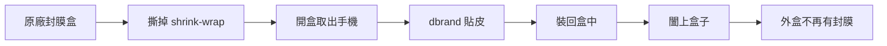

這集直播標題叫「phone updates」，其實包含兩件事：手機相關的更新消息，以及一場 giveaway 的後續說明。而這場送出一大批手機的 giveaway，剛結束沒多久就在網路上引來一個質疑：這是假的嗎？

有人在 Reddit 發了一篇貼文，條列「為什麼我覺得這場 giveaway 是假的」，把影片裡的畫面拿出來逐格分析。創作者在直播中把這些疑點一個個攤開回應——結論是：不是假的，每一個「破綻」其實都有很直白的解釋。

## 疑點一：盒子上都沒有 shrink-wrap（封膜）

質疑者注意到，影片裡一大堆手機盒，沒有任何一個包著原廠的收縮膜。乍看之下確實可疑——全新手機不是應該還封著膜嗎？

真正的原因是 **dbrand 幫每一支手機都貼了皮（skin）**。流程是這樣的：

因為每支手機都被拆出來貼皮再裝回去，封膜自然就沒了。所以「沒有 shrink-wrap」不是造假的證據，而是貼皮這道工序的必然結果。

## 疑點二：盒子敲起來「空心」，好像裡面沒手機

質疑貼文還提到：某些盒子聽起來空空的，像是裡面根本沒放手機。

創作者對這點的回應比較直接：他不知道要怎麼「量化」聲音空不空這種主觀感受，但他很肯定每一個盒子裡都確實有手機，而且全部都被拿出來過（就是為了上面那道貼皮工序）。他也在直播中秀出拍攝當時 25 支手機的照片作為佐證。

## 疑點三：外盒一片空白，看不到任何標籤

第三個被拿來說嘴的是：這些盒子外觀看起來一片空白，沒有印刷資訊。質疑者特別注意到某台 Note 8 的盒子有個外套式的 sleeve，於是好奇為什麼所有盒子看起來都是空的。

原因是**創作者刻意把印有 IMEI 貼紙的那一面藏起來**。手機外盒底部通常會貼 IMEI 標籤，而 IMEI 是機器的唯一識別碼——如果在影片裡公開，等於把未來得獎者手機的 IMEI 拱手送給有心人。

做法很簡單：外盒的 sleeve 可以整個抽出來、轉個方向再套回去，把印有 IMEI 的那面轉到不會入鏡的位置，於是每個盒子的正面看起來就都是空白的。這不是造假，而是**保護得獎者隱私**的處理。

## 25 支手機是真的都在

把三個疑點還原之後，事情其實很單純：這場 giveaway 有 25 支手機，全部編上紅黑相間的號碼，每一支都真實存在、也都拆出來貼過皮。至於「為什麼要花這麼多錢買手機來送」——創作者的態度是：想盡量多送出獎品，這就是他們做事的方式。

## 真正該提防的：得獎詐騙

比「giveaway 是不是假的」更值得觀眾注意的，是創作者在直播尾聲的提醒：**這是一場在 Twitter 與 Instagram 上舉辦的 giveaway，一定會有人冒充官方、私訊你說「你中獎了」來行騙。**

這是社群平台 giveaway 幾乎無法避免的副作用。實務上可以記住幾個原則：

- 官方帳號通常不會主動私訊叫你點連結、付運費或提供個資才能領獎。
- 收到「你中獎了」的訊息，先回到原始貼文與官方帳號本人比對，別急著點對方給的連結。
- 任何要你先付一筆錢、或索取信用卡 / 驗證碼的「領獎流程」，基本上都是詐騙。

換句話說，真假 giveaway 之外，更該保護的是自己的帳號與資料——別讓一場真的送獎活動，變成詐騙分子下手的藉口。

## 參考資料

- [5 New Phone Updates + Giveaway Update! — YouTube](https://www.youtube.com/watch?v=49-rK7SAfQk)
