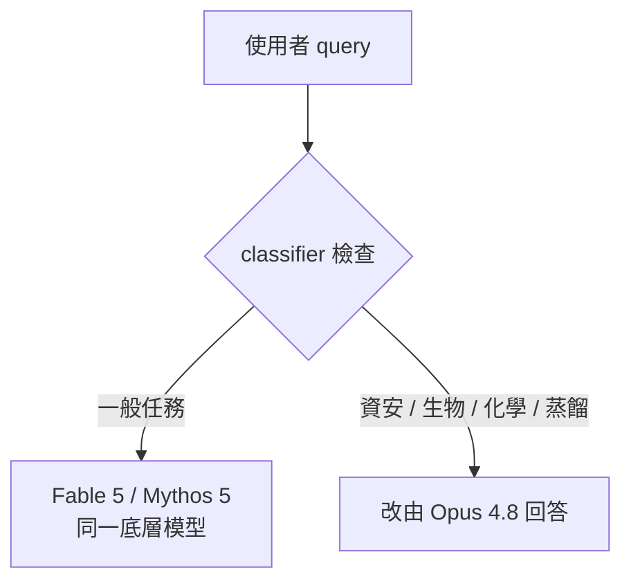

上週，Anthropic 站上舞台，懇求全球的 AI 實驗室一起在前沿 AI 開發上裝一個「協調式的煞車踏板」——因為他們擔心模型正危險地逼近**遞迴自我改善（recursive self-improvement）**。

結果這一週，他們把煞車丟進碎木機，油門一路踩到底：發布了號稱世界見過最強的 AI 模型——**Claude Fable 5**。

這篇文章不談影片裡那些玩笑，只把 Code Report（2026-06-11）這集裡真正的技術重點整理出來：Fable 5 到底是什麼、和 Mythos 5 與 Opus 4.8 差在哪、為什麼偏偏挑這個時間點推出。

## 一個模型，兩張臉：Fable 5 與 Mythos 5

先講最關鍵、也最容易被行銷話術蓋掉的事實：

> **Fable 5 和 Mythos 5 其實是同一個底層模型。**

差別只有一個字——**muzzle（口罩）**。

Mythos 5 是「mythos class」的原始模型，只開放給受控存取。Fable 5 則是被「安全地做了額葉切除（lobotomized）」、給一般使用者用的版本。它外面套了一組 **classifier 模型**，會盯著你送出的每一則 query。

一旦你的請求踩進這幾個領域：

- **cybersecurity（資安）**
- **biology（生物）**
- **chemistry（化學）**
- **model distillation（模型蒸餾）**

這則請求就會被攔下、「核掉」，改由 **Claude Opus 4.8** 來回答。

換句話說，Fable 5「更弱」的部分不是能力本身，而是它願不願意在敏感領域出力。這也是影片點出的一個副作用：像 DeepSeek、Kimi 這類中國模型，**短時間內沒辦法靠蒸餾拿到一個開源的 Fable 級模型**——因為只要你想蒸餾，classifier 就先把你擋下來了。

## 價格與限時 FOMO

Fable 5 和幾週前才發布的 Opus 4.8 相比，最直接的差別是**貴一倍**：

| 模型 | output 定價 |
| --- | --- |
| Claude Opus 4.8 | $25 / 百萬 output token |
| Claude Fable 5 | $50 / 百萬 output token |

行銷手法也很有意思：如果你**現在**有付費的 Claude 方案，可以一路用 Fable 5 用到 **6 月 22 日**；過了這天，Fable 5 就會從方案裡拿掉，之後只能**按 token 計費**使用。

這是很聰明的一步——用「限時可用」直接催出 FOMO，把人推去訂閱 Claude。

## 風評：software engineer 這邊反應很正面

在軟體工程圈，Fable 5 上線後的初期評價相當正面。影片裡提到最強的一個背書，來自 **Bend**（一個給 GPU 用的程式語言）的作者：他形容這是自己的「singularity moment」——Fable 5 直接把他的程式碼掃過一遍，implement 了大幅的效能改進。

至於各種「Fable 屌打 GPT-5.5」的 coding benchmark，影片自己也用「trust me, bro」的口吻標註了——意思是這些數字先聽聽就好，別當成定論。原始素材沒有給出具體的分數，所以這裡也不編。

## 為什麼是現在？IPO 的時間點

把「呼籲暫停」和「推出最強模型」放在同一週看，違和感很強。影片給的一個解讀框架是**上市時間點**：

- 這一週被形容為「歷史性的一週」，SpaceX 週五要 IPO。
- Anthropic 本身也正走向公開上市（going public）。

於是問題就變成：Fable 5 是真正的技術突破，還是**IPO 前用來把數字衝上去的一步棋**？影片作者的立場是保持懷疑、實測看看——而不是照單全收。

值得一提的一段題外話：Sam Bankman-Fried 曾是 Anthropic 的早期投資人，一度持有約 **8%** 股份。

## 小結

Fable 5 這件事，剝掉行銷包裝後其實很清楚：

- 它不是一個全新的底層模型，而是 Mythos 5 加上一層 classifier「口罩」。
- 「更安全」在這裡的具體意思是：敏感領域的請求會被降級由 Opus 4.8 回答，並順手擋掉蒸餾。
- 定價翻倍、限時開放，是很明確的商業與行銷設計。

在「呼籲全球踩煞車」和「推出史上最強模型」之間的張力是真實的——而且不會因為模型名字叫 Fable（寓言，暗示「不是真的」）就消失。這集影片留給觀眾的問題也很簡單：這是奇異點的前奏，還是又一輪 hype cycle？

## 參考資料

- [Anthropic begged the world to stop AI… then shipped this — The Code Report (2026-06-11)](https://www.youtube.com/watch?v=1PBRhm5ZnjU)
