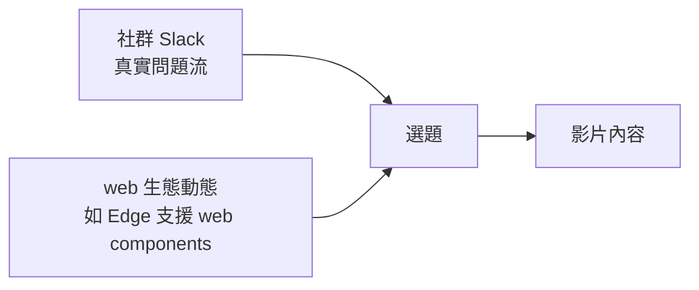

很多人好奇「這種每週講一個技術主題的 YouTube 影片，背後到底怎麼運作」。這篇整理自一場創作者的直播——他原本要一路示範完整的影片製作流程，開場則先回答了觀眾的幾個問題，順帶把「靈感從哪來」「平常怎麼工作」交代得相當具體。以下把這段幕後對話整理成重點。

## 選題靈感從哪來

被問到靈感來源時，他的答案很直接：**大部分來自社群的 Slack 頻道**。因為那裡每天都有穩定的想法流進來——不同的人有不同的需求、遇到不同的問題，這些真實的卡關點本身就是很好的題材來源。他很看重這些建議，並盡量把它們反映到頻道最後產出的內容裡。

除了社群之外，另一條靈感線是**整個 web 開發生態的動態**。他舉的例子是：Edge 瀏覽器剛宣布支援 web components，那就代表「現在正好是可以開始做 web components 內容的時機」。換句話說，選題不只是憑個人喜好，而是抓住生態剛出現、觀眾開始需要的節點。

## 一些日常工作習慣

直播中也回了幾個偏生活流的問題，剛好透露出工作節奏：

- **飲料**：早上喝咖啡，下午改喝茶。
- **tabs 還是 spaces**：他寫程式時習慣用 **tab**，因為打起來稍微快一點；但會讓 VS Code 在存檔時自動 reformat 成 **2 spaces**。理由是——spaces 在多人共享、傳遞程式碼時比較一致、不容易出狀況。這是個很典型的「個人手感 vs. 團隊一致性」取捨：輸入時順自己的手，輸出時遷就協作。

這類細節看似瑣碎，但它其實反映了一個創作者對「產出物要給別人看」的意識——不論是程式碼還是影片。

## 用 Firebase 自建內容系統

直播中被點名想看的一個題目是 **FlameLink**。他的描述是：FlameLink 有點像一個 content-as-a-service 的 API，但**資料庫是架在 Firebase 上由你自己託管**——他認為這是更有效率的做法。

順著這個思路，他提到：其實你完全可以**自己用 Firebase 從零打造一套 CMS**，底層用 **Realtime Database** 或 **Firestore** 都行。而這正是他手上那個 Fireship 產品正在做的事。他也開放，如果觀眾有興趣，之後可以專門開一集示範「怎麼從頭用 Firebase 自建內容管理系統」，並覺得這會是個蠻酷的專案。

另外他也預告了課程更新：正在為 Ionic 課程做一個 **chat feature** 的延伸模組，大約會新增 10～20 支影片、加上一整組新功能，希望下一週左右能上。

## 小結

這段幕後最值得記下的，不是某個剪輯軟體或相機型號，而是**選題的來源結構**：一邊是社群持續回饋的真實問題，一邊是生態剛冒出的新能力，兩者交會之處就是好題目。至於怎麼把題目變成影片、production 和 post-production 具體長怎樣，則是他接著切到螢幕分享要實際示範的部分——那又是另一段故事了。

## 參考資料

- [Behind the Scenes: How I make the Videos（原始直播）](https://www.youtube.com/watch?v=d6V-nGaNbhw)
- [FlameLink（架在 Firebase 上的內容管理服務）](https://flamelink.io)
- [Cloud Firestore / Firebase Realtime Database](https://firebase.google.com/docs/firestore)
