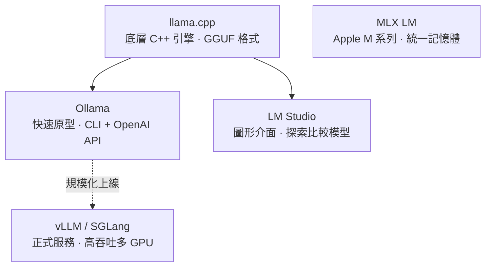

開源模型像 Qwen、Kimi、GLM 家族現在已經強到一個程度：很多情境下，你不一定需要一個託管的 API。你可以直接在自己的筆電上跑這些模型，這樣一來，沒有任何人會看到你的對話或資料。

要在本機跑 LLM，工具生態已經相當成熟。這篇整理五種常見的本地 LLM 執行工具，重點不在「怎麼裝」，而在它們各自的定位——你該挑哪一個，取決於你要做原型、想要圖形介面、還是要撐起正式流量。

## llama.cpp：最底層的推論引擎

llama.cpp 是一個用 C++ 寫的推論引擎，可以跑在 CPU、GPU 以及 Apple silicon 上。它一開始只是一個想在 MacBook 上跑 llama 的 side project，後來成長為大多數其他本地工具賴以建立的基礎。

llama.cpp 還帶來了一個本地模型的標準檔案格式：**GGUF**。一個 GGUF 檔把權重（weights）、tokenizer 和 metadata 打包進單一檔案，並支援量化（quantization）到 4-bit 甚至更低——正是這件事讓大型模型得以塞進消費級硬體。

使用流程很直接：你從 Hugging Face 下載一個 GGUF 檔，執行 llama.cpp、給它模型和你的 prompt，就能拿回 token。

**什麼時候用它？** 當你想要盡可能輕量的 runtime，或是要部署到受限硬體時——例如邊緣裝置，或一台沒有獨立 GPU 的筆電。

## Ollama：把 llama.cpp 變成開發者工具

Ollama 是包在 llama.cpp 外面的一層 wrapper，把它變成一個對開發者友善的工具。它幫你處理模型下載、量化選擇，以及啟動一個本地 server，讓你可以直接跟任何 LLM 對話。

你只要跑一行 `ollama run <模型>`，它就會自動拉取權重、啟動本地 server，並給你一個對話提示字元。上面這些你都不用手動處理。

這個 server 會暴露一個 **OpenAI 相容的 API**，所以任何 OpenAI 的 client library 只要改一行 base URL 就能接上。

**什麼時候用它？** 當你想要從「挑好一個模型」到「在程式裡呼叫它」之間走最短路徑時。它是工程師在打造 AI 系統原型時最常見的起點。

## LM Studio：圖形介面，適合探索比較

LM Studio 是一個帶圖形介面的桌面應用程式，沒有終端機、沒有設定檔。你可以裝在 Linux、Mac 或 Windows 上，在 app 裡搜尋模型、點下載、然後開始聊天。

底層它一樣是把 llama.cpp 包在一個 UI 之下，但在你下載任何東西之前，這個 UI 會先告訴你硬體需求、量化選項與 GPU offload 設定。如果某個模型對你的機器來說太大，它會事先警告你。

LM Studio 是瀏覽與比較模型最容易的方式。你可以在 app 裡探索 Hugging Face、看到每一種可用的量化版本、下載幾個、然後在它們之間切換而不用重啟任何東西。這對於「搞清楚哪個開源模型適合你的硬體和任務」特別有用。

**什麼時候用它？** 如果你是一般使用者，只想要一個簡單的介面跟 LLM 聊天。

## vLLM 與 SGLang：撐起正式流量的服務引擎

vLLM 是一個為了「同時服務很多使用者」而打造的推論引擎。如果說 Ollama 是拿來快速做原型，那 vLLM 就是為了 production——在一張或多張 GPU 上跑高吞吐量的推論。

vLLM 的速度主要來自兩項技術：

- **Paged attention**：一種記憶體更省的 attention 演算法。在沒有 paged attention 的情況下，KV cache 會被存成一整塊連續的記憶體，這很浪費。Paged attention 把 KV cache 切成固定大小的區塊，這些區塊不需要在 GPU 記憶體裡連續存放。這騰出了 GPU 記憶體，可以支援更大的 batch size，進而提高吞吐量與並行度。
- **Continuous batching**：一種給 LLM 服務用的請求排程技術。沒有它的話，GPU 要等一個 batch 裡的每個請求都跑完，才能開始下一批。Continuous batching 讓新的請求一有空位就能加入正在跑的 batch。

這兩項技術加起來，可以顯著拉高 GPU 上的吞吐量。vLLM 就是許多公司在背後拿來跑內部聊天機器人、coding assistant 或批次流程的引擎。

vLLM 的一個替代選擇是 **SGLang**，來自 Berkeley LMSYS 團隊的一個高速服務引擎。它用的是一種叫 **Radix Attention** 的技術，靠一個樹狀結構來跨請求快取共享的 prompt 前綴（prefix）。這讓它在像 RAG 和多輪對話這類「prompt 常常共享很長的共同前綴」的工作負載上特別快。SGLang 正是 xAI 以及許多 DeepSeek 部署在 production 中所使用的引擎。

**什麼時候用它？** 當你已經過了原型階段，需要把一個本地模型拿去服務真實流量時——為公司上線一個聊天機器人、為團隊推出一個 coding assistant，或跑大規模的內部作業。

## MLX LM：發揮 Apple 統一記憶體的優勢

MLX LM 是 Apple 做的工具，專門用來在搭載 M 系列晶片的裝置上跑 LLM。它之所以重要，關鍵在於記憶體。

在一般的 PC 上，CPU 和 GPU 有各自獨立的記憶體，模型必須單獨塞進 GPU 的記憶體裡，而那通常不大。但在 M 系列的 Mac 上，CPU 和 GPU 共用同一個大記憶體池。舉例來說，一台配備 192 GB 記憶體的 Mac Studio，可以載入那些在 PC 上原本得靠好幾張昂貴 GPU 才裝得下的模型。

## 五種工具怎麼選

簡單歸納：

- 想要最輕量的 runtime、或部署到受限硬體 → **llama.cpp**
- 想從挑模型到寫程式呼叫走最短路徑、做原型 → **Ollama**
- 想要圖形介面、探索與比較模型 → **LM Studio**
- 要服務真實流量、追求吞吐量 → **vLLM** 或 **SGLang**
- 用的是 Apple M 系列、想吃統一記憶體的紅利 → **MLX LM**

## 參考資料

- [在本地運行大型語言模型（LLM）](https://www.youtube.com/watch?v=U8lGbSaCCYI)
- [Ollama 官方網站](https://ollama.com)
- [llama.cpp GitHub](https://github.com/ggml-org/llama.cpp)
- [vLLM 官方文件](https://docs.vllm.ai/)
- [SGLang GitHub](https://github.com/sgl-project/sglang)
