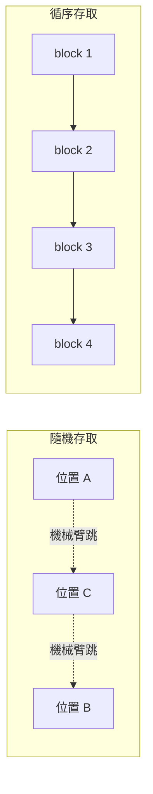

每次聽到「Kafka 很快」，第一個該問的問題其實是：**快，是指什麼？**

「快」這個詞本身很模糊。是指延遲（latency）低嗎？還是吞吐（throughput）高？又是跟什麼比較之下的快？把這件事講清楚，才有辦法討論 Kafka 的設計為什麼有效。

## 先定義「快」：Kafka 優化的是吞吐，不是延遲

Kafka 被設計來優化的目標是**高吞吐**——在短時間內搬動大量的 records。

一個好用的比喻是水管：管徑越大，單位時間能通過的液體體積就越多。所以當有人說「Kafka 很快」，通常指的不是單筆訊息跑得多快，而是它**能有效率地搬動大量資料**的能力。

釐清這點很重要，因為接下來的每個設計決策，都是為了「把管子做粗」，而不是「把單趟跑得更急」。

Kafka 的高效能來自許多設計決策，其中有兩個影響最大。本文先聚焦第一個、也是最核心的一個：**循序 I/O（sequential I/O）**。

## 磁碟不一定慢，隨機存取才慢

有一個常見的迷思：磁碟存取一定比記憶體存取慢。但這其實**很大程度取決於資料的存取模式**。

磁碟存取有兩種常見模式：**隨機（random）** 與 **循序（sequential）**。

以傳統機械硬碟（HDD）為例，資料存在旋轉的磁碟片上，讀寫是靠一支機械臂移動到磁碟上不同位置。當存取是隨機的，機械臂得不斷實體移動到各個位置——**這正是隨機存取慢的原因**。

但如果是循序存取，機械臂不需要到處跳，只要一塊接著一塊往下讀寫，速度就快得多。

## Append-only log：讓存取模式天生就是循序的

Kafka 善用了這個特性，做法是把 **append-only log** 當成它的主要資料結構。

append-only log 的規則很單純：**新資料一律加到檔案的尾端**。既然只往後追加、不回頭插入或改寫，這個存取模式天生就是循序的——機械臂永遠往同一個方向走。

換句話說，Kafka 不是靠更快的硬體取勝，而是靠選對資料結構，把磁碟存取「導向」成它最擅長的循序模式。

## 用數字把差距講清楚

循序與隨機的差距到底有多大？

在配備一組硬碟陣列的現代硬體上：

- **循序寫入**：可以達到每秒數百 MB（hundreds of megabytes per second）
- **隨機寫入**：則落在每秒數百 KB（hundreds of kilobytes per second）的等級

循序存取比隨機存取快上**好幾個數量級**。這也是為什麼「磁碟一定比記憶體慢」的說法，在正確的存取模式下並不成立。

## 便宜又大容量：HDD 讓長期保留訊息成為可能

用 HDD 還有一個成本上的好處。相較於 SSD，硬碟大約只要**三分之一的價格**，卻能提供**約三倍的容量**。

這給了 Kafka 一大片便宜的磁碟空間，而且——因為存取是循序的——**不必付出效能代價**。結果就是：Kafka 可以用很低的成本，把訊息**長期保留**下來（數天甚至更久）。

這在 Kafka 出現之前，是訊息系統相當少見的能力。多數傳統訊息佇列假設訊息被消費後就該清掉，而 Kafka 選擇把「保留」當成一等公民——這正是便宜循序儲存所換來的設計自由度。

## 小結

Kafka 的「快」，本質上是**高吞吐**，而它高吞吐的第一個關鍵，是把磁碟存取變成循序的：

1. **先定義快**：Kafka 優化的是吞吐，不是延遲——像一根粗水管。
2. **循序 I/O**：磁碟慢的是隨機存取；循序存取快上好幾個數量級。
3. **append-only log**：只往檔案尾端追加，讓存取模式天生就是循序的。
4. **便宜的 HDD**：低成本、大容量、無效能懲罰，讓長期保留訊息變得划算。

Kafka 高效能還有第二個同樣關鍵的設計決策，會在本系列的後續篇章中展開。

## 參考資料

- [Why is Kafka fast?（原始影片）](https://www.youtube.com/shorts/wvLdBJEl-wc)
- [Kafka Design — Apache Kafka Documentation](https://kafka.apache.org/documentation/#design)
- [The Log: What every software engineer should know about real-time data — Jay Kreps](https://engineering.linkedin.com/distributed-systems/log-what-every-software-engineer-should-know-about-real-time-datas-unifying)
