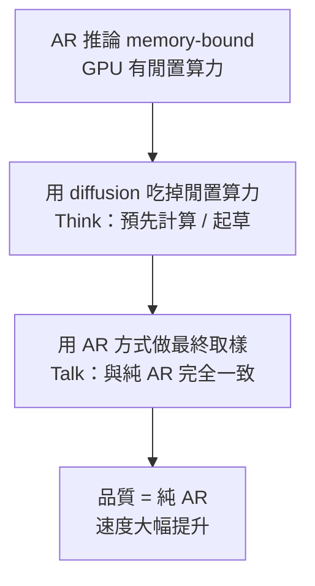

語言模型的推論速度，長期卡在一個看似無解的矛盾：自回歸（Autoregressive，AR）模型品質好，但一次只能吐一個 token；擴散（Diffusion）模型可以平行生成、比較快，但品質通常追不上 AR。Nvidia 的這篇 **TiDAR（Think in Diffusion, Talk in Autoregression）** 換了一個角度切入——它不去賭「哪一種範式最後會贏」，而是先問一個更務實的工程問題：**AR 推論的時候，GPU 其實沒被用滿，那些閒置的算力能不能撿回來用？**

## 為什麼 GPU 在 AR 推論時是閒置的

理解 TiDAR，得先理解一個常被忽略的事實：**自回歸推論主要是 memory-bound（受記憶體頻寬限制），而不是 compute-bound。**

AR 生成的流程是這樣的：先看著 prefix（也就是 prompt），產生下一個 token；把新 token 接回 prefix，再產生下一個；如此一個接一個。每一步的計算量其實不大，真正的瓶頸在於要不斷把模型權重從記憶體搬進來。結果就是——在很多時間點，GPU 的計算單元並沒有被塞滿，有一部分算力是空著的。

TiDAR 的核心提問就在這裡：**能不能聰明地用掉這些多出來的 GPU 算力，而且不必付出其他加速方法常見的代價？**

## 這幾乎是一頓「免費午餐」

影片作者對 TiDAR 的評價很直接：這是「你能拿到的、最接近免費午餐的東西」。所謂免費，意思是——你只是額外花了一點電力去做本來閒著也是閒著的計算，但你**不需要承擔其他系統為了加速而付出的取捨**，例如 speculative decoding 或 block diffusion 各自的那些麻煩。

更關鍵的是品質這一端：TiDAR 是一個 AR 與 diffusion 的混合架構，**但它的取樣行為與純自回歸模型完全一致**。也就是說，你拿到的是道地的 AR 品質，卻能靠「像 speculative decoding 那樣事先把東西算好」來加速——差別在於，TiDAR 這個預先計算是用 **diffusion** 完成的，而且刻意用來填滿 GPU 那些原本空著的算力。

## 先回顧：自回歸模型與它的平行化訓練

要看懂 TiDAR 為什麼能這樣做，需要先把 AR 模型的一個細節攤開來。

AR 模型（GPT 這一類）在**推論**時是一個一個 token 產生的。但如果訓練也照這個方式做，會非常慢——為了算出某個 token 的 loss，你得先處理完它前面所有的 token；換下一個 token 又要重來一次。

所以大家在**訓練**時把它平行化了：同一個句子可以一次構造出多個訓練樣本。把序列在不同位置切開，每個切點左邊當作 prefix（X）、右邊那個 token 當作 target（Y），一句話就能同時產生很多組 loss。要讓這件事成立，唯一的約束是加上一個**三角形（因果）attention mask**——讓每個 token 只能往回看前面的 token，不能偷看後面的答案。

這個「用一次 forward、靠 attention mask 讓多個位置同時被計算」的技巧，正是 TiDAR 得以把 diffusion 和 AR 塞進同一套推論流程、共用算力的基礎。

## TiDAR 在做什麼：Think in Diffusion, Talk in Autoregression

把上面幾點串起來，TiDAR 的構想就清楚了：

- **Think in Diffusion**：用擴散的部分，把 AR 推論時空出來的算力拿去做預先計算，效果類似 speculative decoding 的「先起草」，但用 diffusion 來完成。
- **Talk in Autoregression**：最終輸出仍以自回歸的方式取樣，並且**在數學上等價於純 AR 的取樣結果**，所以品質不打折。

換句話說，它不是「讓 diffusion 猜、AR 大概確認一下」這種近似；而是嚴格地維持 AR 的取樣分布，把 diffusion 純粹當成一個「反正 GPU 也閒著」的加速器。

## 和常見加速方案的差別

| 方案 | 加速來源 | 主要取捨 |
|------|----------|----------|
| Speculative decoding | 先用草稿、再驗證 | 影片指出它有 TiDAR 想避開的取捨 |
| Block diffusion | 分塊平行生成 | 影片指出它有 TiDAR 想避開的取捨 |
| **TiDAR** | 用 diffusion 吃掉 AR 推論的閒置算力 | 額外花電力／算力，但取樣仍與純 AR 一致 |

TiDAR 的立場是：既然那些空出來的 GPU 算力反正是浪費，那用它去換速度，代價幾乎只有電費，而不是品質或架構複雜度上的妥協。

## 小結

TiDAR 有意思的地方，不在於又提出一種新的生成範式，而在於它把問題重新定義了一次：與其爭論 AR 和 diffusion 誰的品質高，不如承認「AR 推論本來就是 memory-bound、GPU 有閒置」這個事實，然後設計一個架構，讓 diffusion 專門去把那塊閒置算力吃回來——同時嚴格保留 AR 的取樣品質。

論文開頭用「當我們邁向通用人工智慧（AGI）」這種大命題當引子，但它真正吸引人的其實是那個非常工程、非常務實的觀察：**免費的算力就在那裡，問題只是你有沒有辦法優雅地用掉它。**

> 註：本文依據該論文的 YouTube 影片解說整理，聚焦在動機與核心構想；更完整的方法細節、訓練設定與量化評測數字，請以下方原始論文為準。

## 參考資料

- [YouTube 影片解說：TiDAR](https://www.youtube.com/watch?v=taCVT5vDAk0)
- [TiDAR: Think in Diffusion, Talk in Autoregression（arXiv 2511.08923）](https://arxiv.org/abs/2511.08923)
- [TiDAR 官方專案頁](https://tidarlm.github.io/)
- [Hugging Face Paper Page](https://huggingface.co/papers/2511.08923)
