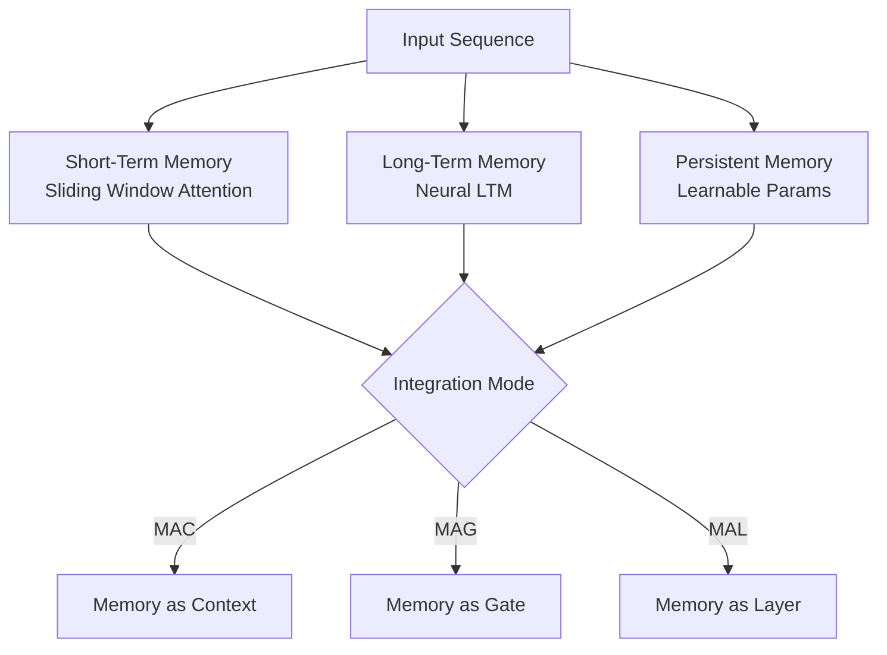

Sequence models face a fundamental tension on long-context tasks: Transformers are expressive but scale quadratically with sequence length; State Space Models (SSMs like Mamba) are efficient but store all context in a fixed-size hidden state that limits memory capacity. Google DeepMind's paper "Titans: Learning to Memorize at Test Time" attacks this tension head-on, proposing a neural memory module that keeps learning — via gradient descent — while running inference.

## TL;DR

Titans introduces a Neural Long-Term Memory (LTM) module whose parameters are updated at test time using a surprise-driven gradient signal. A forgetting mechanism prevents memory overflow. When integrated into a Transformer backbone (three variants: MAC, MAG, MAL), Titans outperforms both Transformers and Mamba on long-context benchmarks while maintaining near-linear complexity.

## Design Philosophy: Memory Shouldn't Be Frozen After Training

Traditional deep learning encodes all "knowledge" into fixed weights during training — inference is stateless. That works fine for short contexts, but breaks down when tasks require recalling information from tens of thousands of tokens ago (long documents, multi-turn dialogues, cross-chapter reasoning).

Titans' core bet is: **memory should update continuously at inference time**, just as humans integrate new information into working memory while reading, rather than relying solely on pre-trained knowledge.

Inspired by Hopfield Networks and Modern Hopfield Networks, Titans models long-term memory as a small MLP whose **parameters are the memory medium**. Writing to memory means updating those parameters via gradient descent; reading means running a forward pass.

## Core Concepts

### Neural Long-Term Memory Module

The memory module $M$ is a small MLP with parameters $\theta$. For each token $x_t$ in the input sequence:

**Writing (memory update):** Compute the prediction error for $x_t$ and update $\theta$ via gradient descent:
$$\theta_t = \theta_{t-1} - \eta \cdot \nabla_\theta \mathcal{L}(M_{\theta_{t-1}}(k_t), v_t)$$
where $k_t, v_t$ are key and value projections of $x_t$.

**Reading (memory retrieval):** Run a forward pass with query $q_t$:
$$\hat{v}_t = M_{\theta_t}(q_t)$$

### Surprise: Deciding What to Remember

Not every token deserves equal memorization. Titans uses **surprise** — the gradient norm of the prediction error — as the write strength signal. The more unexpected a token is to the current memory state, the larger the update:

$$s_t = \|\nabla_\theta \mathcal{L}\|$$

This focuses memorization on novel, rare, or anomalous information and ignores predictable or repetitive content — an intuitive fit with how human memory prioritizes surprising events.

### Forgetting Mechanism

Unbounded accumulation causes interference. Titans adds exponential decay at each step:

$$\theta_t = (1 - \alpha) \cdot \theta_{t-1} - \eta \cdot \nabla_\theta \mathcal{L}$$

The forgetting rate $\alpha$ lets the model prioritize recent information while gradually releasing stale memories — preventing any single past token from permanently corrupting the memory state.

### Momentum

Analogous to SGD with momentum, Titans adds a momentum term to smooth memory updates and prevent large oscillations from individual outlier tokens.

## Three Integration Architectures

The paper proposes three ways to integrate the LTM module with a Transformer backbone:

| Architecture | Integration | Characteristic |
|---|---|---|
| **MAC** (Memory as Context) | LTM outputs concatenated with input tokens before attention | Most intuitive; memory appears as extra tokens |
| **MAG** (Memory as Gate) | LTM output gates the attention output | More flexible; memory controls how much attention output flows through |
| **MAL** (Memory as Layer) | LTM interleaved as independent layers with attention | Modular; easiest to scale and swap |

MAG performs best across most benchmarks, while MAC shows more stable performance on tasks requiring precise memory localization.

## Comparison with Alternatives

| Approach | Context Length | Memory Capacity | Updates at Inference | Complexity |
|---|---|---|---|---|
| Transformer | Limited (quadratic) | Unlimited (window-bound) | No | $O(n^2)$ |
| Mamba (SSM) | Theoretically unlimited | Fixed hidden state | No | $O(n)$ |
| RAG | Extended via retrieval | External database | No | $O(n)$ + retrieval |
| **Titans (MAC/MAG/MAL)** | Theoretically unlimited | Dynamically updated MLP | **Yes** | $O(n)$ |

The core differentiator is **learning during inference** — none of the alternatives offer this.

## When to Use (and When Not To)

**Good fit:**
- Long document understanding (books, legal filings, technical specs)
- Long-horizon chat models that must recall early conversation turns
- Cross-chapter QA and multi-hop reasoning
- Any task where "what was said 50,000 tokens ago" matters

**Poor fit:**
- Short-context tasks where the memory overhead outweighs the benefit
- Edge inference requiring minimal latency (backprop per token adds cost)
- Deployment environments that prohibit parameter updates at runtime (certain compliance requirements)

## Key Experimental Results

- **SCROLLS / LongBench**: Titans-MAG exceeds GPT-4 Turbo (128k context) on multiple subtasks
- **Needle-in-a-Haystack**: Titans locates a specific fact in 100k+ token documents at significantly higher success rates than Mamba
- **Associative Recall**: Near-perfect accuracy; SSMs degrade sharply as sequence length grows

## Observations and Tradeoffs

Titans is an elegant idea — it turns "learning at inference time" from a research curiosity into an architectural primitive. But a few practical concerns are worth watching:

1. **Inference cost**: Each token requires one backward pass through the LTM module. In production, the latency impact depends on LTM size and hardware, but it's non-trivial.
2. **LTM sizing**: The MLP's width and depth cap memory capacity. Different task types need different sizes — another hyperparameter to tune.
3. **Forgetting rate sensitivity**: $\alpha$ is task-sensitive and there's no adaptive schedule yet. Getting it wrong causes either catastrophic forgetting or memory stagnation.
4. **Training stability**: The interaction between the backbone and the updating LTM makes training curves noisier than pure Transformers.

Overall, Titans points to a compelling direction: **models that retain learning capacity at inference time**. This aligns with the broader Test-Time Compute trend (e.g., o1-style reasoning chains), but Titans targets memory rather than reasoning depth. The two ideas are likely complementary — a model that both reasons longer and remembers more is the natural next step.

## References

- [Titans: Learning to Memorize at Test Time (arXiv)](https://arxiv.org/abs/2501.00663)
- [Titans: Learning to Memorize at Test Time (Paper Analysis) — YouTube](https://www.youtube.com/watch?v=v67plFw1nMw)
- [Modern Hopfield Networks and Attention for Immunology](https://arxiv.org/abs/2008.02217)
- [Mamba: Linear-Time Sequence Modeling with Selective State Spaces](https://arxiv.org/abs/2312.00752)
