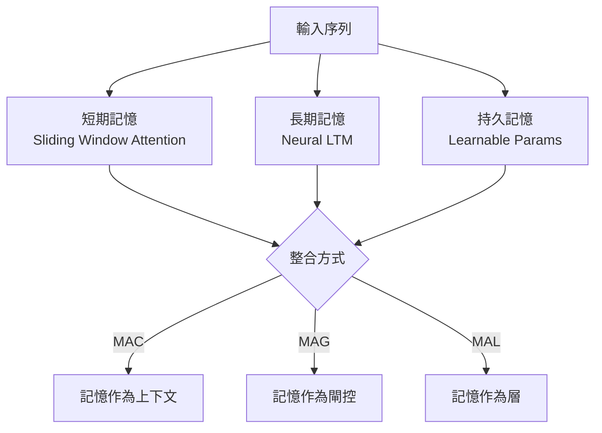

現有的序列模型在長上下文任務上面臨根本性的困境：Transformer 的注意力機制雖然表達能力強，但計算複雜度是 $O(n^2)$，上下文長度一拉長就撐不住。State Space Models（SSMs，如 Mamba）效率高，但固定大小的隱藏狀態決定了記憶容量有限。Google DeepMind 的論文《Titans: Learning to Memorize at Test Time》試圖打破這個困境，提出了一個能在推論時持續更新的神經記憶模組。

## TL;DR

Titans 引入了一個可在測試時（推論期間）透過梯度下降更新的神經長期記憶（Neural Long-Term Memory, LTM）模組。它用「驚訝度」（surprise）來決定哪些資訊值得記住，並透過遺忘機制防止記憶過載。整合到 Transformer 後，Titans 在長上下文 benchmark 上超越了 Transformer 和 Mamba，同時維持接近線性的複雜度。

## 設計哲學：記憶不該只存在於訓練裡

傳統深度學習的訓練與推論是分開的：所有「記憶」都被壓縮進模型權重，推論時不再學習。這個假設在短上下文下沒問題，但面對需要跨越數萬 token 的任務——比如分析長篇文件、跨章節推理——模型會遺忘早期的關鍵資訊。

Titans 的出發點是：**記憶應該在推論時持續更新**，就像人類在閱讀文章時，會即時把重要資訊納入工作記憶，而不是只依賴學前習得的知識。

受到 Hopfield Network 和 Modern Hopfield Networks 的啟發，Titans 把記憶模組本身設計成一個小型神經網路（一個帶有鍵值關聯的 MLP），其**參數就是記憶的載體**，並透過梯度更新來「記住」新資訊。

## 核心概念

### 神經長期記憶模組（Neural LTM）

記憶模組 $M$ 是一個帶有參數 $\theta$ 的小型 MLP。給定輸入序列的 token $x_t$：

1. **寫入（記憶更新）**：計算 $x_t$ 的預測誤差，透過梯度下降更新 $\theta$：
   $$\theta_t = \theta_{t-1} - \eta \cdot \nabla_\theta \mathcal{L}(M_{\theta_{t-1}}(k_t), v_t)$$
   其中 $k_t, v_t$ 分別是從 $x_t$ 投影出的 key 和 value。

2. **讀取（記憶查詢）**：用 query $q_t$ 直接做前向傳播取回記憶：
   $$\hat{v}_t = M_{\theta_t}(q_t)$$

### 驚訝度（Surprise）：決定記什麼

不是每個 token 都值得記住。Titans 用**驚訝度**作為記憶更新的強度訊號——當前 token 對記憶模組而言越「出乎意料」（預測誤差越大），就給予越大的梯度更新步長：

$$s_t = \|\nabla_\theta \mathcal{L}\|$$

這讓記憶系統自動聚焦在新穎、罕見或重要的資訊，忽略重複或可預測的內容——符合人類記憶的直覺。

### 遺忘機制（Forgetting）

無限累積記憶會導致干擾舊資訊。Titans 在每步更新時加入指數衰減：

$$\theta_t = (1 - \alpha) \cdot \theta_{t-1} - \eta \cdot \nabla_\theta \mathcal{L}$$

$\alpha$ 控制遺忘速率，使模型能優先保留近期資訊，同時逐漸釋放不再重要的舊記憶。

### 動量（Momentum）

類似 SGD with momentum，Titans 也引入動量項來穩定記憶更新，防止因單一奇異 token 造成的記憶抖動。

## 三種整合架構

論文提出三種把 LTM 模組整合進 Transformer 的方式：

| 架構 | 整合方式 | 特點 |
|------|---------|------|
| **MAC**（Memory as Context） | LTM 輸出與輸入 token 拼接後送入注意力 | 最直觀；記憶以 token 形式呈現 |
| **MAG**（Memory as Gate） | LTM 輸出與注意力輸出做閘控融合 | 更靈活；記憶影響注意力的輸出比例 |
| **MAL**（Memory as Layer） | LTM 作為獨立層，與注意力層交替堆疊 | 模組化；最易於擴展與替換 |

實驗顯示 MAG 在多數 benchmark 上表現最佳，但 MAC 在某些需要精確定位記憶的任務上更穩定。

## 與常見替代方案比較

| 方案 | 上下文長度 | 記憶容量 | 推論時更新 | 複雜度 |
|------|-----------|---------|-----------|--------|
| Transformer | 受限（quadratic） | 無限（但受窗口限制） | 否 | $O(n^2)$ |
| Mamba (SSM) | 理論無限 | 固定隱藏狀態 | 否 | $O(n)$ |
| RAG | 透過檢索擴展 | 外部資料庫 | 否 | $O(n) + $ 檢索 |
| **Titans (MAC/MAG/MAL)** | 理論無限 | 動態更新的 MLP | **是** | $O(n)$ |

Titans 最大的差異化優勢是**推論時持續學習**，這是其他方案都不具備的。

## 適合 / 不適合的情境

**適合：**
- 長文件理解（書籍、法律文件、技術規格書）
- 長對話歷史的 chat model
- 需要跨章節推理的問答任務
- 任何需要「記住很久以前說過什麼」的場景

**不適合：**
- 短上下文任務（記憶模組帶來的額外計算不划算）
- 需要極低延遲的邊緣推論（梯度更新有額外成本）
- 推論時完全不允許參數更新的部署環境（某些法規合規要求固定模型）

## 實驗結果亮點

論文在幾個長上下文 benchmark 上測試：

- **SCROLLS / LongBench**：Titans-MAG 在多個子任務超越 GPT-4 Turbo（128k context）
- **Needle-in-a-Haystack**：在 100k+ token 的文件中精確定位資訊，Titans 成功率顯著高於 Mamba
- **Associative Recall**：記憶模組在關聯召回任務上幾乎完美，而 SSM 在序列長度增加後明顯退化

## 我的觀察與取捨

Titans 的想法非常優雅——把「推論時學習」從一個研究問題變成架構設計的一部分。但有幾個實際問題值得關注：

1. **推論成本**：每個 token 都需要一次反向傳播來更新記憶，這在生產環境中的延遲影響不容忽視。
2. **記憶模組大小**：LTM 的 MLP 大小決定記憶容量上限，需要根據任務調整，增加了超參數調優的複雜度。
3. **遺忘速率調整**：$\alpha$ 的設定對不同任務敏感，目前還沒有自適應方案。
4. **訓練穩定性**：同時訓練主模型和記憶模組的互動動態，訓練曲線比純 Transformer 更不穩定。

整體而言，Titans 代表了一個重要的方向：**讓模型在推論時保持學習能力**。這與 Test-Time Compute 的整體趨勢（如 OpenAI o1 的長鏈推理）一脈相承，只是 Titans 聚焦在記憶而非推理鏈。

## 參考資料

- [Titans: Learning to Memorize at Test Time（原始論文）](https://arxiv.org/abs/2501.00663)
- [Titans: Learning to Memorize at Test Time (Paper Analysis) - YouTube](https://www.youtube.com/watch?v=v67plFw1nMw)
- [Modern Hopfield Networks and Attention for Immunology](https://arxiv.org/abs/2008.02217)
- [Mamba: Linear-Time Sequence Modeling with Selective State Spaces](https://arxiv.org/abs/2312.00752)
