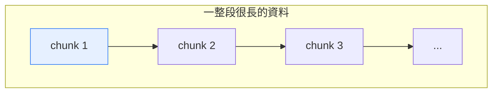
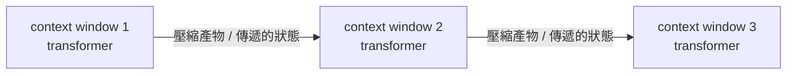

這篇整理來自對 Google Research 論文 **《Titans: Learning to Memorize at Test Time》** 的一段影片分析。這篇論文被當作他們 NeurIPS 發表的一部分推出，還有專門的部落格文章與社群討論，聲勢不小——分析者一開頭就坦白說，自己也是被行銷吸引才點進來看的。看完之後他的結論是：這是一篇好論文，但其中大概是「一半是真的很酷的新東西、一半是把腳踩在行銷油門上」。

以下就順著這個基調，把「它想解決什麼」「核心想法是什麼」「哪些其實不是新東西」整理清楚。

## 它想解決的問題：context window 的天花板

現在的模型大致分兩類。一類是天生的序列模型（sequence model），像是 RNN、LSTM；但這一類大致上已經被 attention-based 的模型，也就是 transformer，給超越了。

transformer 的麻煩在於：**它只能注意（attend）到目前 context window 裡的東西**。對某些任務來說，這個 window 需要非常大——分析者舉的例子是影片理解，或是那種「現實世界中會發生一大堆事情、你得把這些全部納入考量才能決定下一步」的超長任務。

問題其實很單純：你有一段很長的資料，但模型的容量只夠看其中一段（也就是 context window 那麼長的一段）。這個視窗你要放哪都行——放前面、放中間、放後面——但你**沒辦法把所有東西一次塞進同一個 context window**，硬塞就會把模型撐爆。

context window 就像上圖裡那個框：它可以在整段長資料上滑動、對準任何一段，但一次只能框住其中一塊。

## Titans 的核心想法：測試時記憶

Titans 提出的架構，重點是讓一個模型（例如語言模型）**在測試時（test time，也就是推論期間）學會記憶**，藉此走出目前 context window 的範圍。

實際運作的直覺是這樣：把一段非常非常長的文本**切成好幾個部分**，讓模型一段一段地跑過去；在跑的過程中，用一塊「記憶」去記住、去連結前面段落裡的東西，再把它們帶到下一段。這樣一來，即使後面的段落已經看不到最前面的原始內容，模型仍然能透過記憶接得起來——也就繞過了 transformer 那種「只能看到目前視窗」的 context window 限制。

這正是分析者覺得很酷的部分：把「跨越很長文本、記住早先的資訊」變成架構本身的能力。

## 但有一部分並不算全新

分析者也毫不客氣地指出：論文裡很多被叫做「memory」的東西，其實**早就存在了**。他的批評分兩種——有時是把舊東西重新包裝、講得像是新穎的發明；有時則是給既有機制取個新名字，讓它看起來像新東西。

他舉的歷史脈絡是「跨段記憶」這條老路。早在 BERT 之後那一波，就有很多人嘗試把模型推向很長的 context，其中一些變體會明確用到今天我們會稱為 memory 的做法：

1. **先處理一個段落**，在段落結尾產出一個「產物（artifact）」——通常就是最後一個 token 的某種運算結果或 hidden state。之所以拿最後一個 token，是因為序列裡的**最後一個 token 天生就會 attend 到整段內容**，所以它某種程度上把整段的資訊整合了起來。
2. **把這個 hidden state 傳給下一個 context window**。下一段在生成 token 時，雖然沒辦法直接 attend 回上一段的原始內容，但它可以 attend 到這個被傳過來的產物——而這個產物，理論上就是上一整段內容的一個壓縮版本。
3. 而且因為每一段都會從**再前一段**接收到這樣一個壓縮產物，資訊會一路往後帶。

用一句話總結這種老做法的特性：**在段落之間，它像 RNN**——靠一個往後傳遞的狀態串起各段；**而在單一 context window 之內，它又像 transformer**。分析者說這類想法其實不少，名字他記不太清楚，可能叫 Transformer-XL 之類的（他自己也不確定確切名稱）。

除了這種跨段記憶的路線，論文裡另一條被討論的脈絡是 **linear transformers**——最基本的想法就是把原本 softmax 那套 attention 換掉。（影片這段之後的細節不在本次整理的素材範圍內，故略。）

## 小結

Titans 真正吸引人的地方，是把「在測試時保有記憶、跨越很長文本」這件事直接做進架構裡，讓模型能夠處理遠超單一 context window 的內容。這個方向本身很有價值。

但如果照分析者的判斷，看這篇論文時值得保持一點清醒：**它一半是新意，一半是行銷**。當中被冠上「memory」之名的機制，有不少可以追溯到 BERT 之後那一波處理長 context 的跨段狀態傳遞做法——概念不見得是全新的，只是被重新命名、重新包裝了一次。

> 註：本文只涵蓋該影片分析的前半段（問題設定、核心想法、以及對「新意」的評論）。原始論文中關於記憶模組的具體更新規則、遺忘機制與整合方式等細節，不在本次整理的素材範圍內，故未納入，以免出現素材未涵蓋的推測。

## 參考資料

- [Titans: Learning to Memorize at Test Time（原始論文）](https://arxiv.org/abs/2501.00663)
- [Titans: Learning to Memorize at Test Time (Paper Analysis) - YouTube](https://www.youtube.com/watch?v=v67plFw1nMw)
