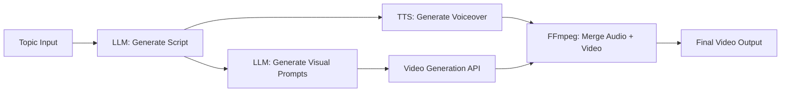

Video production has always had a high barrier to entry — you need editing skills, source footage, voiceover recording, and hours of assembly time just for a three-minute explainer. AI agents are changing this fundamentally: give the agent a topic, and it writes the script, generates voiceover, finds or creates visuals, and assembles the final video — fully automated.

## TL;DR

Chain an LLM (script), TTS (voiceover), a video generation API (visuals), and an automation platform (n8n) into a single agent pipeline. Input a topic, output a narrated video. No programming required — just API keys and workflow configuration.

## Architecture Overview

The core of this agent is a **tool chain** where each step's output feeds the next:



This isn't a single AI model — it's **coordinated AI tools**. That's the essence of "agent": an LLM decides which tools to call and in what order, while specialist models handle each subtask.

## Tool Selection

### Script Generation (LLM)
- **Claude 3.5 Sonnet / GPT-4o**: Generate structured scripts (segments, narration text, visual descriptions)
- Prompt for JSON output so downstream steps can parse it reliably

### Text-to-Speech (TTS)
- **ElevenLabs**: Best naturalness, multilingual, free tier available
- **Azure AI Speech**: Enterprise-grade, stable, excellent for non-English
- **Edge TTS** (local): Free, decent quality, great for development/testing

### Video Generation
- **Runway Gen-3**: High-quality text-to-video clips
- **Pika**: Simpler to use, good for explainer-style content
- **HeyGen**: AI avatar presenter — ideal when you need a human face on screen
- **Stable Video Diffusion** (local): Open-source, self-hostable

### Automation Platform (No-Code Orchestration)
- **n8n**: Open-source, self-hostable, HTTP Request nodes connect any API
- **Make (formerly Integromat)**: Cloud-based, lower learning curve
- **Zapier**: Most integrations, but pricier

### Video Assembly
- **FFmpeg**: Battle-tested open-source tool; n8n can invoke it via Execute Command nodes
- Merges voiceover audio + video clips + optional subtitles → MP4 output

## n8n Workflow Setup

The full pipeline fits in roughly 8 n8n nodes:

1. **Webhook Trigger**: Accept topic input (Slack message, form submission, or cron schedule)
2. **HTTP Request → Claude API**: Send topic, receive structured JSON script
3. **Code Node**: Parse JSON, extract per-segment narration and visual description
4. **Split In Batches**: Process one segment at a time
5. **HTTP Request → ElevenLabs**: Send narration text, download MP3 audio
6. **HTTP Request → Runway**: Send visual description, poll until done, download MP4 clip
7. **Execute Command → FFmpeg**: Merge all audio + video segments
8. **Save / Upload**: Store to Google Drive, S3, or push to a video platform

Once configured, triggering the webhook produces a complete video in minutes — no manual work.

## Script Prompt Design

This is the most critical piece. The LLM output must be structured so downstream tools can consume it reliably. Use JSON:

```
Generate a 2-minute explainer video script about the topic below. Structure it as 4 segments.

Output format (JSON only):
{
  "title": "Video title",
  "segments": [
    {
      "narration": "Spoken voiceover text (~30 seconds)",
      "visual_prompt": "Detailed English description of visuals for video generation AI"
    }
  ]
}

Topic: {{topic}}
```

Write `visual_prompt` in English — Runway, Pika, and similar tools respond better to English prompts even if the narration is in another language.

## Comparison with Traditional Workflow

| Step | Traditional | AI Agent |
|---|---|---|
| Script | Manual writing, 30–60 min | LLM generation, 30 sec |
| Voiceover | Studio recording or outsourced | TTS, instant |
| Footage | Stock library or self-shot | AI-generated |
| Editing | Manual in video editor | FFmpeg auto-assembly |
| **Total time** | Half a day to several days | **5–15 minutes** |

## Good Fits vs. Poor Fits

**Well-suited for:**
- High-volume repetitive content (product demos, tutorials, news summaries)
- Multilingual versions (swap TTS language and re-run)
- Content marketing and regular social media updates
- Quickly validating a video concept before investing in production

**Not suited for:**
- Content that needs genuine human connection (interviews, personal brand videos)
- High-precision visual requirements (AI video generation still has consistency issues)
- Rights-sensitive commercial advertising (AI-generated asset licensing is still evolving)

## Practical Limitations

1. **API costs**: Runway and similar services charge per second of generated video — costs add up for long-form content
2. **Generation time**: Each video segment takes 1–3 minutes to generate; a full pipeline run is 10–20 minutes
3. **Visual consistency**: Different segments generated separately may vary in style — use a style anchor in the visual prompt to enforce consistency
4. **TTS quality gap**: Free tiers sound robotic; ElevenLabs paid plans are noticeably better
5. **n8n self-hosting**: Self-host via Docker to keep workflow data off third-party cloud services

## References

- [Build a Video Production AI Agent Without Coding (YouTube)](https://www.youtube.com/watch?v=lWlOSkcbIEs)
- [n8n Documentation](https://docs.n8n.io/)
- [ElevenLabs TTS API Docs](https://elevenlabs.io/docs)
- [Runway Gen-3 API Docs](https://docs.dev.runwayml.com/)
