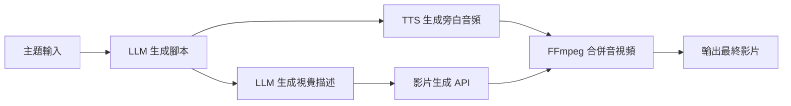

影片製作的門檻一直很高——要會剪輯、要有素材、要錄旁白，光是一支三分鐘的說明影片就能花掉半天時間。AI Agent 的出現讓這件事有了根本性的改變：你只需要給它一個主題，它會幫你寫腳本、配音、找素材、剪成影片，全程自動化。

## TL;DR

把 LLM（腳本）、TTS（配音）、影片生成 API（素材）和自動化平台（n8n）串接成一個 Agent。輸入主題，輸出帶旁白的完整影片。不需要寫程式，只需要設定 API 和流程。

## 整體架構

這套 Agent 的核心是一條**工具鏈（Tool Chain）**，每個步驟的輸出是下一步的輸入：



這不是一個單一的 AI 模型，而是**多個 AI 工具的協調**——這正是「Agent」的本質：讓 LLM 決定要呼叫哪些工具、以什麼順序執行。

## 工具選擇

### 腳本生成（LLM）
- **Claude 3.5 Sonnet / GPT-4o**：生成結構化腳本（分段、每段旁白文字、畫面描述）
- 給定格式提示，讓輸出是 JSON，方便下游處理

### 語音合成（TTS）
- **ElevenLabs**：音質最自然，支援多語言，有免費額度
- **Azure AI Speech**：企業級，穩定，繁體中文支援佳
- **Edge TTS**（本地）：免費，音質夠用，適合開發測試

### 影片素材生成
- **Runway Gen-3**：文字生成高品質影片片段
- **Pika**：操作簡單，適合說明型影片
- **HeyGen**：AI 虛擬人物主播，適合需要人臉的內容
- **Stable Video Diffusion**（本地）：開源，可自己部署

### 自動化串接（No-Code）
- **n8n**：開源自動化平台，可自己架，支援 HTTP Request 節點串接任意 API
- **Make（前 Integromat）**：雲端，入門門檻更低
- **Zapier**：整合數最多，但價格較高

### 影片合併
- **FFmpeg**：老牌開源工具，n8n 可透過 Execute Command 節點呼叫
- 合併旁白音頻 + 影片片段 + 字幕，輸出 MP4

## n8n 流程設定

以 n8n 為例，整個流程大約需要以下節點：

1. **Webhook 觸發**：接收主題輸入（可以是 Slack 訊息、表單或定時任務）
2. **HTTP Request → Claude API**：傳入主題，取得 JSON 格式腳本
3. **Code 節點**：解析 JSON，拆分每個段落的文字和視覺描述
4. **Split In Batches**：逐段處理
5. **HTTP Request → ElevenLabs**：傳入旁白文字，下載 MP3
6. **HTTP Request → Runway**：傳入視覺描述，等待影片生成，下載 MP4 片段
7. **Execute Command → FFmpeg**：合併所有段落的音視頻
8. **儲存 / 上傳**：存到 Google Drive 或 S3

整個流程設定完後，之後每次只需要觸發 Webhook，幾分鐘就能自動產出影片。

## 腳本 Prompt 設計

這是整個系統最關鍵的一步。LLM 的輸出格式要嚴格，建議用 JSON：

```
請根據以下主題生成一個 2 分鐘的說明影片腳本，分為 4 個段落。
輸出格式：
{
  "title": "影片標題",
  "segments": [
    {
      "narration": "旁白文字（約 30 秒）",
      "visual_prompt": "英文畫面描述，用於影片生成 AI"
    }
  ]
}

主題：{{topic}}
```

`visual_prompt` 要用英文，因為 Runway、Pika 等影片生成工具對英文描述的理解更好。

## 跟傳統流程的差異

| 步驟 | 傳統做法 | AI Agent |
|------|---------|---------|
| 腳本 | 人工撰寫，30~60 分鐘 | LLM 生成，30 秒 |
| 配音 | 錄音室錄製或外包 | TTS 即時生成 |
| 素材 | 購買素材庫或自行拍攝 | 影片生成 AI |
| 剪輯 | 剪輯軟體操作 | FFmpeg 自動合併 |
| 總時間 | 半天 ~ 數天 | 5 ~ 15 分鐘 |

## 適合 / 不適合的場景

**適合：**
- 大量重複性內容（產品介紹、教學、新聞摘要）
- 需要多語言版本（TTS 換語言即可）
- 內容行銷、社群媒體定期更新
- 快速驗證影片創意

**不適合：**
- 需要真人情感連結的內容（訪談、個人品牌）
- 高精度視覺需求（影片生成 AI 目前仍有不穩定性）
- 版權敏感的商業廣告（AI 生成素材的授權尚未明確）

## 實際限制與注意事項

1. **影片生成 API 費用**：Runway 等服務按秒計費，長影片成本可觀
2. **生成時間**：影片生成通常需要 1~3 分鐘每段，整條流程可能要 10~20 分鐘
3. **畫面一致性**：不同段落用 AI 生成的畫面風格可能不統一，需要在 prompt 中強調風格一致性
4. **TTS 音質**：免費方案音質有限，ElevenLabs 付費方案效果明顯更好
5. **n8n 部署**：建議自架（Docker），避免流程資料經過雲端服務

## 參考資料

- [无需编程，使用AI打造一款视频制作Agent，自动帮你做视频！](https://www.youtube.com/watch?v=lWlOSkcbIEs)
- [n8n 官方文件](https://docs.n8n.io/)
- [ElevenLabs TTS API](https://elevenlabs.io/docs)
- [Runway Gen-3 API](https://docs.dev.runwayml.com/)
