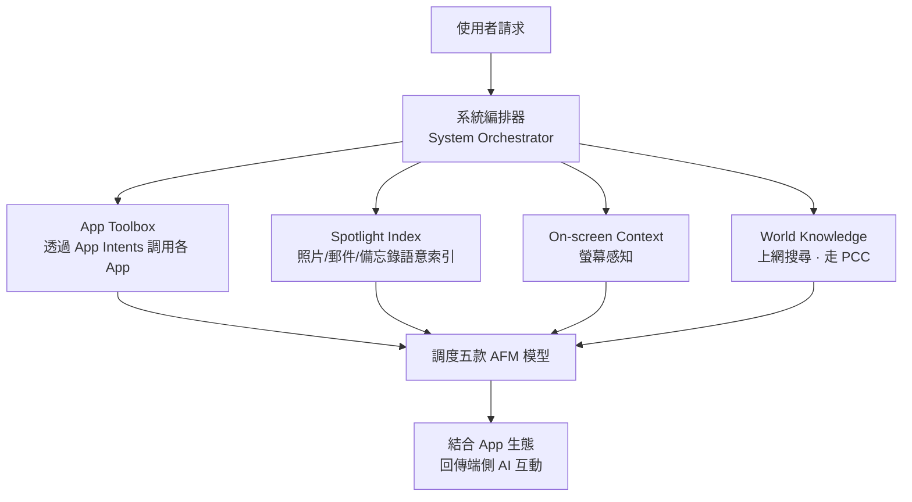

2026 年的 WWDC，是 Tim Cook 卸任前最後一次以 CEO 身分主持大會。台下給了他將近一分鐘的掌聲，但真正的問題不在這場謝幕，而在後面——今年 9 月起，以新 CEO John Ternus 為重心的下一代領導層，要如何帶著蘋果在 AI 時代重新證明「蘋果是定義者，而不是追趕者」。

都 2026 年了、CEO 都要換人了，蘋果的 AI 到底在做什麼？從投資人的角度看，這場發布會其實「比較平淡」——三年半以來，這是外界第一次真的感覺到蘋果在「把 AI 的東西放進手機裡」，但它端出的東西並沒有超出市場預期。這篇文章就順著《矽谷 101》在 WWDC 現場的觀察，把幾件事講清楚：Apple Intelligence 失敗之後蘋果內部經歷了什麼、重組後的領導班底、五款自研模型與系統架構，以及和 Google 合建的隱私計算長什麼樣。

## 從「完美文化」到「AI 危機」

時間拉回 2024 年 6 月 10 日，蘋果正式宣布 Apple Intelligence。但之後功能數次延期交付，不只讓業界質疑蘋果的 AI 研發能力，更把「尚未交付的功能當成宣傳核心」這件事，變成了觸發**消費者虛假廣告訴訟**與**股東證券詐欺訴訟**的引信。2025 年，蘋果毫無疑問陷入了一場「AI 危機」。

危機的根源，是蘋果引以為傲的「完美文化」在 AI 衝擊下失衡了。蘋果過去的成功，很大一部分來自它的整合能力——一年憋一個大招，一點一點往前走。這套節奏在過去很有效，但在 AI 時代可能不適合：這個時代「大概每週就該有一個 release」，你必須激進，因為你必須這麼走。如果還像以前一年憋一個大招，「AI 都已經過了幾個世紀，它才過了一年」，這就是問題。

## 一場祕密會議，改寫了 AI 權力版圖

根據彭博社的報導，2025 年蘋果高層進行了一次人事變動。在年初那場關鍵的祕密會議上，Cook 本人並未出席，由當時的 COO Jeff Williams 主持。蘋果總算意識到：Apple Intelligence 的問題不只是產品延期，而是組織、文化與領導力的問題。

原本負責 AI 的 John Giannandrea 正在失去 Cook 與高層的信任。蘋果需要一個人來把 Siri 和 AI 的爛攤子重新拉起來——這個人是 **Mike Rockwell**，之前負責 Vision Pro 與 visionOS 的那位。Vision Pro 商業銷量不算成功，但在蘋果內部被視為工程難度極高的成果，Rockwell 是打過硬仗、帶過隊伍、做過複雜系統的人，而且他很早就認為 AI 會是蘋果的關鍵問題，也提過 Siri 的改造路線。

不過這裡出現了大公司常見的政治博弈。Rockwell 原本以為自己會成為蘋果整體 AI 的負責人、取代 Giannandrea 直接向 Cook 匯報；但軟體工程老大 **Craig Federighi** 不同意——在他看來，AI 與 Siri 最終應該屬於軟體工程體系。最後的結果是：Rockwell 接下 Siri，但向 Federighi 匯報，而不是直接向 Cook；Giannandrea 最終離開蘋果。這背後其實是蘋果內部對 AI 歸屬權的重新劃分——**AI 到底是一個獨立的新中樞，還是軟體系統的一部分**。

重組後的權力版圖大致是這樣：

- **Tim Cook**：從旁觀產品的 CEO，變成親自下場、介入 AI 路線。
- **Craig Federighi**：依然是軟體負責人，而 AI 成為未來幾年作業系統升級的中心。
- **Mike Rockwell**：接手 Siri、重組 Siri 團隊。
- **Amar Subramanya**：蘋果從外部找來的 AI 模型負責人，這個角色極為關鍵。他在 Google 待過 16 年，曾任 Gemini、Gemini App 與 Bard 的工程副總裁，剛跳槽微軟 5 個月就被蘋果挖走。今年蘋果和 Gemini 的合作，相信他在中間有不少話語權。
- **John Ternus**：今年 9 月之後接替 Cook，成為新 CEO——他繼承的是一個「必須證明 AI 能力」的蘋果。

於是今年的 WWDC，就是這個新高層團隊的檢驗時刻。

## 五款自研模型：端側兩顆、雲端三件套

新一代 Apple Foundation Models（簡稱 AFM）一共五款。發布會反覆強調的重點是：即使進了 AI 時代，蘋果端出的也要是「符合蘋果價值觀」的技術。

**端側兩顆：**

- **AFM 3 Core**：30 億參數。
- **AFM 3 Core Advanced**：200 億參數的 MoE（混合專家）架構，一次大約只激活 10～40 億參數，跟 30 億模型的實際計算量差不多，剛好能在手機端撐住。它的核心優勢是語音——更擬人、更有表現力、可個性化，以及全系統聽寫等多模態能力。代價是硬體門檻高：Advanced 只能跑在 iPhone 17 Pro／Pro Max、搭 M4 晶片的 iPhone Air 及以上，以及至少 12GB 統一記憶體的 iPad（M3 以上）與 Mac 上。這也是部分蘋果用戶吐槽的地方，但端側 AI 對記憶體和晶片的要求本來就太高，某種程度上是沒辦法的事。

Advanced 之所以能在端側跑 200 億參數，除了 MoE 稀疏激活之外，還用上了一個有意思的技術：**把一部分固定／基礎參數放到快閃記憶體（flash）裡**。端側設備的 DRAM 本來就不夠，如果一次把所有參數載進記憶體，會浪費大量資源、也更耗電；蘋果的做法是把常用參數放進 flash，再根據使用者需求動態載入不同的參數，這樣既少佔記憶體，也降低手機耗電。這正是蘋果「軟硬一體」優勢慢慢在大模型上發揮出來的地方。

**雲端三件套**（參數與細節都未公布，只能從職能看）：

- **AFM Cloud**：雲端主力，官方稱之為「server-side workhorse」，當端側能力不夠時接手大部分雲端任務，在速度、效率與綜合性能上重點最佳化。
- **AFM Cloud Pro**：最強雲端模型，負責複雜推理與 Agentic tool use，用在最吃算力、最複雜的場景，並擴展到 Google Cloud 上專為 NVIDIA GPU 最佳化的環境。
- **ADM Cloud（Image）**：雲端圖像模型，負責圖像生成與編輯。

這裡有個外界最關心的問題：兩年前蘋果和 OpenAI 合作時，本地用蘋果模型、雲上用 GPT，被批前沿模型能力不足；這次換成 Gemini，那模型到底是誰的？據蘋果內部人士的回答，答案很直接——**五款模型都是蘋果自研的，但底層用到了 Gemini 的相關技術與 Google Cloud 基礎設施**，其中最重的 Cloud Pro 還擴展到 Google Cloud 的 NVIDIA GPU，並由蘋果的 Private Cloud Compute 隱私架構包住。換句話說，是蘋果主導模型，而不是把 Gemini 直接搬進蘋果平台。蘋果的技術論文也表示，今年夏天稍晚會發布技術報告，分享更多模型細節、評估與 benchmark。

## 系統編排器：把五款模型調度起來

有了五款模型，整個系統靠什麼調度？關鍵字是「系統編排器」（System Orchestrator）。它像演唱會的指揮，負責調度不同模型、組織不同功能來完成任務，底下掛著四個功能架構：

- **App Toolbox**：讓 Siri 能「動手」的關鍵。透過 App Intents 框架，編排器知道手機上每個 App 能做什麼；你叫它發訊息或寄信，它就調用 Messages 或 Mail 執行。
- **Spotlight Index**：把 iPhone 上的照片、郵件、備忘錄、訊息等資料，透過 Spotlight 語意索引組織起來，讓 Siri 更懂你。
- **On-screen Context**：螢幕感知，編排器看得到你當前螢幕上的內容，能結合正在讀的報導或看的影片給出相關回答。
- **World Knowledge**：需要上網搜尋時，透過蘋果與 Google 合作的 Private Cloud Compute 生成回答。

發布會上的 demo 老實說沒超出市場預期：新版 Siri 能結合個人情境搜尋郵件、照片、跨 App 做任務，能回答螢幕內容相關的問題，也能上網取得最新資訊；還有一個獨立的 Siri App，可以回顧過往對話、透過 iCloud 在各裝置間私密同步對話歷史。但大部分 demo 仍是生成式 AI（寫作、修圖）加多模態，**沒有太多真正的 Agentic action**。

不過從追趕的角度看，這未必是壞事——它得先 catch up。對使用者來說，過去用 ChatGPT、用 Claude，自己的手機卻一直沒跟上，要用 AI 總得切到不同 App，各種記憶還整合不起來；如果 Siri 能把照片、郵件都串起來，對用戶就是好事。這次比較驚豔的一個 demo，是透過密碼 App 自動幫你更新密碼——背後是 Apple Intelligence 和 Safari 配合，自動導航到網站、登入、改密碼，這是很典型的 Agentic 場景，但也需要 Siri 與開發者深度合作，而蘋果現在正處於搭建這種 Agentic 生態的初期。

## App Intents：一手胡蘿蔔、一手大棒

蘋果推 App Intents 這套機制，用來取代舊的 SiriKit。它要求開發者把 App 裡的功能、動作或資料，按照結構化的模式宣告出來、開放給 Siri，Siri 就能透過工具調用的方式連接每個 App。舉例來說，如果你開發日曆 App、給了 Siri 權限並按規範寫好背後的程式碼（開發都在 Xcode 生態裡進行），使用者就能在不打開第三方 App 的情況下，完全透過 Siri 調用 App 的主要功能。

蘋果的推法是典型的「胡蘿蔔加大棒」：

- **胡蘿蔔**：用戶量小於兩百萬的開發者，可以**免費**調用蘋果背後的 AFM 大模型。相較之下，若你自己去調用 GPT-5.5 或 Claude 這類模型要付 token 費、還得自己搭一套 Agent Harness 去連 API，蘋果直接幫你把這些都搭好了，你只要照規範寫程式碼就能免費調用。
- **大棒**：如果你不加入，未來越來越多人用蘋果設備、用 Siri 調用 App 時，你就會被邊緣化。蘋果整套設備有數十億用戶，不在這個生態裡，很可能就拿不到 Siri 這部分的流量。

從開發者角度看，這其實划算——降低成本，又多了一個 Siri 流量入口。

## Private Cloud Compute：一條可驗證的計算鏈

要把 Consumer AI 推給全球上億使用者，安全是最重要的問題。這次蘋果和 Google 花大力氣搭的隱私架構，叫 **Private Cloud Compute（PCC）**，並發布了相當詳細的技術報告。

先講結論：蘋果試圖建立一條**可驗證的計算鏈**——只有經蘋果批准、公開登記並完成硬體證明的伺服器，才能取得解密請求的能力；請求處理完後，資料與金鑰隨即銷毀；蘋果、Google 以及雲端管理員都沒有讀取用戶內容的常規介面。這也是發布會反覆強調的那句「連蘋果都不會知道你的資料」。

傳統雲端只在資料儲存時加密、傳輸時走 TLS，但 AI 推理時 GPU／CPU 必須讀取請求內容，資料通常得以可處理的形式出現在伺服器記憶體裡。PCC 想用硬體、密碼學與軟體架構強制隔離用戶資料。整個流程大致六步：

1. 端側設備先判斷請求是否需要上雲。
2. 送資料前，設備先驗證「對面是誰」——驗證目標 PCC 節點的密碼學證明（remote attestation），通過後才信任該節點。
3. 在 TLS 保護的基礎上，PCC 再對節點的解密能力加一層更明確的保護，讓網路營運商、代理、負載平衡器與常規雲端管理系統都看不到請求明文。
4. 請求只在 PCC 的信任邊界內被解密，模型在受隔離的 CPU、GPU 與記憶體環境中處理，雲端宿主與一般管理員沒有通用入口。
5. 模型完成推理後，結果加密回傳、由設備解密顯示，雲端模型只負責當前任務，不能把請求留下來做訓練或用戶畫像。
6. 任務完成後，請求資料、臨時金鑰與運行狀態被清除——蘋果稱之為 **stateless computation（無狀態計算）**。

新版 PCC 的核心變化，是把蘋果原本建立在 Apple Silicon 上的安全理念，遷移到 Google Cloud 的異構硬體體系。這條信任鏈由三層硬體撐起：

- **Intel TDX**（Trust Domain Extensions）：在 CPU 側建立受硬體隔離的機密虛擬機，讓記憶體與計算狀態和宿主機、虛擬化管理程式及其他租戶隔離。
- **NVIDIA Confidential Computing**：AFM Cloud Pro 跑在 NVIDIA GPU 上，光保護 CPU 記憶體不夠，因為參數與中間結果會在 CPU、GPU 間流動，因此用 NVIDIA 的機密計算保護 GPU 推理，並建立 CPU 到 GPU 的受保護路徑。Google 官方明確表示，這是結合 Intel CPU 與 NVIDIA Blackwell GPU 的機密計算能力，保護推理過程中的「data in use」。
- **Google Titan 晶片**：作為 Google Cloud 基礎設施的硬體信任錨點，驗證平台身分、啟動流程與完整性。

再加上蘋果的軟體證明來驗證實際運行的程式碼，就串成一條「Titan 驗平台 → Intel TDX 隔離 CPU → NVIDIA 隔離 GPU 推理 → 蘋果軟體證明」的組合信任鏈。難點在於機密計算成本很高、對硬體有要求，業界過去也沒有把這些技術整合成一套具備同等端到端屬性、又能在全球規模運行的系統——這是蘋果的第一次嘗試。這種投入，「不是一家初創公司能做好的」，需要 Google 這樣的 Infra 團隊，據了解 Google 確實抽調了不少 Infra 成員專門支援蘋果這件事。

## 監管與市場：DMA 是懸著的一塊

蘋果在隱私上砸了真金白銀，但監管仍是硬骨頭，而且在 AI 時代越來越複雜。據《紐約時報》報導，歐盟委員會與蘋果之間關於 AI 監管規則的爭議，導致新 AI 功能在歐盟延後發布。爭議點集中在《數位市場法案》（Digital Markets Act，DMA）：它要求蘋果這類巨頭確保產品具互操作性，意味著外部開發者能提供可下載、與 Siri 競爭的 AI 助理。監管機構認為這對促進競爭至關重要，蘋果則反對，稱這會帶來隱私與安全隱患。雙方已談了好幾個月、提過多種替代方案，但尚未達成一致。

這對蘋果非常關鍵——歐洲是僅次於美國的第二大市場，2025 年銷售額達 1110 億美元；大中華區是第三大市場，同樣舉足輕重。

## 兒童帳戶：一個被低估的重點

這次發布會還花了不少時間講兒童帳戶（Child Account）的大幅升級，涵蓋設備初始化、內容存取、通訊與螢幕使用時間管理，預計隨 iOS 27 / iPadOS 27 / macOS 27 在秋季推出，並可跨 iPhone、iPad、Mac 使用。家長可以決定設備一開始有哪些 App、自行挑選允許孩子使用的 App；孩子想下載新 App、瀏覽新網頁、加新聯絡人時，家長都會收到通知，再決定批准或拒絕。

現場幾位「科技行業媽媽」的實測回饋很具體：最印象深刻的是 Screen Time，把孩子能接觸的 App 分成三大場景，可以用溝通的方式一起商量娛樂與學習時間；設定流程「非常 easy」，對不擅長操作科技產品的父母也友善；把時間決策權交給孩子，對培養自律是好幫手。她們也給了改進建議——目前是到點才提醒，希望能**提前 5～10 分鐘倒數**，因為對小孩來說「戛然而止」最容易情緒崩潰。另外對青春期孩子的適配還不夠：有「國情」因素（家庭用微信而非 Messages，而微信不開放管控），加上孩子的朋友不一定用 Apple 設備，家長就難以覆蓋。不過對小小孩，這套機制能讓家長放心地給孩子一台屬於他自己的設備，而不是把自己的設備分享出去——這大概也會實打實地幫到蘋果的銷量。

## 結尾：這只是開始

把這場 WWDC 放回大局：儘管大家常說 Apple 沒有 SOTA model，但蘋果自身的生態、龐大的用戶量與 distribution，在未來仍有很大潛力；它過去靠「一年憋一個大招」的產品週期文化很成功，但在 AI 時代必須改變。這次的發布，對投資人來說平淡，對一般使用者來說是「手機終於跟上了」，對業界的友商來說也是好事——如果蘋果能把消費者對端側 AI 的接受度帶起來，對整個賽道都有幫助。

真正的看點在後面：五款自研模型的能力，要等夏天的技術報告和 benchmark 才見真章；Agentic 生態能不能靠 App Intents 的胡蘿蔔加大棒真的長出來；PCC 這條跨 Apple Silicon 與 Google Cloud 的信任鏈能不能穩定落地。如果這些只是一個開始，那麼真正屬於消費者 AI 的「iPhone Moment」，或許還要再等一等。

## 參考資料

- [库克的离场，苹果新AI权力重构与价值观天平｜WWDC26（YouTube，硅谷101）](https://www.youtube.com/watch?v=hIdvhl8PUwc)
