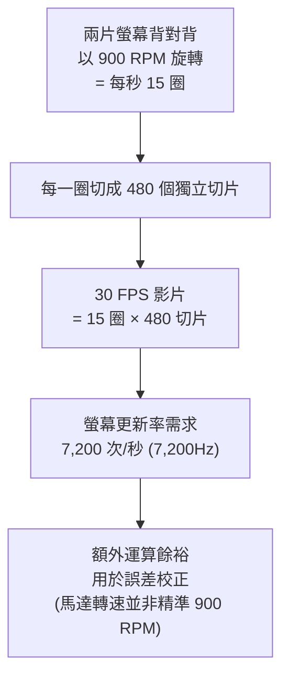

顯示技術最有趣的東西，往往不是每年例行更新的旗艦 OLED 電視或手機螢幕，而是那些「把螢幕放到奇怪地方」或「用奇怪方式產生畫面」的裝置。這篇整理三個真正值得工程師關注的顯示裝置：一個把普通 MacBook 變成觸控筆電的貼附式螢幕、一台靠高速旋轉騙過你眼睛的體積顯示器，以及一台大到接近荒謬、卻真的能取代雙螢幕的 Dell 超寬螢幕。

## 1. Magic Screen：把任何 MacBook 變成觸控筆電

MacBook 一直沒有觸控螢幕。Intricuit 的 **Magic Screen** 就是要補上這一點：一片具觸控感應能力的可撓玻璃，用磁鐵吸附在 MacBook 螢幕上，透過 USB Type-C 連接，馬上讓這台 Mac 得到一個滿版、四角到四角的觸控螢幕。

它的運作方式其實是個聰明的 hack——**對筆電來說，它是假裝成一個觸控板（trackpad）**。所以系統不需要原生支援觸控，就能讓你捲動網頁、在 App 裡點選操作、做點照片編輯。搭配 macOS Tahoe 的 iPhone 鏡像功能時體驗更好，因為你終於可以用手指、以 App 原本被設計的操作方式去控制它。

作為一個外接配件，它把細節想得相當周到：

- **防晃動：** 觸控時螢幕會晃，於是附了一個 folio 保護套，把顯示面板穩穩撐住。
- **攜帶：** 可以巧妙收納，讓它跟著 MacBook 到處走。
- **防夾壞：** 角落的 USB Type-C 埠同時被設計成一個「擋塊」，物理上不讓你不小心把玻璃連同筆電一起闔上而壓破它。
- **觸控筆：** 另附一支觸控筆，可以把玻璃從筆電上拆下來單獨用，像一塊透明的 Wacom 繪圖板，具備懸浮（hovering）與壓力感應，電池續航約 100 小時。

**房間裡的大象**是：預期今年稍晚會有一次 MacBook Pro 改款，帶來 OLED 螢幕與觸控功能。知道這件事，會讓這個產品感覺像是有個倒數計時的到期日。

但它仍值得考慮。不是每個想要觸控的人，都得為此去買一台 5,000 美元的新筆電——尤其手上的 M2 或 M3 都還好好的、大概還能再撐幾年。而且有趣的是，等那台觸控 MacBook Pro 真的推出，反而會讓這個配件**變得更好用**：因為現在的 macOS 完全是為滑鼠鍵盤設計的，從沒有過觸控。等蘋果為觸控筆電更新系統、把觸控目標做大、UI 更能自適應之後，這些改進會一併惠及所有用 Magic Screen 的人。像是視窗左上角那三顆「紅綠燈」控制鈕現在太小、常常按不準，或是要抓住視窗頂端拖動——這些過小的觸控目標屆時都會變得容易許多。

官方表示計畫在今年稍晚的 Kickstarter 之後，推出一個約 150 美元的版本。群眾募資這件事本身讓人有點緊張，但這是個值得祝福的方向。

## 2. 旋轉式體積顯示器：用 7,200Hz 騙過你的眼睛

嚴格來說這是一台**體積顯示器（volumetric display）**，也就是俗稱的「全息」——技術上它並不是真正的全息，但那個技術性細節沒那麼重要。重點是它產生了全息的**效果**：一個懸在 3D 空間裡的物件，人群可以圍著它、幾乎從 360 度觀看。

而它產生這個效果的方式相當瘋狂。關掉電源時你會看到真相：它其實是**兩片螢幕背對背，繞著中央的軸心旋轉**。因為螢幕解析度不算高，你甚至能看到一顆顆獨立的像素。

原理類似你可能看過的旋轉風扇顯示器：把一條像素快速旋轉一圈，就能畫出一個圓;如果讓 LED 每次轉到「完全相同的位置」時才脈衝點亮，你就得到一個懸浮在空中的點——一個像素。把很多這樣的線堆疊起來，就開始加入 Z 軸的深度。而這也正是它變得極度複雜的地方。

這東西以 **900 RPM** 旋轉，也就是每秒約 15 圈。轉這麼快時，它點亮的不再是一個點或一條「懸浮切片」，而是必須把一個 3D 物件的所有切片、以完美的時序一片接一片排好，讓螢幕轉一圈的過程中，拼出一個具有真實體積、彷彿靜止懸在空中的立體物件。

這需要驚人的運算量：一整圈被切成 **480 個獨立切片**，代表光是要播放 **30 FPS** 的影片，這些螢幕每秒就得更新 **7,200 次**——也就是 **7,200Hz 的更新率**。這也是它無法做到高解析度的原因，光是要讓這件事成立，運算量就已經很吃緊。此外還得預留一些運算餘裕做**誤差校正**，因為馬達不見得精準地維持在 900 RPM，系統必須確保所有切片仍然對得齊。

外面那個玻璃罩，一部分是為了安全，另一部分是為了讓螢幕在裡面旋轉時**減少空氣阻力**。要在這種顯示器上呈現內容，還需要專門的軟體、以及專為體積顯示製作的 3D 物件與影像。這是工作室裡見過最有趣的裝置之一。

## 3. Dell 52 吋 6K 超寬螢幕：第一台真能取代雙螢幕的單螢幕

這是一台 **52 吋、6K、微曲、120Hz 的 Thunderbolt 螢幕**，來自 Dell。Dell 今年推出了一批有趣的顯示器，而這台是其中最有意思的一台——因為對長期使用雙螢幕的人來說，這是第一台讓人覺得「可以一路走到底、用單螢幕完全取代雙螢幕而不損失效率」的機種。

規格重點：

- **解析度：** 6K，也就是 **6144 × 2560**。不是 8K，但像素夠多，換算下來大約等同於一台 27 吋 4K 螢幕的像素密度，約 **129 PPI**。文字依然銳利，四角清晰，你可以坐得更近也不會崩壞。
- **面板：** 不是 OLED，卻看起來相當好。四邊窄邊框、微霧面（anti-glare）處理，IPS 面板，**100% sRGB、99% DCI-P3** 色域。不是最頂級的調色級面板，但它要價 **3,000 美元**。

真正讓它有趣的功能，是內建的 **KVM 切換器，最多可接四台電腦**，再加上一整套好用的軟體。連接埠包含 **Thunderbolt 4、兩個 HDMI 2.1、兩個 DisplayPort 1.4**，可以同時接多台機器，然後用一組鍵盤滑鼠在它們之間切換。搭配的不是傳統的子母畫面（picture-in-picture），而是**並排畫面（picture-by-picture）加上畫面分割**，能排成各種版面——這正是它得以取代雙螢幕的關鍵。你甚至能把來自多台機器的畫面全部放在同一片螢幕上，等於在一台螢幕上同時擁有多螢幕的工作環境。

**微曲**的設計也很實用。市面上有些超寬螢幕曲率誇張得多，看起來很酷，但這台的輕微弧度更接近你把兩台大螢幕擺在面前時的實際夾角——當兩台大螢幕平放時，坐在中間會讓兩側角落離你很遠，微曲能讓內容更多留在你正前方，減少轉頭。

最後，那條 Thunderbolt 4 能提供 **140W 供電**：一條線同時幫筆電充電、輸出畫面，還能走 2.5G 乙太網路，全部一次搞定。

## 小結

這三個裝置各自代表顯示技術一種有趣的方向：**Magic Screen** 用「假裝成觸控板」這種務實的 hack，把觸控體驗塞進既有硬體;**體積顯示器**用高速旋轉與 7,200Hz 更新率，硬是在空中堆出立體影像;**Dell 52 吋 6K** 則把「兩台螢幕」的價值濃縮進一片曲面玻璃。最有意思的從來不是誰的面板最先進，而是螢幕正在用各種方式擺脫「一片矩形玻璃」的既定形狀與用途。

## 參考資料

- [The Most Interesting Displays In The World! (YouTube)](https://www.youtube.com/watch?v=WOzcFkld6_g)
