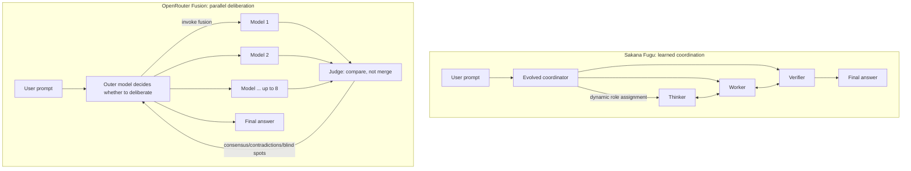

For the past couple of years, picking a model was simple: check the leaderboard, grab the top scorer, wire up the API, done. By 2026 that logic is breaking down. Frontier models have converged, each with its own strengths and blind spots, and committing to "always one model" means carrying single-vendor risk while throwing away what the others do well.

So a new class of product appeared: **orchestrate several models behind one API and expose only a single endpoint**. You call it like one model; behind it, a pool of them collaborate. This piece unpacks two leading examples — Sakana AI's **Fugu** and OpenRouter's **Fusion**. They solve the same problem with opposite design philosophies.

## Why now: the single-model ceiling

Both products rest on the same observation, "mixture-of-agents": fan one prompt out to several models, combine the results, and you often beat any single model. OpenRouter's own data makes the point sharpest — they found that even *fusing Opus 4.8 with itself* lifted the score from 58.8% to 65.5% (+6.7 points). **The synthesis step itself contributes the gain**, not just model diversity.

In other words, the single-model bottleneck isn't only "not smart enough" — it's "no second opinion." One model that's wrong won't doubt itself; with several answering, the disagreement is the signal. Fugu and Fusion both build on this, but hand "collaboration" to very different machinery.

## Sakana Fugu: evolving the coordination strategy

Fugu's core stance: **don't pre-design how the team divides labor — let the system learn it.** It's built on two Sakana ICLR 2026 papers:

- **TRINITY**: a lightweight, evolved coordinator dynamically assigns Thinker, Worker, and Verifier roles across multiple LLMs over sequential turns — for coding, math, and reasoning.
- **Conductor**: uses reinforcement learning to *discover* natural-language coordination strategies and inter-agent communication patterns, instead of hand-coding a workflow.

This runs opposite to traditional multi-agent frameworks (LangGraph, CrewAI — where you hand-craft every node and edge). Fugu lets a trained coordinator decide who speaks first, who verifies, when to hand off. The routing details are completely opaque to you.

Externally it's just **one OpenAI-compatible endpoint**. You don't pick models; Fugu decides which ones participate and how they hand off. It also offers compliance flexibility: you can exclude specific providers to meet privacy or export-control requirements — a real selling point in geopolitically sensitive contexts.

Fugu comes in two tiers:

| | Fugu | Fugu Ultra |
|---|---|---|
| Positioning | Balances performance and latency, everyday work | Deeper agent pool, prioritizes answer quality |
| Fits | Coding, chat, interactive tasks | Paper reproduction, Kaggle, security analysis |
| Provider opt-out | Per-provider exclusion | Fixed agent pool, not adjustable |

Published benchmarks (against frontier models like Gemini 3.1 Pro, Claude Opus 4.8, GPT-5.5):

- **SWE Bench Pro**: Fugu 59.0, Fugu Ultra 73.7
- **LiveCodeBench**: Fugu 92.9, Ultra 93.2
- **GPQA-Diamond**: both 95.5
- Qualitative: Fugu Ultra solved all 300 Rubik's cubes (competitors generated non-functional code); in blindfold chess it beat three frontier models and the Stockfish engine

On pricing, subscriptions come in Standard ($20/mo), Pro ($100/mo, 10× usage), and Max ($200/mo, 30× usage); pay-as-you-go bills Fugu at underlying model rates and Fugu Ultra at $5 input / $30 output per 1M tokens. Notably, **multiple active agents don't stack fees** — you pay at the rate of the highest-tier model involved.

The limits are clear too: due to incomplete GDPR compliance, it's **not available in the EU/EEA**; routing and model selection are a black box you can't inspect; Fugu Ultra's agent pool is fixed, and only Fugu allows per-provider opt-outs.

## OpenRouter Fusion: parallel deliberation, a judge that compares — not merges

Fusion takes the other road: **no trained coordinator, but an explicit, interpretable deliberation pipeline.** It packages mixture-of-agents as a *tool* attached to an outer model. Five steps:

1. You send a prompt to `openrouter/fusion`, which resolves to an underlying model with the fusion tool attached.
2. The outer model first judges whether the task needs deliberation — it can answer directly or invoke fusion.
3. **Panel analysis**: up to 8 models answer simultaneously, each with web search and fetch, producing independent responses.
4. **Judge synthesis**: a dedicated judge model receives every response and **compares them — it doesn't merge them** — emitting structured JSON.
5. The outer model uses the judge's analysis to write the final answer.

The key difference is step 4. The judge doesn't blend answers together; it produces structured analysis along four dimensions:

- **Consensus**: points most models agree on, treated as higher-confidence
- **Contradictions**: where the panel disagrees
- **Coverage gaps**: topics only some models covered
- **Blind spots / unique insights**: what nobody addressed, and the novel takes of individual models

This is a different thing from a normal router: **a router picks one best model *before* sending (cheap model for easy tasks, expensive for hard); Fusion sends to many at once and combines.** One saves money; the other spends it to chase quality.

There are two ways to call it. The simple one is a model alias:

```json
{
  "model": "openrouter/fusion",
  "messages": [{"role": "user", "content": "Your prompt"}]
}
```

For more control, use the server-tool mode: specify your own outer model, choose the judge, and mix it with other tools. Tunable parameters include `analysis_models` (default is a 3-model Quality preset — Claude Opus / GPT-latest / Gemini Pro, settable from 1–8), `max_tool_calls` (default 8), and `tool_choice: "required"` to force deliberation on every request. There's recursion protection too: inner fusion calls carry headers that stop panel and judge models from invoking fusion again, preventing infinite nesting.

Performance numbers come from 100 deep-research tasks in the DRACO benchmark: **Fable 5 + GPT-5.5 fused scored 69.0%, beating every individual model** (Fable 5 alone 65.3%, GPT-5.5 60.0%, Opus 4.8 58.8%). More interesting is the cost angle — a "budget panel" of Gemini 3 Flash, Kimi K2.6, and DeepSeek V4 Pro hit 64.7%, nearly matching standalone Fable 5 **at half the cost per task**.

The catch is money. With the default 3-model panel, **expect roughly 4–5× the cost of a single completion** (each panel model runs independently, plus one judge call afterward), scaling linearly with panel size. Fusion isn't a cost-saver; its positioning is explicit: **use it when the cost of being wrong far outweighs the cost of a few extra completions** — deep research, expert critique, compare-and-contrast prompts.

## Two philosophies, side by side

| | Sakana Fugu | OpenRouter Fusion |
|---|---|---|
| Core mechanism | Learned/evolved coordinator dynamically assigns roles | Parallel deliberation + judge's structured comparison |
| Is collaboration interpretable? | Black box, opaque routing | Transparent: consensus / contradictions / blind spots |
| Model selection | System decides (can exclude providers) | User specifies panel and judge |
| Billing logic | Highest-tier rate, no stacking | Linear stacking, ~4–5× a single call |
| Headline use case | General: coding, interactive, Ultra for hard tasks | High-stakes decisions, deep research, second opinions |
| Openness | Fully managed service | A tool you attach to your chosen outer model |
| Known limits | No EU/EEA, opaque routing | Costly, fundamentally research/analysis-oriented |

In one line: **Fugu bets that coordination strategy can be trained, hiding complexity in a black box to buy generality; Fusion bets the deliberation should be visible, exposing model disagreement to buy interpretability and control.**

## Overall architecture



Place the two diagrams together and the difference jumps out: Fugu's arrows are "coordinator assigns downward, roles loop back and forth" — control lives in that central learned coordinator; Fusion's arrows are "fan out once, then converge on the judge" — control stays in a deliberation structure you can see.

## The bottom line

These two products represent two bets on the "post-single-model era" of 2026. Neither is wrong; the trade-off is clear:

- Want **a drop-in general endpoint that handles model selection and hand-off for you**, can tolerate a black box — or specifically need to exclude certain providers for compliance? Pick **Fugu**. It decides the whole "should we use multiple models, and how should they collaborate" question on your behalf.
- Want **control over the deliberation and visibility into where models disagree**, on tasks where being wrong is expensive (research or decision-making)? Pick **Fusion**. It's expensive, but expensive *transparently*, and it bolts onto an outer model you choose.

The bigger takeaway may be this: **"which model do I pick" is being lifted out of the user's hands and folded into the infrastructure.** Whether it's Fugu's trained coordination or Fusion's deliberative synthesis, the direction is the same — what you call in the future may no longer be a model, but a system wrapped to look like one.

## References
For a deeper look at the technologies and architectures discussed here, see the official documentation and further reading below.

Some details are not fully expanded here due to length; the body also uses inline links for further reading.

- [Sakana AI — Fugu](https://sakana.ai/fugu/)
- [OpenRouter Fusion](https://openrouter.ai/fusion)
- [OpenRouter Docs — Fusion Router](https://openrouter.ai/docs/guides/routing/routers/fusion-router)
- [OpenRouter Blog — Surpassing Frontier Performance with Fusion](https://openrouter.ai/blog/announcements/fusion-beats-frontier/)
