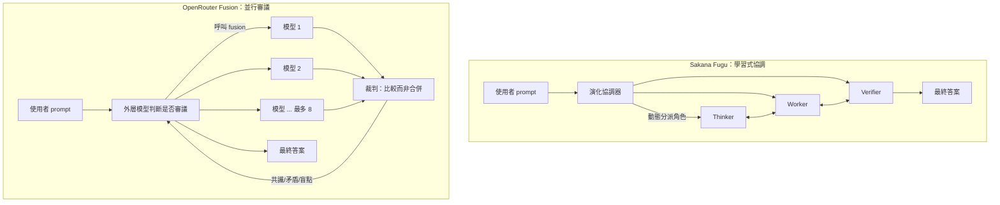

過去兩年大家挑模型的方式很單純：看排行榜，選分數最高那顆，接上 API 就走。但到了 2026，這套邏輯開始失效——前沿模型彼此差距縮小、各有擅長與盲點，而「永遠只用一顆」既要承擔單一供應商風險，也把另外幾顆模型的長處白白丟掉。

於是出現了一類新產品：**把多個模型編排在同一個 API 後面，對外只露出一個端點**。你呼叫它就像呼叫一顆模型，背後其實是一群模型在協作。這篇要拆解兩個代表作——Sakana AI 的 **Fugu** 與 OpenRouter 的 **Fusion**——它們解決的問題相同，設計哲學卻是兩個方向。

## 為什麼是現在：單模型的天花板

這類產品的共同前提是「mixture-of-agents」這個觀察：把同一個 prompt 丟給多個模型、再把結果整合，效果往往勝過任何單一模型。OpenRouter 自己的數據最能說明問題——他們發現連「把 Opus 4.8 跟它自己融合」都能從 58.8% 拉到 65.5%（+6.7 分）。**合成這個動作本身就帶來增益**，不全靠模型多樣性。

換句話說，單模型的瓶頸不只是「不夠聰明」，而是「沒有第二意見」。一顆模型答錯時不會自我懷疑；多顆模型一起答，分歧本身就是訊號。Fugu 與 Fusion 都建立在這個前提上，只是把「協作」這件事交給了不同的機制。

## Sakana Fugu：把協作策略「演化」出來

Fugu 的核心立場是：**不要預先設計團隊怎麼分工，讓系統自己學出來。** 它建立在 Sakana 兩篇 ICLR 2026 論文上：

- **TRINITY**：用一個輕量、演化出來的協調器，在多顆 LLM 之間動態分派 Thinker（思考）、Worker（執行）、Verifier（驗證）三種角色，逐輪推進，適用於 coding、數學、推理任務。
- **Conductor**：用強化學習去「發現」自然語言的協調策略與代理間的溝通模式，而不是人工寫死 workflow。

這跟傳統 multi-agent 框架（LangGraph、CrewAI 那種你要手刻每個節點與邊的）是相反方向：Fugu 把「誰先發言、誰負責驗證、何時換手」交給訓練出來的協調器決定，路由細節對使用者完全不透明。

對外它只是**一個 OpenAI 相容的端點**。你不選模型，Fugu 替你決定哪幾顆模型參與、怎麼換手。它也提供合規上的彈性：可以排除特定供應商以滿足隱私或出口管制需求——這點在地緣政治敏感的場景是實際賣點。

Fugu 分兩個檔次：

| | Fugu | Fugu Ultra |
|---|---|---|
| 定位 | 平衡效能與延遲，日常工作 | 深度代理池，追求答案品質 |
| 適用 | coding、聊天、互動式任務 | 論文復現、Kaggle、安全分析 |
| 供應商 opt-out | 可逐一排除 | 代理池固定，不可調 |

官方公布的 benchmark（對手是 Gemini 3.1 Pro、Claude Opus 4.8、GPT-5.5 等前沿模型）：

- **SWE Bench Pro**：Fugu 59.0、Fugu Ultra 73.7
- **LiveCodeBench**：Fugu 92.9、Ultra 93.2
- **GPQA-Diamond**：兩者皆 95.5
- 質性展示：Fugu Ultra 在 300 顆魔術方塊全數解出（對手生成的程式碼跑不動）；盲棋對局擊敗三個前沿模型與 Stockfish 引擎

定價上，訂閱制分 Standard（$20/月）、Pro（$100/月，10× 用量）、Max（$200/月，30× 用量）；按量計費的話 Fugu 以底層模型費率計、Fugu Ultra 為每百萬 token 輸入 $5／輸出 $30。值得注意的是**多個代理同時運作時不疊加收費**，以參與的最高階模型費率為準。

限制也很明確：因 GDPR 合規未完成，**目前不在 EU/EEA 上線**；路由與模型選擇是黑箱，無法檢視；Fugu Ultra 的代理池固定，只有 Fugu 能逐一排除供應商。

## OpenRouter Fusion：並行審議，裁判只比較不合併

Fusion 走的是另一條路：**不靠訓練出來的協調器，而是用一個明確、可解釋的審議流程。** 它把 mixture-of-agents 做成一個「工具」掛在外層模型上，五步走完：

1. 你把 prompt 送到 `openrouter/fusion`，它解析成一顆掛了 fusion 工具的底層模型。
2. 外層模型先判斷這題需不需要審議——可以直接答，也可以呼叫 fusion。
3. **評審團分析**：最多 8 顆模型同時作答，每顆都能用網路搜尋與抓取，各自獨立產生回應。
4. **裁判合成**：一顆專責的 judge 模型收下所有回應，**只比較、不合併**，輸出結構化 JSON。
5. 外層模型拿裁判的分析寫出最終答案。

關鍵差異就在第 4 步。裁判不是把答案攪在一起，而是產出四個維度的結構化分析：

- **Consensus（共識）**：多數模型都同意的點，視為高信心區
- **Contradictions（矛盾）**：評審團互相打架的地方
- **Coverage gaps（覆蓋缺口）**：只有部分模型談到的主題
- **Blind spots / unique insights（盲點與獨到見解）**：沒人提到的，以及個別模型的獨特觀點

這跟一般 router 是兩回事：**router 是在發送「前」挑一顆最適合的模型（簡單題給便宜模型、難題給貴模型）；Fusion 是同時發給多顆、再整合。** 一個是省，一個是搏品質。

呼叫方式有兩種。簡單的用模型別名：

```json
{
  "model": "openrouter/fusion",
  "messages": [{"role": "user", "content": "你的問題"}]
}
```

要更多控制就用 server tool 模式，自己指定外層模型、自選裁判、跟其他工具混用。可調參數包括 `analysis_models`（預設 3 顆品質組合：Claude Opus / GPT-latest / Gemini Pro，可設 1–8 顆）、`max_tool_calls`（預設 8）、以及 `tool_choice: "required"` 強制每次都跑審議。系統也有遞迴保護：內層 fusion 呼叫帶 header 阻止評審與裁判再去呼叫 fusion，避免無限套娃。

效能數據來自 DRACO benchmark 的 100 個深度研究任務：**Fable 5 + GPT-5.5 融合後得 69.0%，超過任何單一模型**（單獨 Fable 5 為 65.3%、GPT-5.5 為 60.0%、Opus 4.8 為 58.8%）。更有意思的是成本面——一個由 Gemini 3 Flash、Kimi K2.6、DeepSeek V4 Pro 組成的「平價評審團」拿到 64.7%，幾乎追平單獨 Fable 5，**每題成本卻便宜一半**。

代價是錢。預設 3 顆評審團，**成本大約是單次 completion 的 4–5 倍**（每顆模型獨立跑一次、最後再加一次裁判呼叫），而且隨評審團人數線性增加。Fusion 不是省錢工具，它的定位很清楚：**當「答錯的代價」遠大於「多跑幾次的代價」時才用**——深度研究、專家級批判、compare-and-contrast 這類題目。

## 兩種哲學的對照

| | Sakana Fugu | OpenRouter Fusion |
|---|---|---|
| 核心機制 | 學習/演化出的協調器動態分派角色 | 並行審議 + 裁判結構化比較 |
| 協作是否可解釋 | 黑箱，路由不透明 | 透明，輸出共識/矛盾/盲點 |
| 模型選擇 | 系統決定（可排除供應商） | 使用者可指定評審團與裁判 |
| 計費邏輯 | 取最高階模型費率，不疊加 | 線性疊加，約 4–5× 單次成本 |
| 主打場景 | 通用：coding、互動、Ultra 攻硬任務 | 高風險決策、深度研究、需要第二意見 |
| 開放程度 | 完全託管的服務 | 可掛在自選外層模型上的工具 |
| 已知限制 | 不在 EU/EEA、黑箱路由 | 成本高、本質上偏研究/分析型任務 |

一句話總結差異：**Fugu 賭「協作策略可以被訓練出來」，把複雜度藏進黑箱換取通用性；Fusion 賭「審議過程應該被看見」，把多模型分歧攤開來換取可解釋性與可控性。**

## 整體架構



兩張圖放在一起，差別一目了然：Fugu 的箭頭是「協調器往下指派、角色之間來回」，控制權在中央那顆學出來的協調器；Fusion 的箭頭是「一次扇出、再收斂到裁判」，控制權留在你能看見的審議結構裡。

## 整體來說

這兩個產品代表了 2026 年「後單模型時代」的兩種下注方向，沒有誰對誰錯，取捨點很清楚：

- 想要**一個能直接接上、自己會處理模型選擇與換手的通用端點**，而且能接受黑箱、或正好需要排除特定供應商來符合合規——選 **Fugu**。它把「要不要多模型、怎麼協作」整件事都替你決定了。
- 想要**對審議過程有掌控、看得到模型之間在哪裡分歧**，題目又屬於「答錯成本很高」的研究或決策型——選 **Fusion**。它貴，但貴得透明，而且能掛在你自己選的外層模型上。

更大的啟示或許是：**「選哪顆模型」這個問題，正在從使用者手上被抽走，變成基礎設施的一部分。** 無論是 Fugu 的訓練式協調還是 Fusion 的審議式合成，方向都一致——未來你呼叫的可能不再是一顆模型，而是一套被包裝成模型的系統。

## 參考資料
如果想更深入了解本文提到的技術與架構，建議進一步閱讀以下官方文件與延伸文章。

部分內容因篇幅限制不會完整展開，內文也會適度使用超連結，方便讀者延伸閱讀。

- [Sakana AI — Fugu 官方頁面](https://sakana.ai/fugu/)
- [OpenRouter Fusion 官方頁面](https://openrouter.ai/fusion)
- [OpenRouter Docs — Fusion Router](https://openrouter.ai/docs/guides/routing/routers/fusion-router)
- [OpenRouter Blog — Surpassing Frontier Performance with Fusion](https://openrouter.ai/blog/announcements/fusion-beats-frontier/)
