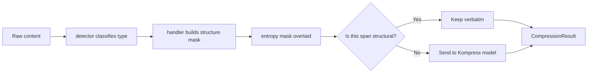
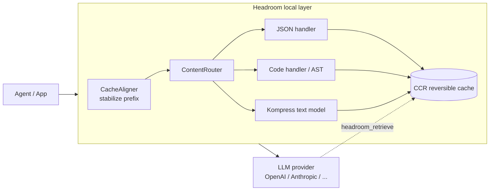

The biggest cost sink in agent workflows isn't the model — it's **context bloat**. One `grep` returning 100 results, one incident log, one RAG retrieval, and you've stuffed tens of thousands of tokens into a prompt where maybe a tenth carries signal. [Headroom](https://github.com/headroomlabs-ai/headroom) exists to fix exactly that: before a request reaches OpenAI or Anthropic, it strips that noise **locally** by 60–95%, claiming accuracy stays essentially flat.

This isn't just a feature tour. I read it down to the code to unpack **how it decides what to compress and what to keep** — including one design I rarely see done this maturely, and one gap where the docs run ahead of the implementation.

## The core abstraction: every compression is a mask

The easiest way to misread Headroom is to assume it "rewrites content into a summary." It rewrites nothing — **it produces a per-character boolean mask** marking each span as "keep" or "compressible," then only touches the compressible parts.

`UniversalCompressor` is the orchestrator, with a fixed flow:



The split is the point: **structure is decided by rules, semantics go to the ML model**. JSON keys, function signatures — those "skeletons" are preserved 100% by deterministic handler rules and never mangled by a model. Only the leftover prose spans go through the ML model. If the model can't compress or isn't installed, the fallback chain degrades to plain truncation (`_simple_compress`). This design boxes the risk of lossy compression into a safe zone.

## Three handlers: content-aware, not one model for everything

Headroom first classifies content. The primary path is Google's **Magika** (a local deep-learning model, ~5ms, 100+ types), normalized into seven categories: JSON / CODE / LOG / DIFF / MARKDOWN / TEXT / UNKNOWN. Without Magika it falls back to pattern matching. Confidence below 0.5 collapses to UNKNOWN and a NoOp — it won't gamble on compressing.

Then it routes to the matching handler:

**The JSON handler's** real rules (read `json_handler.py`, not the README):
- **Every key is kept** — so the LLM can see which fields exist and navigate
- Structural punctuation `{}[]:,` is kept
- Numbers: kept if ≤10 digits; string values: kept only if ≤20 chars, or high-entropy (no spaces + entropy > 0.85, catching UUIDs / hashes)
- **Arrays keep only the first 3 entries in full**, aggressively compressing from the 4th on

A clever detail: self-normalized entropy scores English prose >0.85 too, so a "no spaces" gate prevents mistaking a sentence for an identifier and pointlessly preserving it.

**The code handler** uses AST:
- Primary path **tree-sitter**, regex fallback, supporting Python / JS / TS / Go / Rust / Java / Perl
- **Kept**: imports, function and method signatures, class / struct / interface definitions, type declarations, decorators
- **Compressed**: function bodies, comments, whitespace
- The subtlety: "the signature runs to the body start; the body is NOT marked, so nested function bodies stay compressible." It even handles tree-sitter's byte-offset → char-offset conversion (multi-byte correctness).

In other words, after compression you still see a file's full API shape — only the bodies are folded away. That's exactly what an LLM needs to understand a file.

## The part worth stealing: cache-mutation economics

If I could only show you one file, it'd be the Rust side's `compression_policy.rs`. Because it asks a higher-order question than "can we compress?":

> **Does dropping this span — and thereby busting the provider's prompt cache — actually pay off?**

Most compression tools ignore something: on providers with KV caching, blind compression can cost *more*, because mutating a cached prefix invalidates the whole cache downstream, forcing a rewrite at 1.25× the price. Headroom writes this as a net-gain formula:

```
gain = ΔT·(w + r·(R−1)) − P_alive·(w−r)·(S+ΔT)
```

- `w = 1.25` (writing a cached token costs 1.25× a plain input token)
- `r = 0.1` (reading a cached token costs 0.1×)
- `ΔT` = tokens removed, `R` = expected remaining reads, `S` = the suffix invalidated after the edit, `P_alive` = probability the cache stays valid

The intuition (from its test anchors):

| Scenario | Calculation | Result |
|----------|-------------|--------|
| Small shave, deep suffix (50K suffix, shave 2K, 10 reads) | 4300 − 59800 | **−55500 unprofitable** |
| Big shave, shallow suffix (10K suffix, shave 50K, 3 reads) | 72500 − 69000 | **+3500 profitable** |

The break-even formula `R = 11.5·S/ΔT`: a small shave needs 287 reads to pay off (basically never), a big shave only 2.3 (profitable within a few turns). `should_mutate_deep()` only fires when `gain > 0`.

It even tiers policy by billing mode: **subscription users get CacheAligner turned off entirely**, because what they pay for is prompt-cache stability — you can't let compression mutate cached prefixes and corrupt the cache hash. This "compression bows to billing reality" nuance is a level most open-source compressors never reach.

## CCR: turning lossy compression into lazy loading

The biggest worry with aggressive compression is "what if you dropped the one thing that mattered?" Headroom's answer is **CCR (Compress-Cache-Retrieve)**: originals stay in a local store after compression, and the LLM gets a `headroom_retrieve` tool — when it senses it's missing something, it can fetch the original on demand.

That demotes "lossy compression" to "lazy loading": save tokens by default with the compressed version, and pay one tool round-trip only when full content is actually needed. It's also the safety net behind the claim of aggressive compression without accuracy loss.

## The overall architecture



There are four ways in: library (`compress(messages)` inline), proxy (`localhost:8787`, a zero-code gateway), agent wrapper (`headroom wrap claude`), and MCP server. Any OpenAI-compatible client works through the proxy. The text model, Kompress-v2-base, is an **extractive** token classifier built on ModernBERT (149M params) + LoRA — it predicts keep / drop per token rather than generating a summary, so it can't hallucinate content the original never had.

## An honest caveat: the docs run ahead of the code

After reading the code, I found a gap worth writing down. The README and docs repeatedly stress that JSON compression does "statistical analysis [to] keep errors, anomalies, boundaries." But in the actual `json_handler.py`, there is **no error detection, no anomaly detection, no statistical sampling** — it just "keeps all keys + the first 3 entries + short / high-entropy values." The only "statistical" element is entropy scoring, and that's for catching identifiers, not anomalies.

This doesn't mean it's lying — it's the classic signature of an early project (single-author-led, in an F2.x phase, with plenty of fields "plumbed but not yet consumed"): **the README describes the vision architecture; the code is the current version.** Whenever you evaluate a compression tool, remember — don't make architecture decisions off capability claims, go read what the code actually does right now.

And note: those "92% / 87.6%" ratios are cherry-picked from high-redundancy scenarios (search results, logs); the ML model itself defaults to just 18% on prose. Don't expect 90%+ on ordinary conversation.

## The bottom line

Headroom's real technical highlights are three, each extractable on its own: **mask-based extraction** (rules guarantee structure, only semantics go to the model), **cache-mutation economics** (decide whether to compress via a cost model, not blindly), and **CCR reversibility** (lossy demoted to lazy loading). The second one in particular is worth borrowing for anyone leaning on prompt caching with Anthropic or OpenAI.

The reasons to stay skeptical are just as clear: docs ahead of code, cherry-picked ratios, an early single-author project. If you're on a single provider at modest volume, native context management is probably enough. But if you run multi-agent, cross-provider daily dev flows and feel the token bill, Headroom's design is worth one read-through — even if you never adopt it, that cache-mutation formula alone earns its keep.

## References
For a deeper look at the technologies and architecture mentioned here, see the official resources below.

- [headroomlabs-ai/headroom (GitHub)](https://github.com/headroomlabs-ai/headroom)
- [Headroom official docs](https://headroom-docs.vercel.app/docs)
- [Kompress-v2-base model (Hugging Face)](https://huggingface.co/chopratejas/kompress-v2-base)
- [Google Magika: local content-type detection](https://github.com/google/magika)
- [tree-sitter: incremental parsing library](https://tree-sitter.github.io/tree-sitter/)
- [Anthropic Prompt Caching docs](https://docs.claude.com/en/docs/build-with-claude/prompt-caching)
