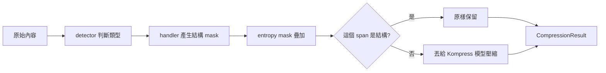
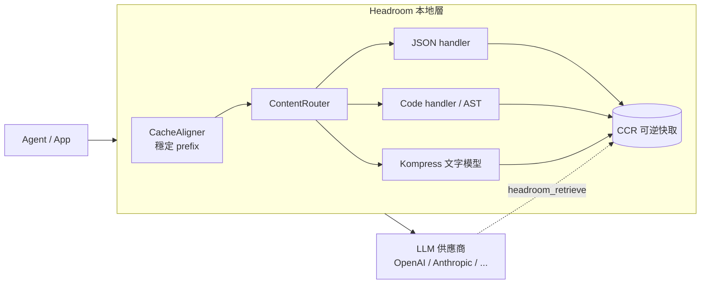

Agent 工作流最大的成本黑洞不是模型本身，而是**上下文膨脹**。一次 `grep` 回 100 筆結果、一份 incident log、一個 RAG 檢索，動輒上萬 token 塞進 prompt，而其中真正有訊號的可能不到一成。[Headroom](https://github.com/headroomlabs-ai/headroom) 想解決的就是這件事：在請求送到 OpenAI / Anthropic 之前，於**本地**把這層雜訊壓掉 60–95%，宣稱準確度幾乎不變。

這篇不只介紹它能做什麼，而是讀到程式碼層級，拆解它**怎麼決定該壓什麼、該留什麼**——其中有一個我認為這領域少見的成熟設計，也有一個文件跑在實作前面的落差值得提醒。

## 核心抽象：所有壓縮都是一張 mask

最容易誤解 Headroom 的地方，是以為它「把內容重寫成摘要」。實際上它一個 token 都不重寫——**它產生一張逐字元的 boolean mask**，標記每個片段是「保留」還是「可壓縮」，再只對「可壓縮」的部分動手。

`UniversalCompressor` 是 orchestrator，流程固定：



關鍵在於分工：**結構由規則決定，語意才交給 ML 模型**。JSON 的 key、code 的函式簽名，這些「骨架」由 handler 用確定性規則 100% 保住，絕不會被模型搞壞；只有剩下的散文片段才丟進 ML 模型做語意壓縮。模型壓不動或沒裝時，fallback 鏈會退化成單純截斷（`_simple_compress`）。這個設計讓「有損壓縮」的風險被框死在安全範圍內。

## 三種 handler：內容感知，不是無腦塞模型

Headroom 先用 detector 判斷內容類型——主路徑是 Google 的 **Magika**（本地深度學習模型，約 5ms、支援 100+ 類型），標準化成 JSON / CODE / LOG / DIFF / MARKDOWN / TEXT / UNKNOWN 七類；沒裝 Magika 時退化成 pattern matching。信心值低於 0.5 一律歸 UNKNOWN，走 NoOp 不冒險壓。

判完型，分流到對應 handler：

**JSON handler** 的真實規則（看 `json_handler.py`，不是看 README）：
- **所有 key 一律保留**——讓 LLM 看得到有哪些欄位、能導航
- 結構符號 `{}[]:,` 保留
- 數字：10 位以內保留；字串值：20 字元以內、或高熵（無空白 + entropy > 0.85，抓 UUID / hash）才保留
- **陣列只保留前 3 筆完整**，第 4 筆之後積極壓縮

有個聰明的工程細節：self-normalized entropy 會讓英文散文也 >0.85，所以加了「無空白」這道閘門，避免把英文句子誤判成識別碼硬留下來。

**Code handler** 走 AST：
- 主路徑 **tree-sitter**，退化用 regex，支援 Python / JS / TS / Go / Rust / Java / Perl
- **保留**：import、函式與方法簽名、class / struct / interface 定義、型別宣告、decorator
- **壓縮**：函式 body、註解、空白
- 精妙處：「簽名延伸到 body 起點；body 不標記為保留 → 巢狀函式的 body 仍可被壓」。它還處理了 tree-sitter 的 byte offset → char offset 轉換（多位元組字元正確性）這種現實坑。

換句話說，code 壓完你還看得到完整的 API 形狀，只是 body 被折疊——這正是 LLM 理解一個檔案時真正需要的東西。

## 最值得學的部分：快取變異經濟學

如果只看一個檔案，我會挑 Rust 端的 `compression_policy.rs`。因為它問的不是「能不能壓」，而是一個更高階的問題：

> **壓掉這一段、進而打掉供應商的 prompt cache，划不划算？**

多數壓縮工具忽略一件事：在有 KV cache 的供應商上，盲目壓縮反而可能更貴——因為你動了 cached prefix，下一輪 cache 整段失效，要用 1.25× 的價格重新寫入。Headroom 把這件事寫成一條淨收益公式：

```
gain = ΔT·(w + r·(R−1)) − P_alive·(w−r)·(S+ΔT)
```

- `w = 1.25`（寫 cache 的成本是普通 input token 的 1.25×）
- `r = 0.1`（讀 cache 是 0.1×）
- `ΔT` = 砍掉的 token，`R` = 預期剩餘讀取次數，`S` = 編輯點後被連帶失效的 suffix，`P_alive` = cache 仍有效的機率

直覺結論（來自它的測試錨點）：

| 情境 | 計算 | 結果 |
|------|------|------|
| 小砍、深 suffix（5 萬 suffix 砍 2 千，10 次讀取） | 4300 − 59800 | **−55500 虧** |
| 大砍、淺 suffix（1 萬 suffix 砍 5 萬，3 次讀取） | 72500 − 69000 | **+3500 賺** |

break-even 公式 `R = 11.5·S/ΔT`：小砍要 287 次讀取才回本（幾乎不可能），大砍只要 2.3 次（幾回合對話內就回本）。`should_mutate_deep()` 只在 `gain > 0` 時才動手。

它甚至按付費模式分級政策：**訂閱用戶直接關掉 CacheAligner**，因為他們付錢買的就是 prompt-cache 穩定，不能讓壓縮去變異 cached prefix、寫壞快取雜湊。這種「壓縮服從於計費現實」的細膩度，是很多開源壓縮工具沒想到的層次。

## CCR：把有損壓縮變成延遲載入

激進壓縮的最大疑慮是「萬一壓掉的正是關鍵怎麼辦」。Headroom 的答案是 **CCR（Compress-Cache-Retrieve）**：壓縮後原文留在本地 store，同時給 LLM 一個 `headroom_retrieve` 工具——模型發現資訊不足時，可以主動 call 回原文。

這等於把「有損壓縮」降級成「延遲載入」：預設給壓縮版省 token，需要時才付一次工具往返的代價取回完整內容。這也是它敢宣稱激進壓縮又不掉準確度的安全網。

## 整體架構



接入方式有四種：library（`compress(messages)` 內嵌）、proxy（`localhost:8787` 零改碼 gateway）、agent wrapper（`headroom wrap claude`）、MCP server。任何 OpenAI 相容 client 都能走 proxy。語音模型 Kompress-v2-base 是基於 ModernBERT（149M 參數）+ LoRA 的**抽取式** token 分類器——逐 token 預測 keep / drop，不是生成式摘要，所以不會幻覺出原文沒有的東西。

## 一個誠實的提醒：文件跑在實作前面

深入讀完程式碼後，我發現一個值得寫進來的落差。README 和官方文件反覆強調 JSON 壓縮會「statistical analysis keeps errors, anomalies, boundaries」（統計分析保留錯誤、異常、邊界值）。但 `json_handler.py` 的實際程式碼裡，**沒有任何錯誤偵測、異常偵測或統計抽樣**——它就只是「保留所有 key + 前 3 筆 + 短值 / 高熵值」。唯一的「統計」成分是 entropy scoring，而那是拿來抓識別碼，不是抓異常。

這不是說它造假，而是這類早期專案（單一作者主導、處於 F2.x 階段、不少欄位是「已接線但還沒有 consumer 讀取」）的典型訊號：**README 描述的是願景架構，程式碼是當下版本。** 評估任何壓縮工具時都該記得——別照能力宣稱做架構決策，去看程式碼此刻真正做了什麼。

順帶提醒，那些「92% / 87.6%」的壓縮率都是高冗餘場景（搜尋結果、log）特挑出來的；ML 模型本身對散文預設只壓 18%。一般對話別期待 90%+。

## 整體來說

Headroom 真正的技術亮點有三個，而且都可以拆出來單獨學：**mask-based 抽取**（結構用規則保證、語意才交給模型）、**快取變異經濟學**（用成本模型決定要不要壓，而非盲目壓）、**CCR 可逆性**（有損降級成延遲載入）。第二個尤其值得任何在 Anthropic / OpenAI 上吃 prompt caching 的人借鏡。

該保留懷疑的地方也清楚：文件超前實作、壓縮率是特挑場景、單一作者的早期專案。如果你只是單一供應商、量也不大，原生 context 管理可能就夠了。但如果你跑的是多 agent、跨供應商的日常開發流，又對 token 帳單有感，Headroom 的設計思路至少值得讀一遍——就算不直接用，那條 cache 變異公式也夠回本了。

## 參考資料
如果想更深入了解本文提到的技術與架構，建議進一步閱讀以下官方資源。

- [headroomlabs-ai/headroom（GitHub）](https://github.com/headroomlabs-ai/headroom)
- [Headroom 官方文件](https://headroom-docs.vercel.app/docs)
- [Kompress-v2-base 模型（Hugging Face）](https://huggingface.co/chopratejas/kompress-v2-base)
- [Google Magika：本地內容類型偵測](https://github.com/google/magika)
- [tree-sitter：增量解析庫](https://tree-sitter.github.io/tree-sitter/)
- [Anthropic Prompt Caching 文件](https://docs.claude.com/en/docs/build-with-claude/prompt-caching)
