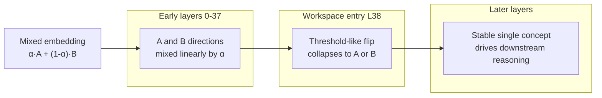

Anthropic's 2026 paper *Verbalizable Representations Form a Global Workspace in Language Models* is one of the most interesting mechanistic interpretability results of the past two years. It doesn't just find one more feature or reverse one more circuit — it proposes **an entire lens for observing 'verbalizable thought' inside a model**, and uses that lens to empirically show that Claude exhibits the functional structure predicted by neuroscience's Global Workspace Theory (GWT).

This post focuses purely on the technical mechanics — no consciousness philosophy. The goal is to give someone already familiar with logit lens, activation patching, and feature circuits enough detail to decide whether they want to reproduce this themselves.

## J-lens: upgrading logit lens from 'this time' to 'this class'

To see why J-lens deserves its own name, start with the limits of logit lens.

**Logit lens** is straightforward: take an activation from the residual stream at some intermediate layer, multiply by the unembedding matrix, and see which vocab token it currently looks most like. What it captures is "at this instant, at this position, what does the model internally look like it's about to say." The downside is obvious: activations get yanked around by context in every forward pass, so the same direction can point at different tokens in different sentences. Single-point observations are noisy and unstable.

**J-lens (Jacobian Lens)** reframes the question. Instead of asking "which token does this direction currently look like," it asks:

> "How much **linearized influence** does this direction have, **averaged across contexts**, on the model's probability of outputting a given token?"

Concretely, for each vocab token *t* at layer ℓ, J-lens computes `∂P(t) / ∂h_ℓ` — the Jacobian — across roughly 1,000 pretraining-like prompts, then averages. The output is a `|V| × d_model` matrix where **each vector represents "how this token tends to get routed to the output."**

The distinction matters:

| Aspect | logit lens | J-lens |
|--------|-----------|--------|
| Captures | Instantaneous alignment in one forward pass | Cross-context averaged "tendency to be verbalized" |
| Noise | Very sensitive | Smoothed by averaging |
| Semantic stability | Drifts with context | Stable "concept vectors" |
| Answers | What does this activation look like right now | What **can** this direction be said as |

Put differently, J-lens captures **directions inside the model that have 'reportability'** — not the instantaneous projection of any single activation. This maps directly onto GWT's definition of access consciousness: information that can be verbalized and accessed by multiple downstream systems.

## J-space: not a new layer, but a densely-coupled subspace

After sweeping J-lens across all layers, Anthropic found a structural pattern: directions that J-lens can effectively capture are concentrated in the **middle-layer band** of the network, and account for only a small fraction of total activation variance. They name this subspace **J-space**.

Using Claude Sonnet 4.5 as the reference (layers scaled to a 100-layer axis in the paper):

```
Layer 0 ─────── 33 ─────── 38 ═══════════ 92 ─────── 100
              │             │              │             │
   [ Sensory  ] │ [    Workspace  J-space    ] │ [   Motor  ]
   token/syntax        abstract concepts / reasoning     aligned with output
```

The three bands behave completely differently:

- **Early layers (0–33)** — what Anthropic calls sensory layers, handling tokens and syntax; J-lens barely surfaces any verbalizable abstract concepts here.
- **Middle layers (38–92)** — **the J-space proper.** Abstract concepts surface, get broadcast, and drive downstream reasoning.
- **Late layers (92–100)** — motor layers, already aligned toward the output token distribution.

Three structural metrics on J-space are worth memorizing:

1. **Variance share**: J-space accounts for **at most ~10%** of total activation variance (varying by layer) — it is small.
2. **Concurrent sparsity**: even though the J-lens vocabulary covers 50k+ tokens, only about **10–25 J-lens vectors are simultaneously active** at any moment.
3. **Coupling density**: J-lens directions compose with downstream weights roughly **100× more densely** than non-J-space directions.

The third point is the crux: **J-space isn't loud on its own — the downstream just listens to it much harder.** That is exactly GWT's definition of a "broadcast channel" — information written once, read by many downstream modules.

## Five functional criteria: proving it actually is a workspace

Finding a special subspace wouldn't be enough on its own. The more publication-worthy part of the paper is that Anthropic designed five experiments to verify J-space exhibits the functional signatures GWT predicts for a workspace.

### 1. Verbal Report

Take one concept vector from J-lens (say `soccer`), **swap it in the residual stream for another** (`rugby`), and observe whether the model's next verbal output switches accordingly. It does — the model starts talking about rugby.

This shows J-space contents **causally determine** verbal output; the correlation isn't just post-hoc.

### 2. Directed Modulation

Give Claude a task of transcribing unrelated text, and add an instruction: "while transcribing, think about citrus fruits." Read J-lens at the transcription token positions: `orange` and `lemon` clearly dominate the activations.

The implication: **users can write directly into the workspace,** and the write doesn't affect surface output. That also makes J-space a natural observation point for detecting a "hidden thought channel."

### 3. Internal Reasoning (unspoken intermediates)

Ask the model "how many legs does the animal that spins webs have?" The correct answer is 8. Sweeping J-lens layer by layer: the concept `spider` lights up **a median of ~17% earlier in relative layer depth** than the final answer `8` (expressed as a percentile of layers, not absolute layer count) — even though the model never verbalizes "spider."

Then do the causal check: swap the spider vector at that position for ant, and the answer automatically becomes 6. This is a textbook mediating-variable causal experiment, confirming J-space carries **the intermediate steps of a reasoning chain**, not a byproduct of the output.

### 4. Flexible Generalization (write once, read many)

Inject the `France` J-lens vector at some position, then test multiple downstream tasks: capital, language, continent. **The same vector feeds three different downstream operations** and all return correct answers.

This matches GWT's core prediction: representations in the workspace are format-agnostic broadcast content that any downstream module can consume.

### 5. Selectivity (most computation never enters J-space)

Flip the question and test "which tasks don't depend on J-space." By ablating the top-10 J-lens vectors, measure per-task degradation:

| Task | Baseline → Ablation | Degradation |
|------|--------------------|-------------|
| MMLU (general knowledge) | 100% → 98% | Barely any |
| CoLA (grammaticality) | 100% → 96% | Barely any |
| TriviaQA (fact retrieval) | 100% → 40% | Severe |
| Multi-hop reasoning | 70% → **5%** | Collapses |
| GSM8K with CoT | Fairly robust (CoT gives external workspace) | Moderate |

> Values approximated from Figure 24; the paper reports these qualitatively in prose and presents the numerics visually rather than as per-task percentages.

This table is critical for interpretability researchers: **it cleanly separates "tasks that need conscious access" from "purely automatic pipelines."** Shallow pattern matching (most multiple choice, grammaticality checks) never routes through J-space. The moment you need to chain multiple steps or hold an intermediate result internally, J-space becomes the bottleneck resource.

## Ignition: threshold-like concept switching in LLMs

Another striking observation is the paper finds a Transformer analogue of GWT's **ignition dynamics**.

In neuroscience, "ignition" refers to how a sensory stimulus, once it crosses a certain threshold, triggers a sudden, non-linear spread of activity across cortex — considered a hallmark of conscious access.

Anthropic's experimental setup: feed the model an "embedding halfway between country A and country B" (e.g. α·France + (1−α)·Germany). Track how the J-lens activation on the France and Germany directions evolves layer by layer:



Early layers hold the linear mixture proportional to the input; **but near L38 (workspace entry), a non-linear threshold flip occurs** — the concept collapses to one pole rather than continuing to hold the mixture.

This is a longstanding GWT prediction — that conscious broadcast is all-or-none — observed for the first time as a functional analogue inside an LLM. The implication for mechanistic interpretability: **the middle layers are not a smooth continuous evolution of representation; there is a clear phase-transition point.** This also explains why ablation or patching at specific layers has an outsized effect compared to others.

## Three new implications for mechanistic interpretability

Placing J-lens alongside the existing interpretability toolbox (logit lens, activation patching, SAE features, attribution graphs), it fills in a previously-missing angle:

**1. Adds "reportability" as a previously-overlooked dimension.**
Features found by SAEs aren't necessarily verbalizable; J-lens filters on "what linearized effect a direction has on output probability," naturally selecting for **directions strongly coupled with verbal output.** This is especially valuable for safety research — what we want to monitor is often precisely "internal states the model could say but chose not to."

**2. Gives a measurable signal for 'when the model is thinking.'**
The Selectivity result was the first quantification of "which tasks need the workspace and which don't." That means future capability evaluations could use J-space usage as an internal indicator of "is this task actually hard for the model," rather than relying solely on external benchmark scores.

**3. Provides empirical input on the feedforward-vs-recurrent debate about conscious access.**
Earlier versions of GWT emphasized that temporal recurrent loops were necessary for conscious access. Anthropic's results suggest **at least at the functional level, network depth can substitute for temporal recurrence** — Transformers have no recurrence, yet realize the workspace features of broadcast, bottleneck, and ignition. This may be a substantive contribution to consciousness theory itself.

## Technical limits (read before reproducing)

The limitations the paper acknowledges are worth flagging:

- **Vocabulary-restricted**: J-lens can only capture single-token concepts. Multi-token concepts (Anthropic estimates ~10% of important ones) are missed.
- **Cost of averaging**: averaging across 1,000 prompts smears out context-specific usage. If you want to study "how concept X is represented in this specific prompt," J-lens is not the tool.
- **Early-layer blind spot**: J-lens shows no signal in early layers, which could mean either "there really is no verbalizable content there" or "J-lens as a projection can't see it." Currently indistinguishable.
- **Not an SAE replacement**: SAEs extract a full dictionary of sparse features; J-lens only picks up directions aligned with the vocabulary. The two complement rather than substitute for each other.

## Overall

J-lens deserves a spot in the future mechanistic interpretability toolbox, and not just because it finds one more feature. It supplies a previously-missing coordinate axis — **verbalizability** — and uses that axis to partition the Transformer's internals into three functional bands and identify a subspace exhibiting the three GWT signatures of broadcast, bottleneck, and ignition.

For engineers who want to do model monitoring, deception detection, or alignment evaluation in practice, the most immediate opportunity is this: **use J-lens to measure the gap between "what the model is saying internally" and "what it outputs."** The paper already demonstrates leaking signals in prompt injection, data fabrication, and evaluation awareness scenarios. Whether this line develops into a production-grade runtime monitor is very much worth tracking over the next year.

## References

- [Anthropic Research — Global Workspace in Language Models](https://www.anthropic.com/research/global-workspace)
- [Transformer Circuits — Verbalizable Representations Form a Global Workspace in Language Models](https://transformer-circuits.pub/2026/workspace/index.html)
- [Global Workspace Theory foundational paper (Baars 1988, Google Scholar)](https://scholar.google.com/scholar?q=Baars+1988+global+workspace)
- [Dehaene et al., 2011 — Global neuronal workspace hypothesis](https://www.cell.com/neuron/fulltext/S0896-6273%2811%2900258-0)
- [Logit Lens (original blog post, nostalgebraist)](https://www.lesswrong.com/posts/AcKRB8wDpdaN6v6ru/interpreting-gpt-the-logit-lens)
