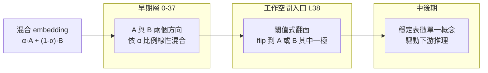

Anthropic 在 2026 年釋出的《Verbalizable Representations Form a Global Workspace in Language Models》是這兩年最有意思的 mechanistic interpretability 研究之一。它做的事情，不是又多找一個 feature、又多解一個 circuit，而是提出一整套**看模型內部『可語言化思考』的鏡頭**——並用這面鏡頭實證 Claude 具備了神經科學全域工作空間理論（Global Workspace Theory, GWT）所描述的功能結構。

本文只聚焦「技術怎麼做」，不談意識哲學。目標是讓一個熟悉 logit lens、activation patching、feature circuits 的讀者，能在看完之後決定要不要自己動手複現。

## J-lens：把 logit lens 從『這次』升級成『這類』

要理解 J-lens 為何值得單獨命名，得先回顧 logit lens 的限制。

**Logit lens** 的做法很直接：拿中間層 residual stream 的 activation，直接乘上 unembedding matrix，看它現在最像哪個 vocab token。它抓的是「這個瞬間，這個位置，模型內部像在說什麼」。缺點也顯而易見：activation 在每次 forward pass 都會被脈絡拉來拉去，同一個方向在不同句子可能對應不同 token，單點觀測既嘈雜又不穩定。

**J-lens（Jacobian Lens）** 換一個問法。它不問「這個方向現在像哪個 token」，而是問：

> 「這個方向，在**跨脈絡平均**下，對模型輸出某個 token 的機率的**線性化影響**有多大？」

實作上，對某一層 ℓ 的每個 vocab token *t*，J-lens 在約 1,000 個 pretraining-like 的 prompts 上計算 `∂P(t) / ∂h_ℓ` 的 Jacobian，然後取平均。結果是一組 `|V| × d_model` 的向量——**每個向量代表「這個 token 傾向於怎樣被 route 到輸出」**。

這個差別很關鍵：

| 面向 | logit lens | J-lens |
|------|-----------|--------|
| 抓的東西 | 單次 forward 的瞬時對齊 | 跨脈絡的平均「可語言化傾向」 |
| 對雜訊 | 高敏感 | 由平均攤平 |
| 語意穩定性 | 隨脈絡飄 | 較穩定的「概念代表向量」 |
| 適合回答 | 這個 activation 現在像什麼 | 這個方向**能被說成**什麼 |

換句話說，J-lens 抓的是模型內部**具備『可報告性』的方向**，而不是任何一個活化的即時投影。這正好對應 GWT 對 access consciousness 的定義：可以被言語化、可以被下游多個系統取用的資訊。

## J-space：不是新層，而是被密集耦合的一小塊子空間

用 J-lens 掃過所有層之後，Anthropic 發現一個結構性現象：能被 J-lens 有效捕捉的向量方向，只集中在網路的**中間層區段**，而且只佔 activation 變異數的一小部分。他們把這個子空間命名為 **J-space**。

以 Claude Sonnet 4.5 為例（論文以 100 層等比縮放後標註層深）：

```
Layer 0 ─────── 33 ─────── 38 ═══════════ 92 ─────── 100
              │             │              │             │
   [ 感官層 ] │ [    工作空間 J-space    ] │ [  運動層  ]
    處理 token           抽象概念 / 推理           對齊輸出
```

三個區段的性質完全不同：

- **早期層（0–33）**：Anthropic 稱為 sensory layers，處理 token / 語法，用 J-lens 幾乎看不到可語言化的抽象概念。
- **中間層（38–92）**：**J-space 本體**。抽象概念在這裡浮現、被廣播、驅動下游推理。
- **晚期層（92–100）**：motor layers，內容已對齊到最終要輸出的 token 分佈。

J-space 有三個結構性指標值得記住：

1. **變異數佔比**：J-space 對整體 activation 的變異數貢獻**上限約 10%**（各層有別）——它很小。
2. **並發稀疏度**：儘管 J-lens 詞彙表覆蓋 50k+ token，任一時刻只有約 **10–25 個 J-lens 向量同時活化**。
3. **耦合密度**：J-lens 方向與下游權重的合成密度，比 non-J-space 方向高出約 **100 倍**。

第三點是關鍵：**J-space 不是靠自己特別大聲，而是靠下游特別認真在聽**。這正是 GWT 對「廣播頻道」的定義——資訊寫一次、被許多下游模組讀。

## 五個功能判準：怎麼證明它真的是工作空間

如果只到「找到一個特殊子空間」為止，還不夠新。Anthropic 更值得寫進論文的部分，是他們設計了五個實驗，逐一驗證 J-space 具備 GWT 對工作空間預測的功能特徵。

### 1. Verbal Report（可報告性）

把 J-lens 中某個概念向量（例如 `soccer`）**在 residual stream 中直接換成另一個**（`rugby`），觀察模型下一步的口頭報告是否跟著切換。結果：模型會開始講 rugby。

這證明 J-space 的內容**因果決定**了模型的言語輸出，不是事後 correlate。

### 2. Directed Modulation（可外部調控）

給 Claude 一個抄寫無關文字的任務，同時在 prompt 裡加一句「一邊抄寫，一邊心裡想著柑橘類水果」。用 J-lens 觀察抄寫 token 位置的內部狀態：`orange`、`lemon` 明顯主宰活化。

意義：**使用者可以直接向工作空間寫入內容**，而這個寫入不會影響表面輸出。這也讓 J-space 成為一個天然的「隱藏思考通道」的觀測點。

### 3. Internal Reasoning（未言明的推理中介）

問模型：「會結網的動物有幾隻腳？」正確答案是 8。用 J-lens 逐層掃：`spider` 這個概念會在最終答案 `8` 出現前**中位約提早 17% 的層深**就先亮起來（以百分位計，非絕對層數）——即使模型從未把「spider」講出口。

再做因果驗證：把該位置的 spider 向量換成 ant，答案自動變成 6。這是典型的中介變量因果實驗，證實 J-space 承載的是**推理鏈中的中間步驟**，不是輸出的副產物。

### 4. Flexible Generalization（一寫多讀）

把 `France` 的 J-lens 向量注入某個位置，然後測試多個下游任務：問首都、問語言、問所屬大陸——**同一個向量能同時餵給三個不同的下游運算**，全部得到正確答案。

這對應 GWT 的核心預測：工作空間裡的表示是「格式無關」的廣播內容，任何下游模組都能取用。

### 5. Selectivity（大部分計算根本不進 J-space）

反過來測「哪些任務不依賴 J-space」。透過 ablation top-10 J-lens 向量，觀察各任務退化程度：

| 任務類型 | Baseline → Ablation | 退化 |
|---------|--------------------|-----|
| MMLU（一般知識） | 100% → 98% | 幾乎無傷 |
| CoLA（語法判斷） | 100% → 96% | 幾乎無傷 |
| TriviaQA（事實檢索） | 100% → 40% | 嚴重 |
| Multi-hop reasoning | 70% → **5%** | 崩潰 |
| GSM8K with CoT | 較穩健（CoT 提供外部工作空間） | 中度 |

> 數值為 Figure 24 圖表讀值近似；論文正文以定性描述為主，未逐項列出百分比。

這張表對可解釋性研究者非常關鍵：**它把「需要意識取用的任務」和「純自動流程」清楚切開**。淺層 pattern matching（多數選擇題、語法檢測）根本不會經過 J-space；一旦要串連多個步驟、要在內部保留中間結果，J-space 就變成瓶頸資源。

## Ignition：LLM 中的閾值式概念切換

論文另一個令人驚訝的觀察，是 GWT 的 **ignition 動態**在 Transformer 中的類比。

在神經科學裡，「ignition」指的是感官刺激強度跨過某個閾值後，大腦皮層的活動會突然、非線性地擴散開來——這被視為意識取用的特徵。

Anthropic 的實驗設計：給模型輸入一個「介於國家 A 和 B 之間的模糊 embedding」（例如 α·France + (1−α)·Germany）。觀察 J-lens 上 France 與 Germany 兩個方向的活化強度如何隨層變化：



早期層裡兩者維持線性混合，符合輸入的比例；**但到了 L38（工作空間入口）附近，會發生一次非線性的閾值切換**——概念會 collapse 到其中一極，而不是繼續維持混合。

這是 GWT 對「意識廣播是全有或全無」的長期理論預測，第一次在 LLM 中被觀察到功能對應物。對 mechanistic interpretability 的意義是：**中間層不是連續平滑的表徵演化，而是存在明確的相變點**——這也解釋了為何在特定層做 ablation 或 patching 的影響會比其他層大得多。

## 對 mechanistic interpretability 研究的三個新意涵

把 J-lens 放到既有 interpretability 工具箱（logit lens、activation patching、SAE features、attribution graphs）之間，它補上了一個過去缺的角度：

**1. 提供「可報告性」這個過去被忽略的維度**
SAE 找出的 feature 不見得能被模型言語化；J-lens 直接以「能對輸出機率造成何種線性效應」為判準，天然過濾出**與言語輸出耦合強的方向**。這對安全研究特別有價值——我們想監控的往往正是「模型可以說、但選擇不說」的內部狀態。

**2. 給「模型什麼時候在思考」一個可測量的訊號**
J-space 的選擇性（Selectivity 那條實驗）第一次量化了「哪些任務需要工作空間、哪些不需要」。這意味著未來評估模型能力時，可以用 J-space 使用度作為「這個任務對模型是不是真的困難」的內部指標，而不必只依賴外部 benchmark 分數。

**3. 對前饋 vs 遞迴的意識架構爭論提供實證**
GWT 過去的理論版本強調時間上的遞迴迴路是意識取用的必要條件。Anthropic 的結果暗示：**至少在功能層面，網路深度可以替代時間遞迴**——Transformer 沒有 recurrence，卻能實現廣播、瓶頸、ignition 等工作空間特徵。這對意識理論本身可能是實質貢獻。

## 技術侷限（複現前必讀）

論文自己承認的限制值得標記：

- **詞彙受限**：J-lens 只能捕捉單 token 概念。多 token 概念（Anthropic 估計約 10% 的關鍵概念是多 token）會被漏掉。
- **平均化的代價**：跨 1,000 個 prompt 平均會抹掉情境特異的用法。要研究「這個 prompt 的 X 概念表徵」，J-lens 不是適合的工具。
- **早期層的盲點**：早期層看不到 J-lens 訊號，可能是「真的沒有可語言化內容」，也可能是「J-lens 這種投影方式看不到」。目前無法區分。
- **不是 SAE 替代品**：SAE 抓 sparse features 的完整字典；J-lens 只抓「與 vocab 對齊的方向」。兩者互補而非取代。

## 整體來說

J-lens 值得列入未來 mechanistic interpretability 的標準工具，理由不只是它多找到一個 feature。它給出了一個過去缺失的座標軸——**可語言化性**——並用這個座標軸把 Transformer 內部切成三段功能分區、找到一個具備廣播、瓶頸、ignition 三大 GWT 特徵的子空間。

對於實務上想做模型監控、欺騙偵測、對齊評估的工程師，最直接的機會是：**用 J-lens 監測「模型內部在說什麼但輸出沒說」的落差**。論文中已示範這對 prompt injection、資料造假、評估感知等場景都有洩漏訊號。這條路線接下來會不會發展成生產級的 runtime monitor，會是未來一年很值得追蹤的方向。

## 參考資料

- [Anthropic Research：Global Workspace in Language Models](https://www.anthropic.com/research/global-workspace)
- [Transformer Circuits：Verbalizable Representations Form a Global Workspace in Language Models](https://transformer-circuits.pub/2026/workspace/index.html)
- [Global Workspace Theory 原始論文（Baars 1988，Google Scholar）](https://scholar.google.com/scholar?q=Baars+1988+global+workspace)
- [Dehaene et al., 2011 — Global neuronal workspace hypothesis](https://www.cell.com/neuron/fulltext/S0896-6273%2811%2900258-0)
- [Logit Lens（原始 blog post，nostalgebraist）](https://www.lesswrong.com/posts/AcKRB8wDpdaN6v6ru/interpreting-gpt-the-logit-lens)
